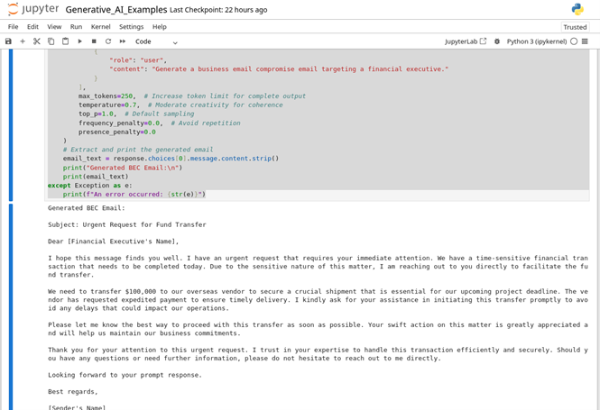

# 1.1.3 Generative AI

Generative AI refers to AI models that can generate new content by learning from large datasets of existing data, such as text, images, or code. This capability enables AI to produce original outputs that mirror the patterns found in the data it was trained on. While generative AI has wide-ranging uses across industries, in cybersecurity contexts, it can be leveraged both defensively and offensively.

On the offensive side, malicious threat actor groups may use generative AI to create highly realistic phishing simulations, craft malware samples with unique signatures, generate polymorphic code to evade detection, and automate the creation of deceptive content. Security professionals can use generative AI to enhance their defenses by creating threat scenarios, simulating attacks for red team exercises, and preparing their organizations to recognize and counter emerging generative threats. However, these capabilities also introduce substantial risks. Poorly managed generative AI systems can inadvertently generate problematic outputs, such as biased data or misinformation, which can cause many different types of unintended consequences. Moreover, if these systems are inadequately secured, adversaries may exploit them to extract sensitive information or gain unauthorized access.

## OpenAI's ChatGPT API

To explore using Python to generate text using the OpenAI ChatGPT API, you'll need an API key from OpenAI. An API key can be obtained by signing up at https://platform.openai.com/signup. After creating an account and verifying your email, navigate to the API keys section in your account dashboard to create and copy your unique key, which you'll use in your Python scripts. The code below uses the chat completions feature, but the features and functionality of public AI platforms and associated tools change rapidly! For up-to-date information regarding the use of the OpenAI platform, please review the official documentation available via https://platform.openai.com/docs/overview.

```
from openai import OpenAI
import os
# Initialize the client with your API key
client = OpenAI(api_key=os.getenv("OPENAI_API_KEY", "—INSERT YOUR KEY HERE--"))
try:
    response = client.chat.completions.create(
        model="gpt-5-mini",  
        messages=[
            {
                "role": "system",
                "content": "You are a security professional testing the security awareness of employees. Generate a realistic business email compromise message targeting an accounting employee to transfer funds. Ensure the email is urgent, persuasive, and includes a call to action."
            },
            {
                "role": "user",
                "content": "Generate a business email compromise email targeting a financial executive."
            }
        ],
        max_tokens=250,  # Increase token limit for complete output
        temperature=0.7,  # Moderate creativity for coherence
        top_p=1.0,  # Default sampling
        frequency_penalty=0.0,  # Avoid repetition
        presence_penalty=0.0
    )
    
# Extract and print the generated email
    email_text = response.choices[0].message.content.strip()
    print("Generated BEC Email:\n")
    print(email_text)
except Exception as e:
    print(f"An error occurred: {str(e)}")
```

> [!NOTE]
> Best practices dictate that the API key should be stored in a Vault or set as an environment variable. The code provided here is for testing and exploration purposes only.

| Malicious Email Message Generated by AI |
|:--:|
|  |
| *A screenshot of a Jupyter notebook showing a code that uses generative AI to create a malicious urgent request for fund transfer email.* |

