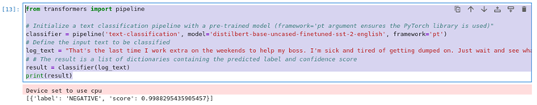

# 1.1.8 Transformers

**Transformers** are neural network architectures that excel at processing and analyzing sequences of data by focusing on the connections between different pieces of information in a sequence, such as how words in a sentence relate to each other, making them highly effective for natural language processing tasks like translation and summarization. In the context of cybersecurity, transformers play an increasingly important role in analyzing textual data for threat intelligence, identifying suspicious patterns in logs and emails, and even classifying malicious content.

Transformers can be used to parse and analyze threat reports, detect phishing attempts, and help automate the analysis of incident response reports by extracting relevant,unstructured text. Furthermore, transformers can improve **User and Entity Behavior Analytics (UEBA)** by analyzing sequences of user activity to identify indicate insider threats or compromised accounts. This capacity to understand context and event relationships makes transformers a vital technology for SOC analysts, threat hunters, and security researchers.

## Practical Example: The DistilBERT Model

**The DistilBERT model** is a simple sentiment classification model that only produces the labels "negative" and "positive." For more complex security log analysis tasks, a more sophisticated model capable of performing anomaly detection, event classification, and threat labeling would be more suitable. The following example is intended to illustrate how AI can be useful to quickly discern sentiment while avoiding the complex code required for more sophisticated analysis of real security log data.

```
from transformers import pipeline

# Initialize a text classification pipeline with a pre-trained model (framework='pt' argument ensures the PyTorch library is used) 
classifier = pipeline('text-classification', model='distilbert-base-uncased-finetuned-sst-2-english', framework='pt')

# Define the input text to be classified
log_text = "That's the last time I work extra on the weekends to help my boss. I'm sick and tired of getting dumped on. Just wait and see what happens this weekend, this place is in for a surprize"

# The result is a list of dictionaries containing the predicted label and confidence score
result = classifier(log_text)
print(result)
```

| Text Classification using the Transformers Library |
|:--:|
|  |
| *A screenshot of a code using the transformers library for text classification.* |


**Label 'NEGATIVE'**
The model predicts that the sentiment of the input text is negative. In the context of the distilbert-base-uncased-finetuned-sst-2-english model, "NEGATIVE" indicates that the text expresses unfavorable, unpleasant, or critical emotions. Phrases like "I'm sick and tired," "getting dumped on," and "just wait and see what happens" convey frustration, anger, and dissatisfaction. These strongly negative expressions lead the model to classify the text as "NEGATIVE."

**Score 0.999**
This is the confidence score, ranging from 0 to 1, representing the model's certainty in its prediction. A score of 0.999 means the model is 99.9% confident that the text's sentiment is negative. The high confidence reflects the clear negative tone of the input, with strong emotional cues like "sick and tired" and the implied threat of "this place is in for a surprise."