# 1.2.15 Live Lab: Prompt Design and Optimization

## Scenario
This lab guides participants through hands-on prompt engineering with a focus on cybersecurity threat analysis using real-world CVE (Common Vulnerabilities and Exposures) datasets. You'll progressively develop your understanding and skill in crafting prompts for AI analysis, learning to extract actionable threat intelligence, monitor and optimize LLM usage, and integrate best practices for secure and cost-effective deployment.

This lab is structured to guide participants through a hands-on exploration of prompt engineering techniques applied to cybersecurity use cases. The steps are designed to build foundational skills, practice prompt engineering in key cybersecurity areas, and advance to more complex tasks like analyzing CVE datasets and optimizing AI performance.

> [!NOTE]
> **The Mission**:
> - Upload and preprocess a CVE dataset.
> - Practice zero-shot, one-shot, and few-shot prompting methods to investigate CVEs.
> - Develop system prompts that instruct the LLM to produce concise, actionable summaries.
> - Monitor and interpret key metrics for your LLM, optimizing operational efficiency.
> - Optimize the LLM to balance cost, latency, and response quality for scalable operations.

## Exam Objectives
This activity is designed to test your understanding of and ability to apply content examples in the following CompTIA SecAI+ objectives:

- 1.1 Compare and contrast various AI types and techniques within the context of cybersecurity.

---

## Upload and Preprocess a dataset
In this task, you'll upload a dataset of Common Vulnerabilities and Exposures (CVEs) and prepare it for analysis. You'll also check the data for any Personally Identifiable Information (PII) and learn how to apply anonymization strategies to keep the dataset secure and compliant.

| Data Storage Container creation|
|:--:|
| 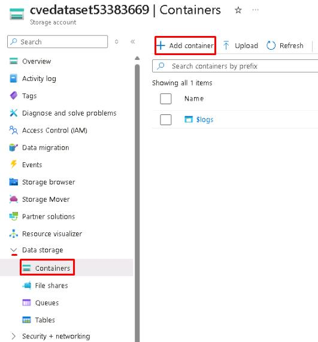 |

| Uploading cve.txt to Azure |
|:--:|
| 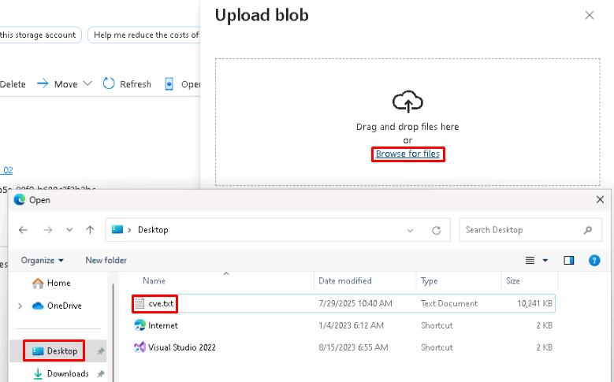 |

| Check cve-indexer was created |
|:--:|
| 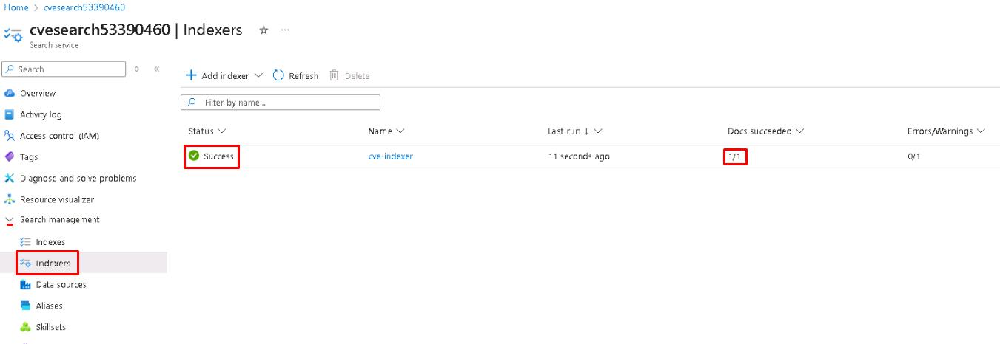 |

| Applying more settings for the cve-index |
|:--:|
| 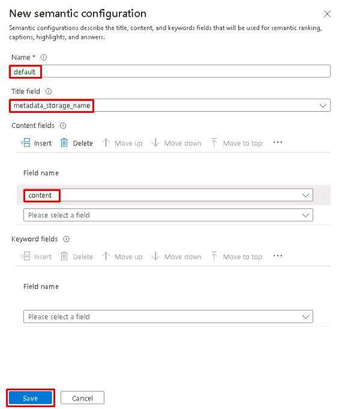 |

> [!NOTE]
> By creating an Azure AI Search index and indexer, we let Azure automatically split the large CVE dataset into manageable chunks during ingestion. This bypasses the default 512 KB per-document limit that applies to direct Playground uploads, ensuring the entire file can be indexed and queried without manual splitting.

| Adding the cve-index data source into Microsoft Foundry |
|:--:|
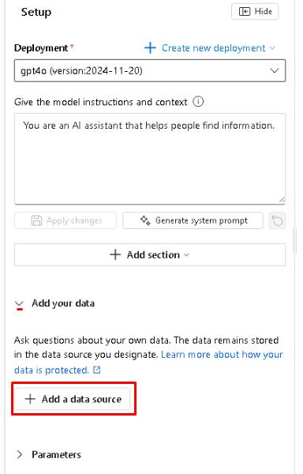 |
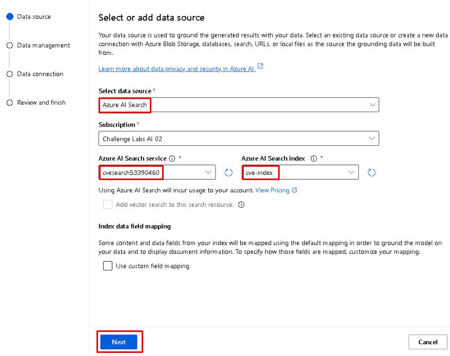 |
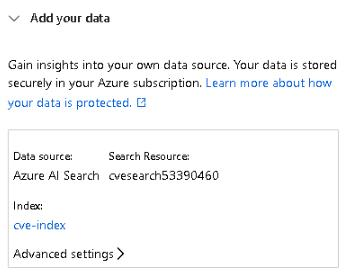 |

> [!NOTE]
> Retrieval-Augmented Generation (RAG) combines search with generation so the model can answer using your indexed CVE data rather than relying only on pretraining. When you connect Azure AI Search to the Chat Playground, your query is used to pull the most relevant chunks from the index, and those chunks are passed into the model's context. The result is that responses are grounded in your dataset, making them more accurate, current, and relevant.

---

## Prompt Engineering Techniques
In this task, you'll practice prompt engineering techniques to extract actionable insights from the CVE dataset. By experimenting with different prompt styles and structures, you'll learn how to guide the AI in analyzing vulnerabilities, prioritizing risks, and generating cybersecurity recommendations based on the indexed data.

| Advanced settings |
|:--:|
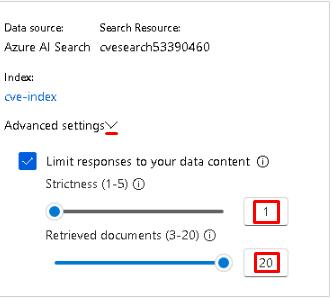 |

> [!NOTE]
> **Strictness** controls how tightly the AI ranks and filters results from the index.
> - Higher strictness returns only the most confident matches but risks excluding relevant chunks.
> - Lower strictness widens the scope and includes more possible matches.

> [!NOTE]
> **Retrieved documents** defines how many chunks of data the AI can pull from the index for each query.
> - Increasing this value gives the model more context to work with, which is especially useful for large datasets with many short entries.

| AI Response |
|:--:|
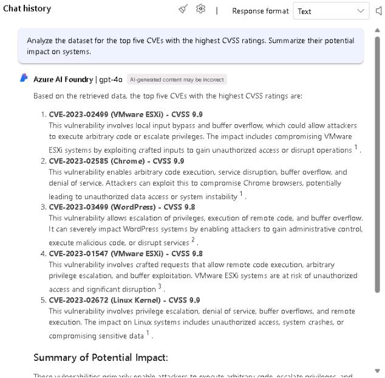 |

> [!NOTE]
> Prompt engineering can guide AI to quickly identify patterns and risks in vulnerability data. For threat analysis, well-phrased questions help the model surface critical issues and suggest mitigation strategies from complex datasets.

| AI Response2 |
|:--:|
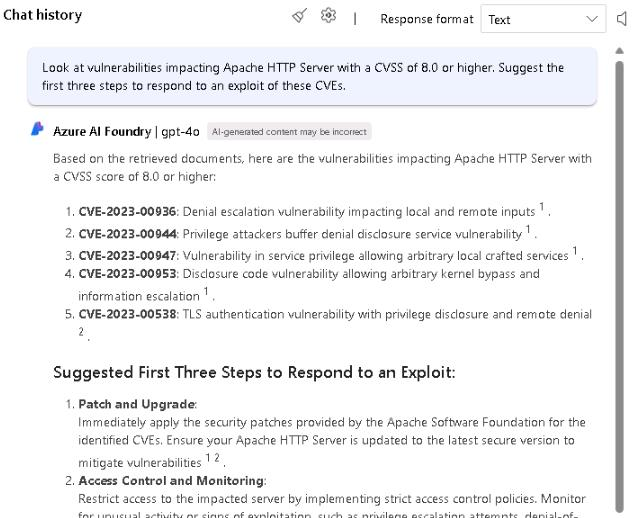 |

> [!NOTE]
> AI can assist with planning and decision-making during security incidents. Clear, structured prompts help the model generate actionable response steps aligned with the specific vulnerabilities or systems at risk.

| AI Response3 |
|:--:|
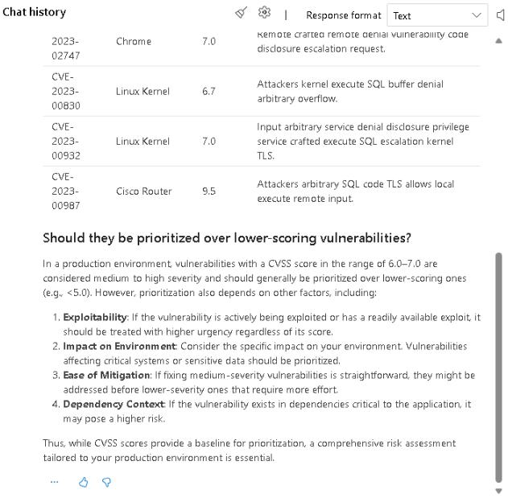 |

> [!NOTE]
> Using clear prioritization cues in prompts helps the AI focus on ranking and risk assessment. Structured prompts like this are valuable when guiding the model to make decisions based on severity or business impact.

| AI Response4 |
|:--:|
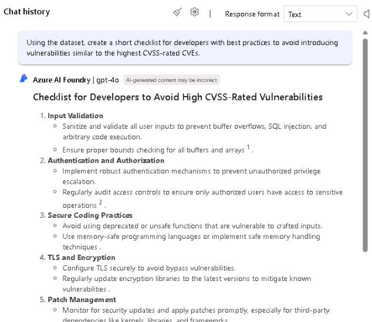 |

> [!NOTE]
> Prompts that specify tone or output style demonstrate how even small adjustments can tailor content to different audiences. This shows the value of prompt engineering for communication-focused tasks.

---

## Monitoring the LLM
In this section, you'll learn how to monitor your Azure OpenAI instance to track performance and usage. By reviewing key metrics like API calls, latency, and token consumption, you can understand how the service is being used and identify areas to improve efficiency.

| AI Usage Metrics |
|:--:|
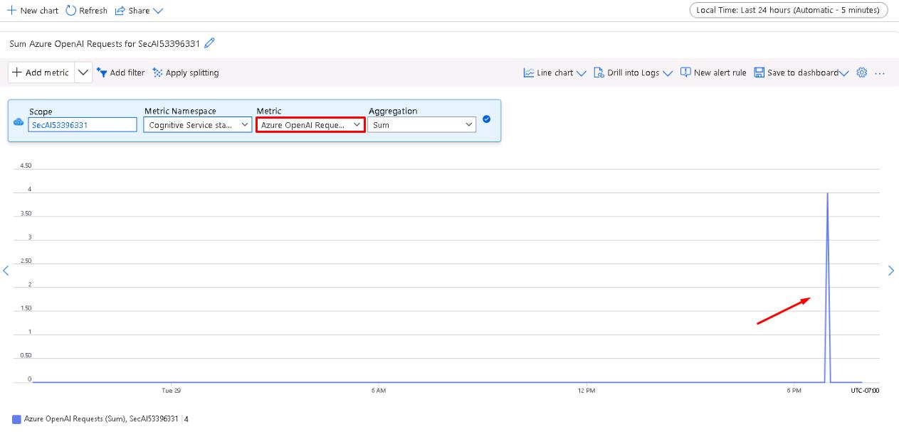 |

> [!NOTE]
> This metric shows the total number of requests made to the service over time. You should see a single spike indicating the prompts you ran earlier.

| AI Usage Metrics2 |
|:--:|
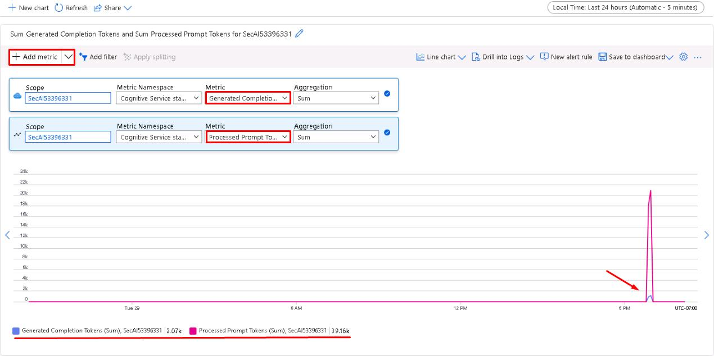 |

> [!NOTE]
> This will overlay a second metric on top of the first one. **Generated Completion Tokens** measures the size of the model's output, while **Processed Prompt Tokens** measures the size of the input you send to the model. Together, they show how prompt length and response length drive overall token usage and cost.

| AI Usage Metrics3 |
|:--:|
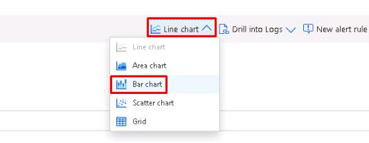 |
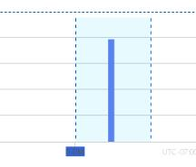 |
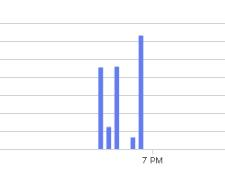 |
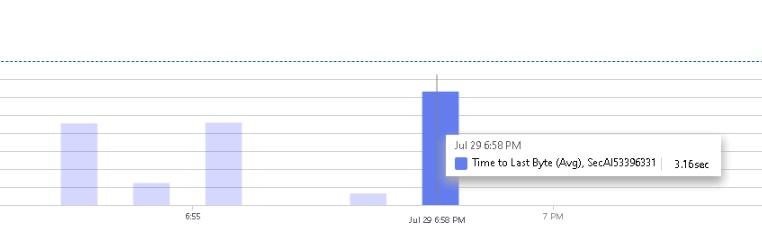 |

> [!NOTE]
> Monitoring API calls, latency, and token usage helps track performance and cost drivers. These metrics are critical for scaling and optimizing AI workloads.

---

## Optimizing the LLM
In this section, you'll focus on optimizing cost and performance for your AI service. You'll compare different model configurations and use token limits to balance response quality with resource usage, helping you keep the service both effective and cost-efficient.

| Deploying gpt-4.1-mini |
|:--:|
 |

> [!NOTE]
> Smaller models like GPT4.1mini can handle less complex tasks at a lower cost per token, making them a good choice for routine queries.

| Changing chat model to gpt-4.1-mini |
|:--:|
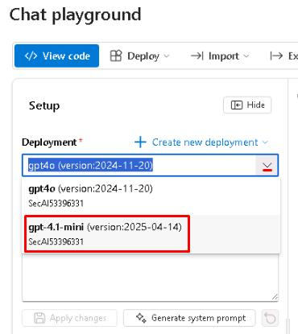 |
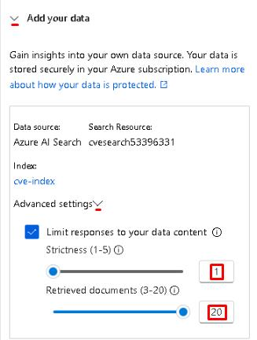 |

| AI response (gpt-4.1-mini) |
|:--:|
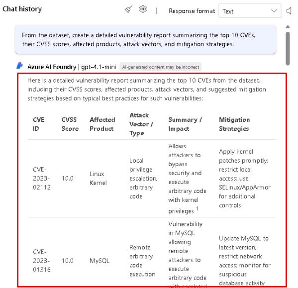 |

| AI response (gpt-4o) |
|:--:|
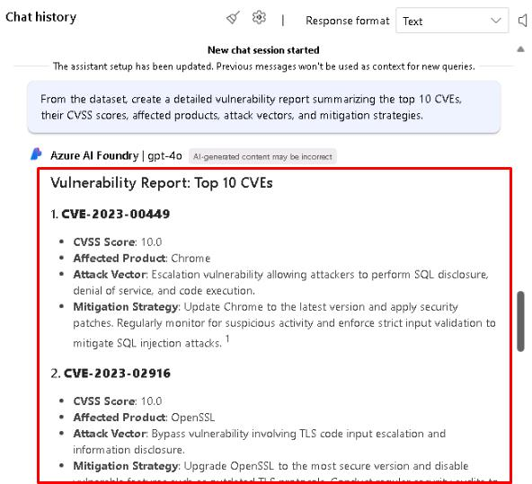 |

| AI response metrics |
|:--:|
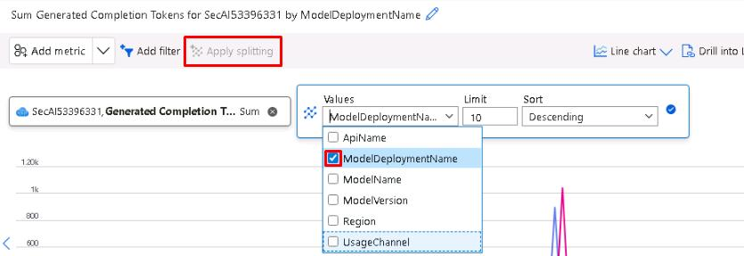 |
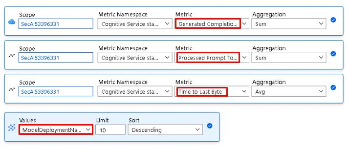 |
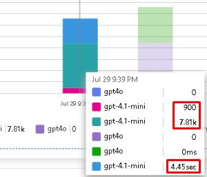 |
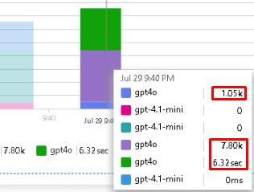 |

> [!NOTE]
> The metrics may vary, but in general GPT-4.1 Mini should use fewer completion tokens and have a lower latency than GPT-4o. Comparing models and token usage side-by-side helps balance cost efficiency with the level of detail and accuracy needed for your use case.

> [!NOTE]
> Reducing the maximum response tokens from 1,000 to 200 limits how much text the model can generate in each call. This applies to both GPT4o and GPT4.1 Mini and helps control costs by capping token usage regardless of which model is used. Setting a lower max token value is a simple but effective optimization strategy, especially for tasks where shorter, more focused answers are sufficient.
