# 1.3.4 Live Lab: Examine RAG Solutions

## Scenario
Retrieval-Augmented Generation (RAG) is a technique that combines the reasoning ability of language models with the precision of external knowledge sources. Instead of relying only on the model's internal training data, RAG systems pull in relevant chunks of documents at query time, grounding answers in up-to-date or domain-specific context.

In this lab, you'll practice how retrieval settings like chunk size, overlap, and Top-K affect results, why large documents can overwhelm a model's context window, and how a pipeline approach with LlamaIndex offers more flexibility than the built-in OpenWebUI RAG. By the end, you'll understand not just how to configure RAG, but also its strengths, limitations, and tradeoffs.

> [!NOTE]
> **The Mission**:
> - Learn about model context limits and full document retrieval.
> - Adjust chunk size, overlap, and retrieval parameters to see how these settings influence precision, recall, and overall answer quality.
> - Shift to the LlamaIndex pipeline and compare pipeline-based RAG to the built-in approach.
> - Add more files to the pipeline and query across a multi-document dataset.

## Exam Objectives
This activity is designed to test your understanding of and ability to apply content examples in the following CompTIA SecAI+ objectives:

- 1.2 Explain the importance of data security related to AI.

---

## Context Limits and Full Document Retrieval
Before diving into RAG tuning, you'll see what happens when a large document is sent directly into the model's context. This demonstrates the risk of relying on full-document retrieval.

| Adding data into the AI knowledge set |
|:--:|
| 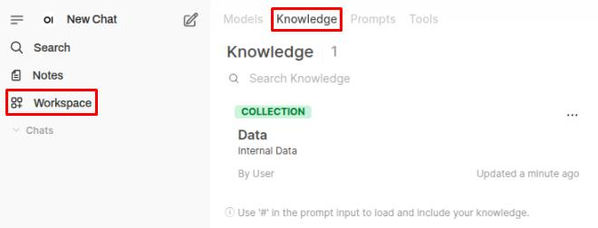 |
| 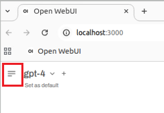 |
| 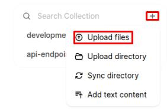 |
| 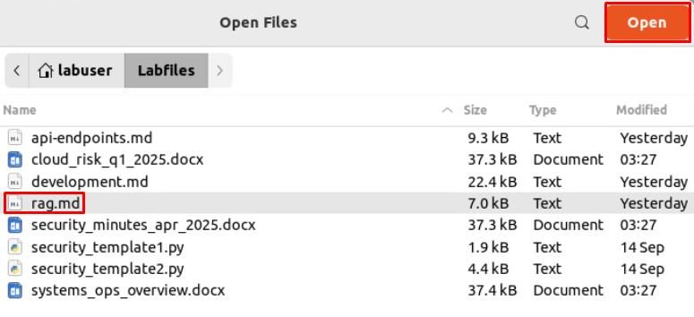 |
| 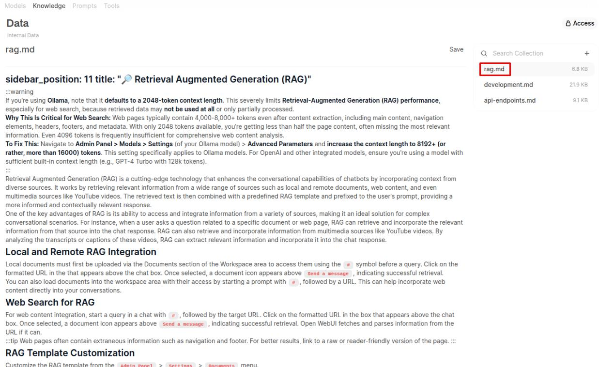 |

> [!NOTE]
> The rag.md file now in the Knowledge workspace displays the text as the model sees it after extraction. With full document retrieval, everything here is sent into the prompt at once. That means more tokens, more context space consumed, and more chance the model focuses on irrelevant parts instead of just what you asked for.

| Including rag.md into the chat prompt |
|:--:|
| 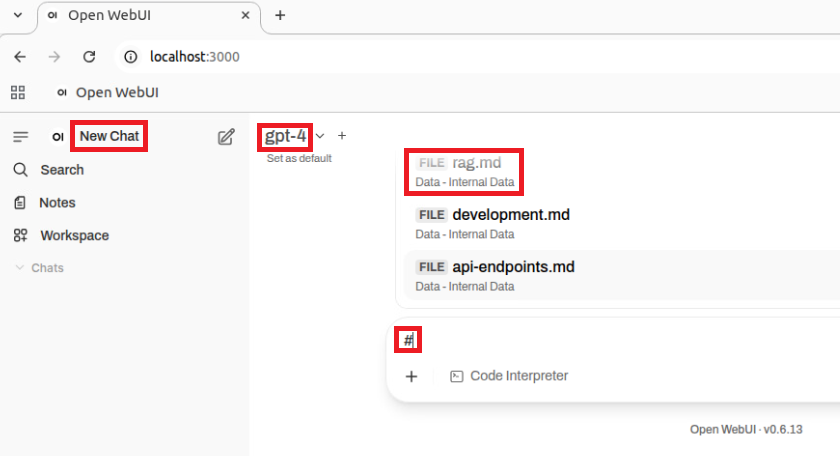 |
| 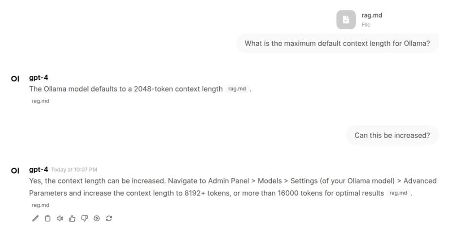 |

> [!NOTE]
> Each response will show the sources used to generate it. In this case, the rag.md entry below each of the responses indicates that it's the data source being used.

| Compare results |
|:--:|
| 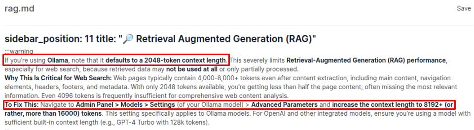 |
| 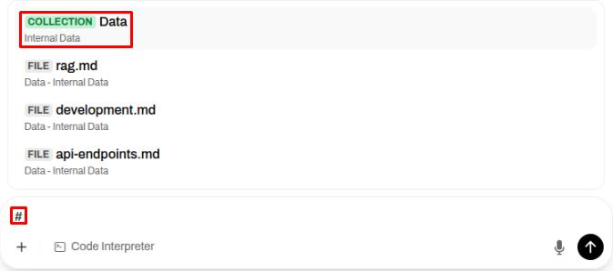 |

> [!NOTE]
> Prompting against the entire data collection lets you ask broader, comparative questions across multiple documents. Querying a single file keeps the scope narrow and precise. Together, these modes let you zoom out for trends or zoom in for detail, depending on the task.

| Compare results |
|:--:|
| 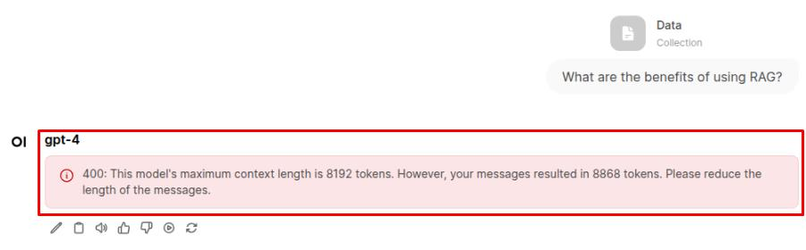 |

> [!WARNING]
> Full-doc retrieval quickly consumes the model's context window, especially with multiple files. Even if it doesn't error, huge prompts leave less room for your actual query and answer, forcing the model to drop or compress information. Chunking ensures only the most relevant parts of each file are included, keeping responses accurate and efficient.

---

## Chunking, Overlap, and Retrieval Settings
Full-doc retrieval showed the limits of dumping an entire file into context. Now you'll explore how RAG breaks documents into smaller "chunks" for retrieval. By adjusting chunk size, overlap, and retrieval parameters, you'll see how these settings change the balance between precision, completeness, and noise in the answers.

| Turning off full-doc retrieval |
|:--:|
| 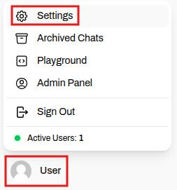 |
| 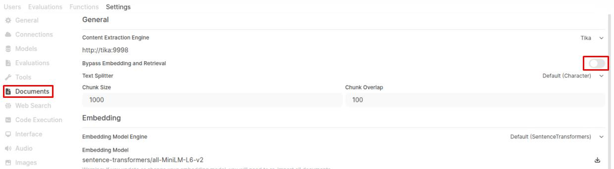 |

> [!NOTE]
> This disables full-doc retrieval and enables embedding and retrieval settings below.

| Error: No context |
|:--:|
| 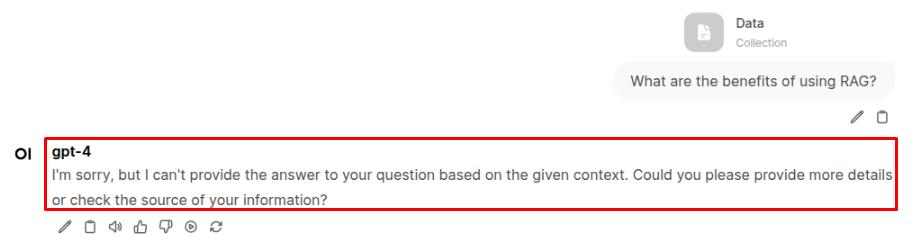 |

> [!NOTE]
Now that chunking is enabled, the data collection can be processed within the model's context limits. However, with the default settings (Chunk Size = 1000, Chunk Overlap = 100), the model still fails to return the information we're looking for - even though we know it's present in rag.md.

| Updating chunk size |
|:--:|
|  |

> [!NOTE]
> Chunk size controls how much text goes into each piece: larger values provide more context but risk pulling in irrelevant details, while smaller values are more precise but may fragment ideas. Overlap determines how much chunks share with each other: higher overlap keeps continuity between chunks but adds redundancy, while lower overlap is more efficient but can cut off context mid-thought.

| Re-upload of Data |
|:--:|
| 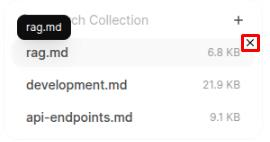 |
| 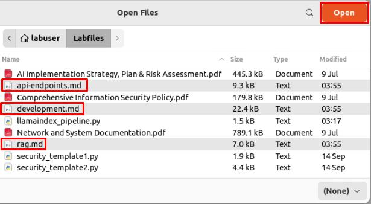 |

> [!NOTE]
> Chunk size and overlap control how a document is split into pieces during ingestion. Once a file is uploaded, those chunks are fixed. Changing the chunking settings doesn't retroactively rebuild them - so the files must be deleted and re-uploaded for the new settings to take effect.

| AI Response |
|:--:|
| 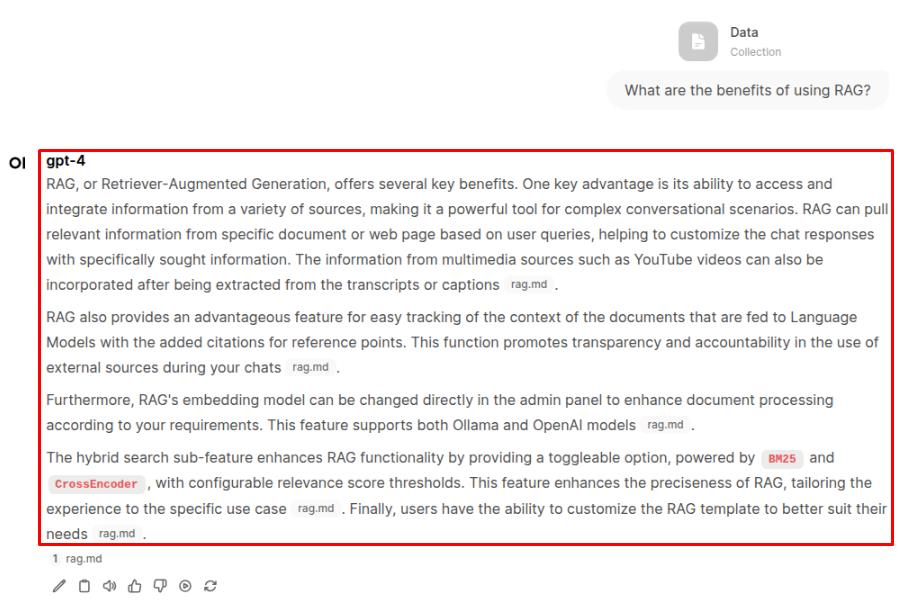 |

> [!NOTE]
> With the new chunking settings, the responses should now be much more accurate. Different file types and formats often benefit from different chunking configurations, so when applying RAG to your own data, some experimentation may be needed to find the settings that work best.

| AI Response Error |
|:--:|
| 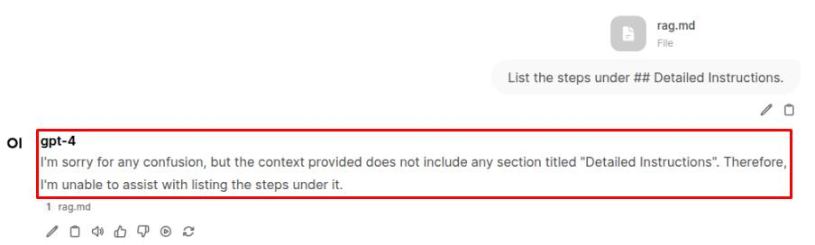 |
| 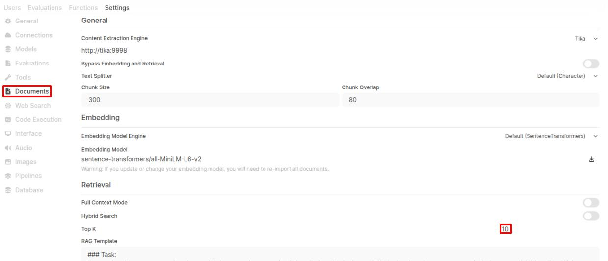 |

> [!NOTE]
> Because Top-K is a retrieval setting, files don't need to be re-uploaded when it's changed. This option affects how many chunks are pulled at query time, not how the data is stored during upload.

| AI Response |
|:--:|
| 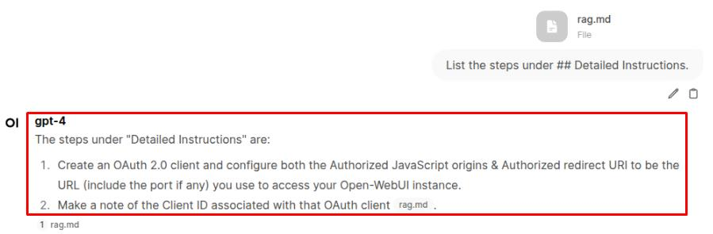 |

> [!NOTE]
> Increasing Top K helped retrieval find the right section by pulling in more chunks, but because the chunk size is still very small (300 with overlap 80), each chunk only contains a sliver of the text. That's why the answer is still incomplete - the model can see where the information is, but not enough of it at once.

| AI Response |
|:--:|
| 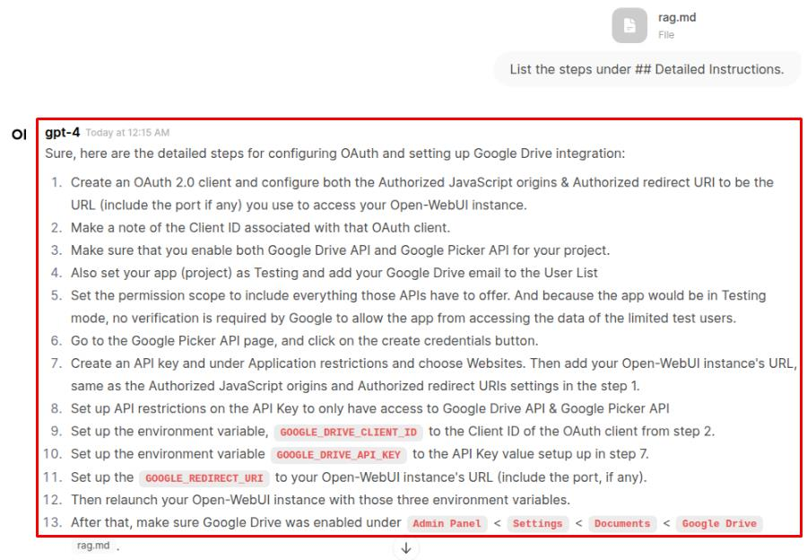 |

> [!NOTE]
> With the larger chunk size and overlap, the model should now return a more complete answer. You can verify its accuracy by viewing rag.md in the Data collection.

| rag.md instructions |
|:--:|
| 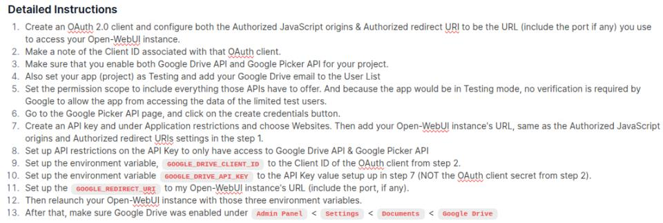 |

---

## Using the LlamaIndex Pipeline
You've seen how OpenWebUI's Knowledge tab handles chunking, overlap, and retrieval. Now, you'll try a different architecture: running Retrieval-Augmented Generation through a LlamaIndex pipeline. In this approach, the pipeline acts as a small server, responsible for ingesting, embedding, and retrieving documents, while OpenWebUI simply passes queries to it. This lets you treat RAG like a separate service that can be tuned, extended, or swapped out independently of the UI.

| rag.md instructions |
|:--:|
| 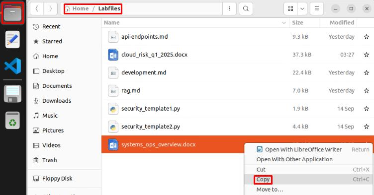 |
| 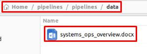 |

> [!NOTE]
> The pipeline is coded to watch this specific directory. When the server starts, it scans this folder for files to ingest, turning them into searchable vectors. To add or update data, place files in this folder, then start/restart the server so they can be indexed.

| Terminal play |
|:--:|
| 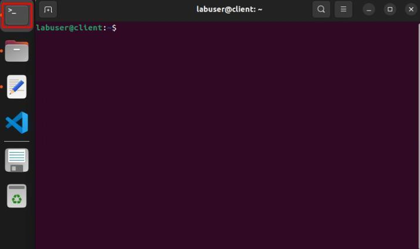 |

> [!NOTE]
> The start.sh script launches a small web server using Uvicorn, which runs the pipeline as an API service. When it starts, the pipeline scans the /data folder, ingests any files, and builds the search index. OpenWebUI then connects to this API (via the OpenAI-style endpoints Uvicorn exposes) to send your questions and receive grounded answers.

> [!WARNING]
> Wait until you see Uvicorn running on http://0.0.0.0:9099 before continuing.

| Using Uvicorn server |
|:--:|
| 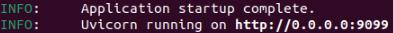 |
| 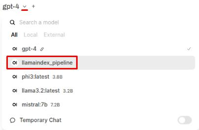 |

> [!NOTE]
> When the pipeline server is running, OpenWebUI shows llamaindex_pipeline as a model option.
> - This isn't a separate LLM - it's the pipeline service acting like one.
> - Behind the scenes, it uses HuggingFace embeddings to turn text into vectors and store them in an index, then queries your chosen LLM (here, Llama 3.2) to generate answers.
> - The combination gives you retrieval (via HuggingFace) and reasoning (via Llama 3.2) in a single selectable model.

| llamaindex response |
|:--:|
| 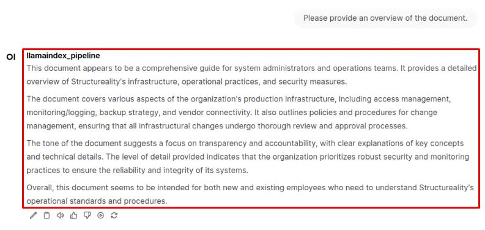 |
| 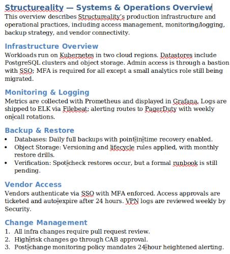 |
|  |
| 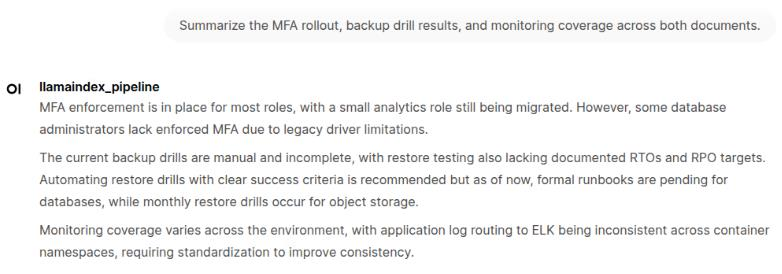 |

> [!NOTE]
The pipeline embeds your question, finds the most similar chunks from each indexed document, and feeds those slices to the LLM. You're seeing a synthesis built from multiple sources

| llamaindex response2 |
|:--:|
| 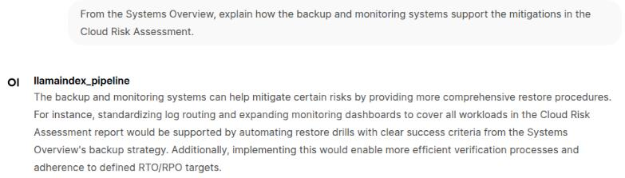 |

> [!NOTE]
> Retrieval pulls relevant chunks from each file and the LLM reasons over them together. The Systems Overview describes backup/monitoring capabilities, while the Risk Assessment lists mitigation needs. The model ties these together by using context from one doc to validate and explain the other.

| llamaindex response3 |
|:--:|
| 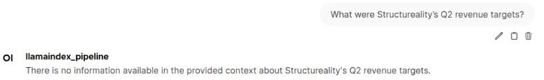 |

> [!NOTE]
> This pipeline only has access to the ingested documents, not external databases or financial systems. Since revenue targets aren't in the two docs, the model should reply that it doesn't have this information rather than invent numbers.

| llamaindex response4 |
|:--:|
| 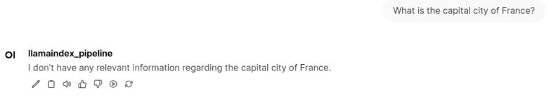 |

> [!NOTE]
> Pipelines like this don't reach the public internet or APIs. They can only answer from the vectorized context you've ingested. Pipelines aren't restricted to local documents, though. They can be configured to pull from other sources, such as APIs, databases, or streaming feeds, giving them the flexibility to include both private and public data in responses.