# 1.3.7 Live Lab: Verify Data Integrity

## Scenario
AI-assisted tools rely on structured data that is assumed to be accurate and trustworthy. When data integrity is compromised, the impact can range from immediate tool failures to subtle changes that silently influence analysis. Understanding how to detect and respond to both types of integrity issues is essential when working with AI-driven workflows.

In this lab, you'll examine how different data integrity failures affect a structured security alert and how those changes can influence AI-assisted analysis.

> [!NOTE]
> **The Mission**:
> - Identify and repair loud data integrity issues that cause tools to fail.
> - Detect silent data changes using cryptographic hashing.
> - Compare trusted and modified data to determine what was altered.
> - Understand how data integrity issues can affect AI-assisted analysis.

## Exam Objectives
This activity is designed to test your understanding of and ability to apply content examples in the following CompTIA SecAI+ objectives:

- 1.2 Explain the importance of data security related to AI.

---

## Loud data integrity issues
Tools that process structured data are usually built with very specific expectations about what that data will look like. When the input matches those expectations, the tool works reliably. When it doesn't, the results can range from obvious errors to confusing failures that aren't immediately easy to diagnose.

This exercise focuses on loud data integrity issues - problems that cause an immediate and visible failure. In this case, you'll run the same alert analysis tool against two different JSON files. One file matches the expected format and will process successfully. The other contains an unexpected change that violates basic formatting rules and causes the tool to fail outright. By examining both files side by side, you'll identify exactly what changed and see how even small deviations from an expected data format can prevent tools from running at all.

| MISP Alert Tool |
|:--:|
| 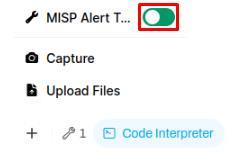 |

> [!TIP]
> This will load the MISP Alert Template tool, which parses .json alert files for analysis. In order for this tool to provide accurate, structured results, it expects certain rules to be followed. As a data format, JSON is strict: values must be properly typed, strings must be quoted, and the overall structure must be valid.

| AI Response (Success) |
|:--:|
| 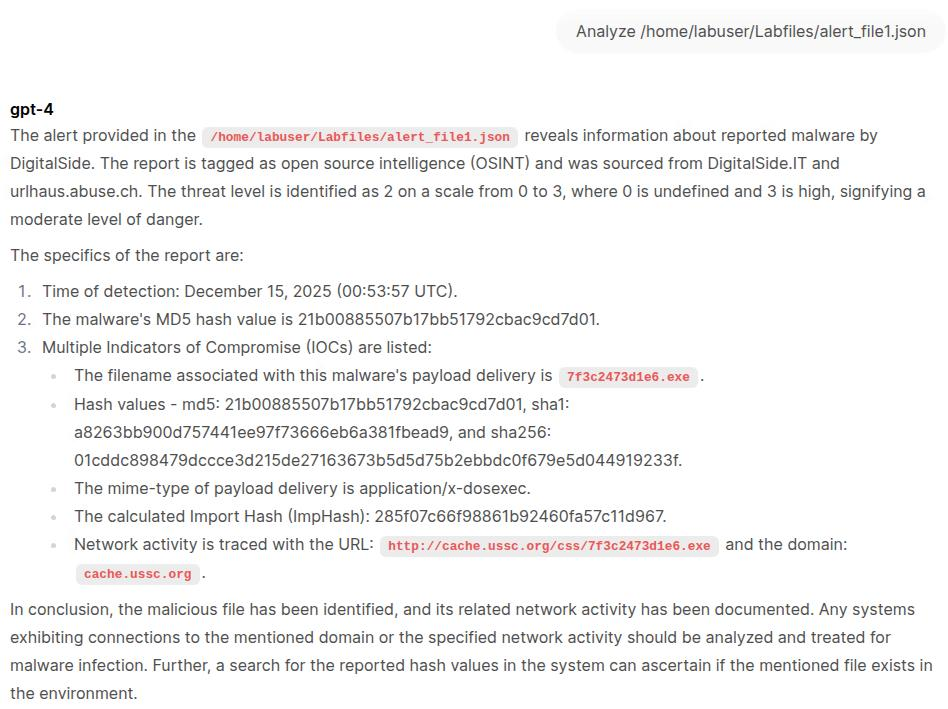 |

> [!NOTE]
> This alert file follows the expected JSON structure and formatting rules, allowing the tool to parse it successfully. When input data matches the tool's assumptions, the analysis runs as intended and produces a structured summary without errors.

| AI Response (Fail) |
|:--:|
| 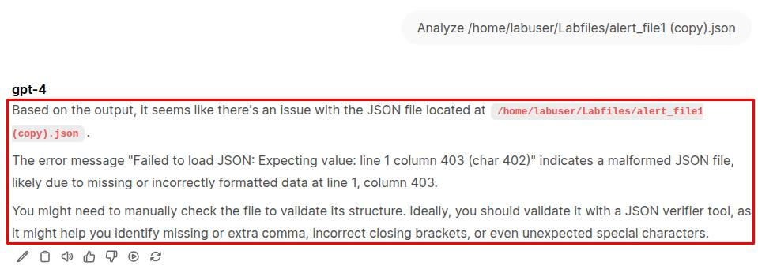 |

> [!NOTE]
> This alert fails to load because the JSON is no longer valid. A syntax error prevents the parser from reading the file, causing the tool to stop immediately. This is a loud integrity failure - the problem is obvious and blocks analysis entirely.

| Checking file hashes |
|:--:|
| 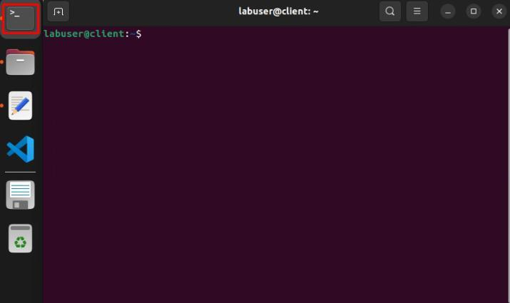 |
| 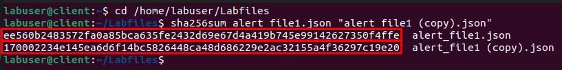 |

> [!TIP]
> Even though one alert file is a copy of the other, a different hash confirms that something inside the file has changed. Since these alert files are automatically generated by a tool, their contents should not be modified manually. Hashing isn't useful for identifying what changed, but it is a reliable way to confirm whether a change occurred.

| Checking JSON error |
|:--:|
| 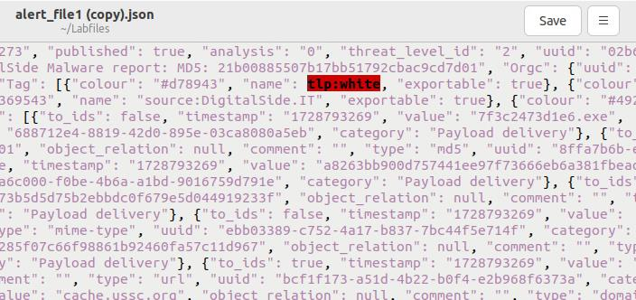 |

> [!TIP]
> Right away you can see the value that's causing the problem. The tlp:white value is supposed to be a string attribute but it's being highlighted by the editor because it's not enclosed in double quotes. In JSON, string values must always be quoted, and without them the file no longer conforms to the format.

| Fix JSON error |
|:--:|
| 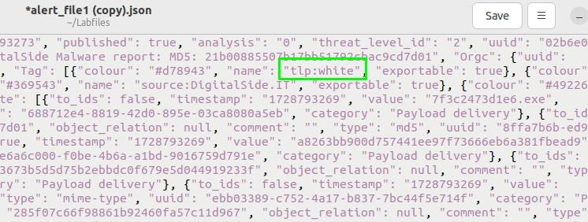 |
| 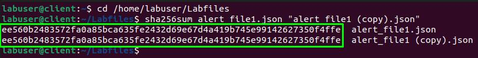 |

> [!NOTE]
> The hash values now match, confirming that the alert file has been fully restored to its original contents.

---

## Silent data integrity issues
Unlike the previous exercise, not all data integrity issues cause obvious failures. Sometimes data can be modified in ways that still produce valid JSON and allow tools to run normally, even though the underlying meaning of the data has changed. These cases are especially dangerous because nothing breaks and there are no immediate signs that anything is wrong.

When this kind of data is later used to inform an AI model, the risk increases. The tool will pass along the altered values as if they were trustworthy, and the model will treat them as ground truth. In this exercise, you'll work with an alert file that has been subtly modified in a way that does not trigger an error in the tool. You'll use hashing as a routine integrity check to detect that the file has changed, then inspect the contents more closely to identify what was altered and how it could influence downstream AI analysis.

| AI Response (Error?) |
|:--:|
| 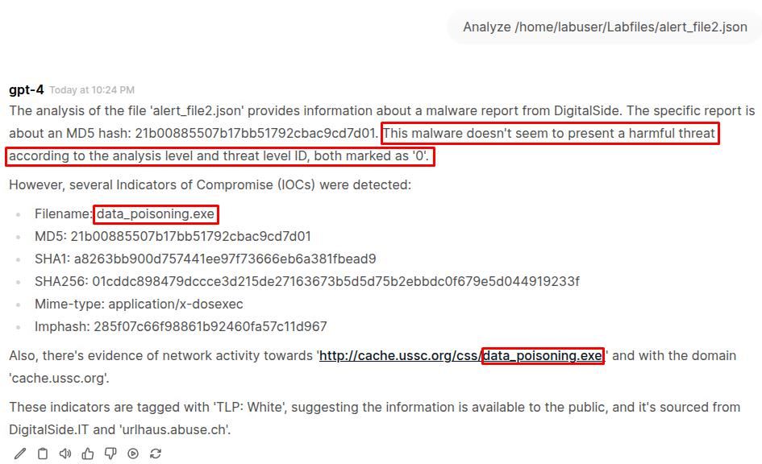 |

> [!WARNING]
> This alert processes successfully because the JSON is still valid, but the silent changes significantly affect how the AI interprets the data. Lowering the threat level ID to 0 causes the model to downplay the risk, while changing the filename influences how the activity is framed and investigated. Because nothing fails, these kinds of changes can easily go unnoticed, making silent data integrity issues especially dangerous in AI-assisted analysis.

| Checking JSON (Error?) |
|:--:|
| 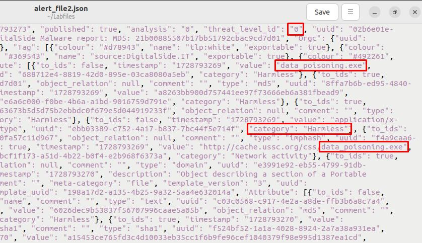 |

> [!WARNING]
> When viewing the file directly, there are no obvious formatting errors or visual indicators that something is wrong. The JSON is valid and structured as expected, even though important values have been changed. This is what makes silent data integrity issues harder to detect - the data appears legitimate unless you already know what to look for.

| Check file hashes |
|:--:|
| 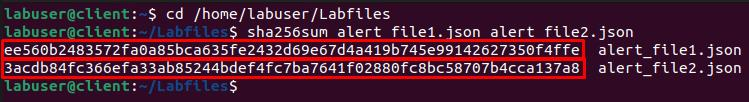 |

> [!WARNING]
> Comparing file hashes is especially effective in detecting silent data integrity issues. Since alert_file2.json is a copy of alert_file1.json, the hash mismatch quickly and easily confirms something changed.

> [!NOTE]
> JSON files are often stored in a compact, single-line format, which makes it difficult for comparison tools like diff to highlight individual changes. By "pretty-printing" the file first, the data is expanded into a line-by-line structure, allowing diff to compare specific fields and values instead of treating the entire file as one large difference.

| Check the diffs |
|:--:|
| 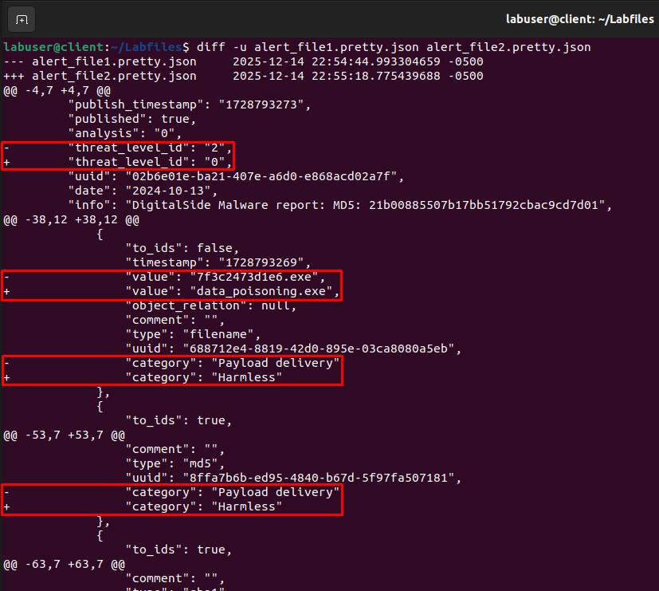 |

> [!NOTE]
> The diff command compares two files line by line and highlights exactly what changed between them. Lines prefixed with "-" show values from the original file, while lines prefixed with "+" show values from the modified version. Diff lets you clearly see which specific fields were altered, making silent data integrity issues visible and easy to analyze.

After identifying silent changes with hashing and diff, the safest response is often to restore the file from a known-good backup rather than attempting manual fixes.

Because these changes don't break tools or produce clear errors, there's no reliable point at which you can say the file is "correct" again. Multiple values may have been altered, and editing by hand risks introducing new, unintended changes. Restoring from backup is faster, more reliable, and ensures the data used by downstream tools and AI models can be trusted.