# 2.1.9 Live Lab: Apply a Threat Modeling Framework to AI

## Scenario
In this lab, you'll learn how to identify and describe potential security threats in AI systems before they cause harm. You'll explore how threat modeling provides a structured way to think about risks-what could go wrong, why it might happen, and how to reduce the chance of it happening again.

You'll begin with open-ended discovery to identify risks in autonomous or semi-autonomous AI systems. Then, you'll apply a modern threat-modeling framework tailored for AI agents to structure those risks into clear, repeatable scenarios.

> [!NOTE]
> **The Mission**:
> - Identify potential threats in AI systems that operate independently.
> - Learn how threat modeling organizes risks into patterns and scenarios.
> - Compare freeform discovery against a standardized threat-model format.
> - Use the Threat Intel RAG pipeline to automate threat modeling with the MAESTRO framework.

## Exam Objectives
This activity is designed to test your understanding of and ability to apply content examples in the following CompTIA SecAI+ objectives:

- 2.1 Given a scenario, use AI threat-modeling resources.

---

## Identify AI System Risks

> [!NOTE]
> Before you start building a formal threat model, it helps to understand how an AI system can fail at different levels.
> - **CSA's MAESTRO framework** breaks the layers down from the core model that generates responses to the wider ecosystem where multiple agents interact.

In this exercise, you'll move through each of the seven layers, using the model to explore how problems might appear at that level.

| Identify AI System Risks |
|:--:|
| 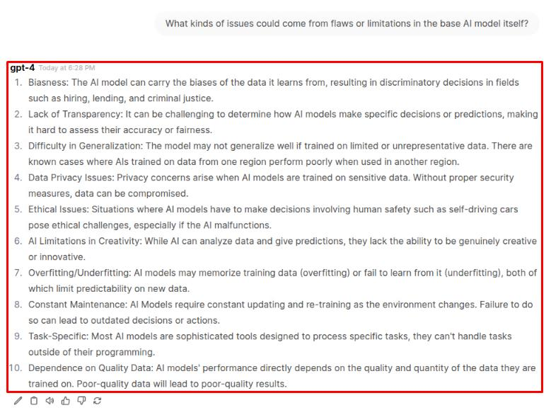 |

> [!NOTE]
> The **Foundation Models** layer is where intelligence begins. Here, hidden bias, poisoned training data, unsafe updates, or proprietary model leaks can ripple upward into every other layer.

| Identify AI System Risks 02 |
|:--:|
| 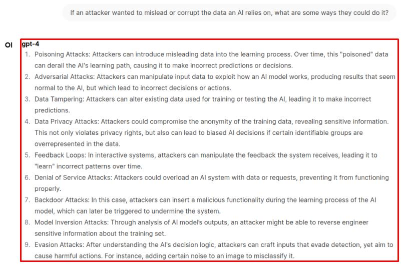 |

> [!NOTE]
> **Data Operations** covers everything the agent reads or remembers - from logs to vector stores. Unverified or poisoned data can twist an otherwise safe model into making dangerous choices.

| Identify AI System Risks 03 |
|:--:|
| 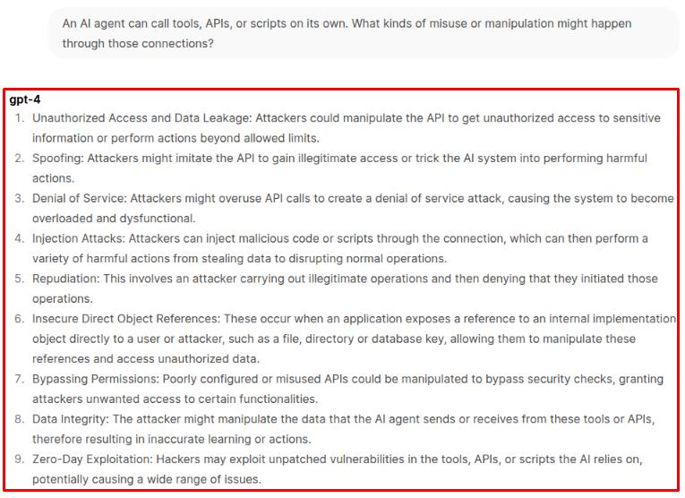 |

> [!NOTE]
> The **Agent Frameworks** layer defines how intent turns into action. Prompt injections, plugin abuse, and dependency hijacking are all common threats here.

| Identify AI System Risks 04 |
|:--:|
| 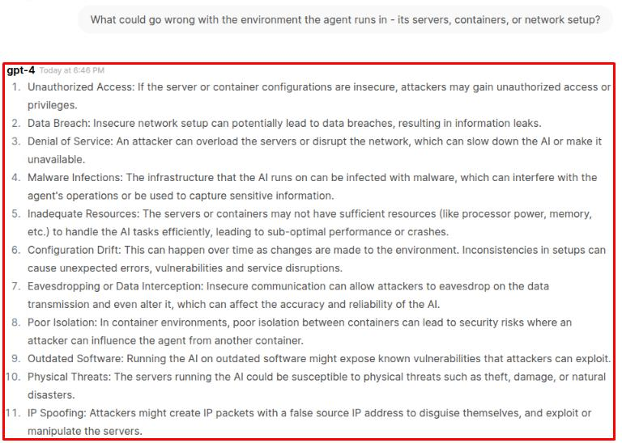 |

> [!NOTE]
> The **Deployment and Infrastructure** layer is where traditional IT meets AI. Weak access controls, exposed APIs, or compromised environments can give attackers indirect control over the agent itself.

| Identify AI System Risks 05 |
|:--:|
| 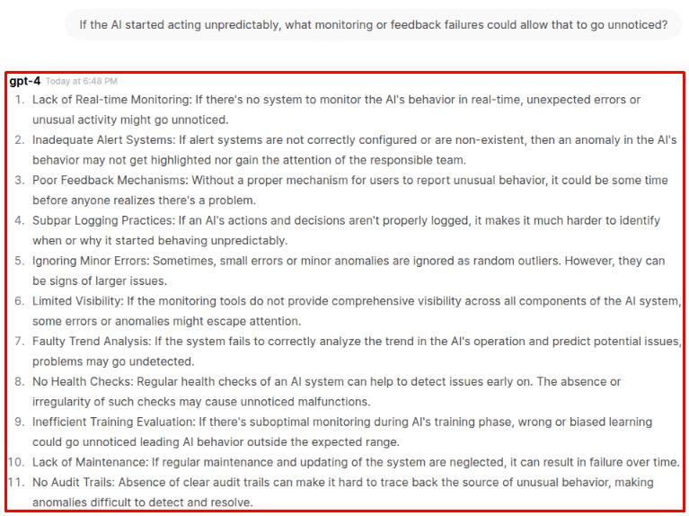 |

> [!TIP]
> Layer 5 is **Evaluation and Observability**. Without visibility - logs, metrics, or audits - bad behavior can persist indefinitely. MAESTRO stresses that you can't secure what you can't observe.

| Identify AI System Risks 06 |
|:--:|
| 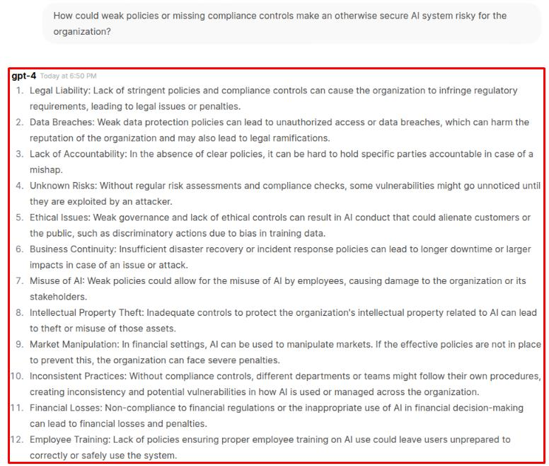 |

> [!TIP]
> Even well-built systems can fail compliance or data-protection rules. The **Security and Compliance** layer ensures technical security translates into organizational safety.

| Identify AI System Risks 07 |
|:--:|
| 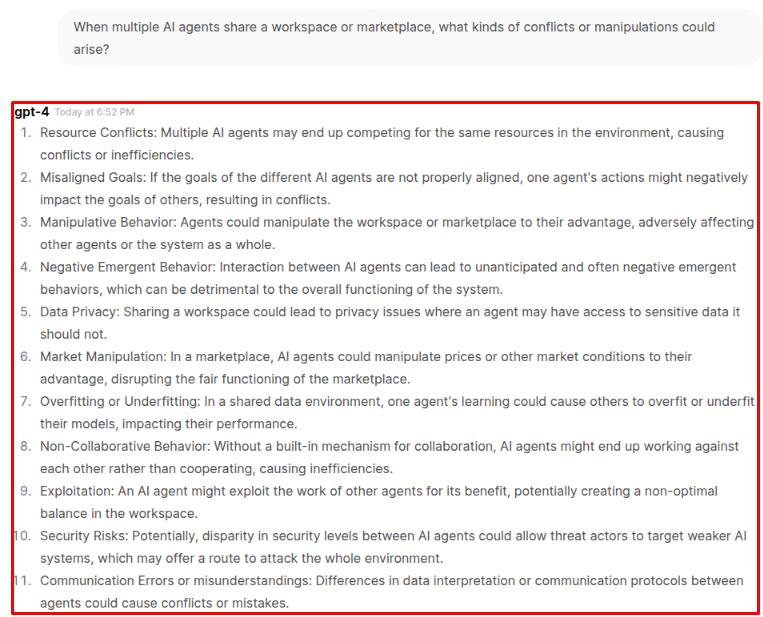 |

> [!TIP]
> The **Agent Ecosystem** is the outermost layer - the social space of agents. Collusion, misinformation loops, and untrusted integrations all live here.

When you look back over the seven layers of ***MAESTRO***, you should see how each one stacks on the next:

- **Foundation Models** define how an AI system thinks.
- **Data Operations** control what it knows.
- **Agent Frameworks** shape how it acts.
- **Deployment & Infrastructure** decide where it runs.
- **Evaluation & Observability** show how we measure and correct it.
- **Security & Compliance** determine who is responsible.
- **Agent Ecosystem** governs how it behaves among others.

Together, these layers form a map of AI-specific risk - one that goes beyond servers, networks, and users to include reasoning, autonomy, and collaboration between agents. Traditional frameworks like ***STRIDE*** or ***MITRE ATT&CK*** don't yet fully capture these new surfaces; ***MAESTRO*** helps fill that gap by mapping emergent and agentic threats through a structure security teams already understand.

> [!TIP]
> ***MAESTRO*** is developed by the Cloud Security Alliance (CSA), which publishes ongoing updates and applied examples. More information can be found at https://cloudsecurityalliance.org.

---

## Apply a Threat Modeling Framework to AI
Applying a threat modeling framework to AI systems means identifying how data, tools, and model behavior could be misused or manipulated, not just how software might be exploited. This shifts the focus from traditional vulnerabilities to risks like overexposure of data, misuse of tool access, and untrusted or attacker-controlled inputs influencing AI decisions.

| Apply some Threat Modeling |
|:--:|
| 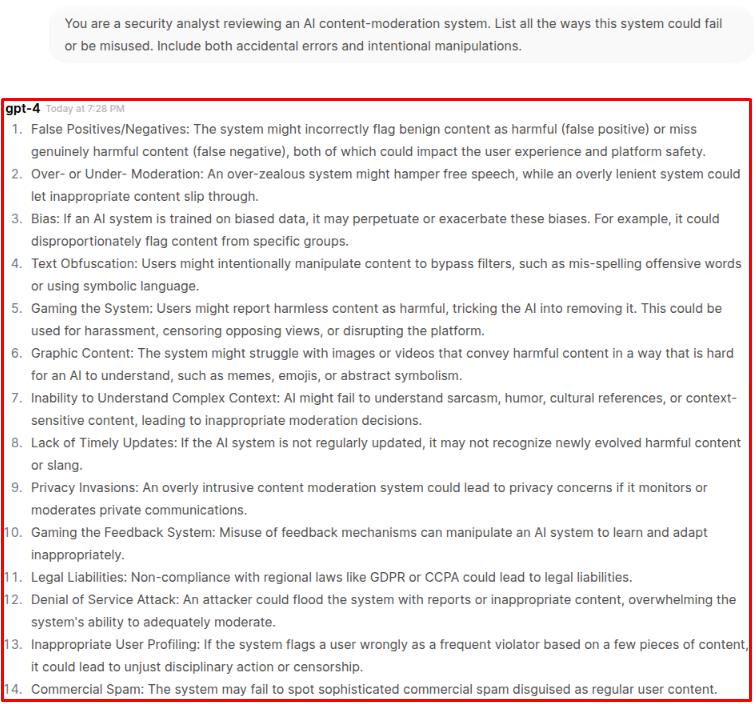 |

> [!NOTE]
> Unstructured prompting lets the model think freely-but the results often overlap, skip entire domains (like infrastructure or observability), or mix system flaws with user behavior.

| Apply some Threat Modeling 02 |
|:--:|
| 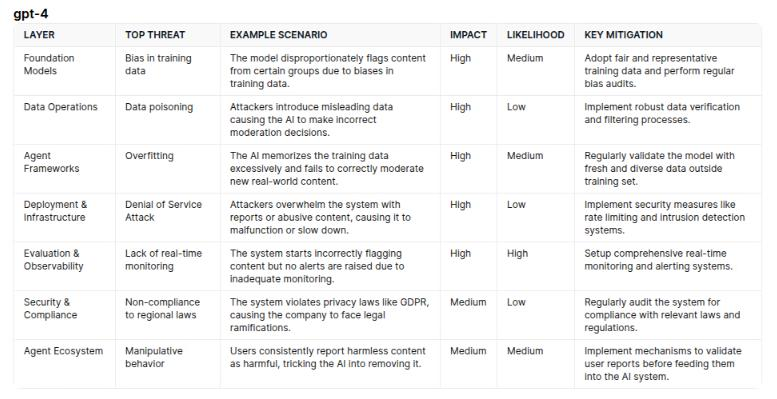 |

> [!NOTE]
> By introducing a framework, the same model now must think systematically. Instead of random risks, you get coverage across data, tooling, infrastructure, and governance-each tied to specific mitigations.

> [!NOTE]
> One effective way to prioritize threats is through consolidation - if a single underlying issue contributes to multiple threats across different layers, address that issue first.

> [!NOTE]
> Not all AI threats come from attackers. Some are emergent risks-failures caused by the model's own behavior or design-while others are adversarial, triggered by deliberate manipulation. Distinguishing the two helps analysts choose the right defenses: emergent risks need better design and monitoring, while adversarial ones require stronger controls and validation.

---

## Threat Modeling through Automation
So far, you've explored threat modeling concepts and applied structured prompts directly through GPT-4. Those steps built the foundation - helping you see how a model can reason through AI system risks using the ***MAESTRO framework***.

Now, you'll shift to using the ***Threat Intel RAG pipeline*** - the same one introduced in the previous lab - but with a new focus and system prompt tailored for AI threat modeling. The core workflow hasn't changed: the pipeline still retrieves information from web sources, indexes it, and queries an LLM for analysis. What's different here is that it now combines multiple capabilities you've practiced across previous labs into a single, automated process.

This version of the pipeline can:

Use the ***MAESTRO framework*** automatically in every response.
Combine retrieval, structured prompting, and synthesis in one step.
Reference live, authoritative sources and integrate them into a consistent output format.
In short, this exercise shows how the same structured reasoning you practiced manually can now be operationalized through automation - giving you a scalable, repeatable way to perform AI-specific threat modeling with minimal setup.

| Threat Modeling through Automation |
|:--:|
|  |

> [!WARNING]
> Wait until you see **Application startup complete** before continuing.
> 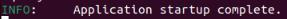

| Threat Modeling through Automation 02 |
|:--:|
|  |
| 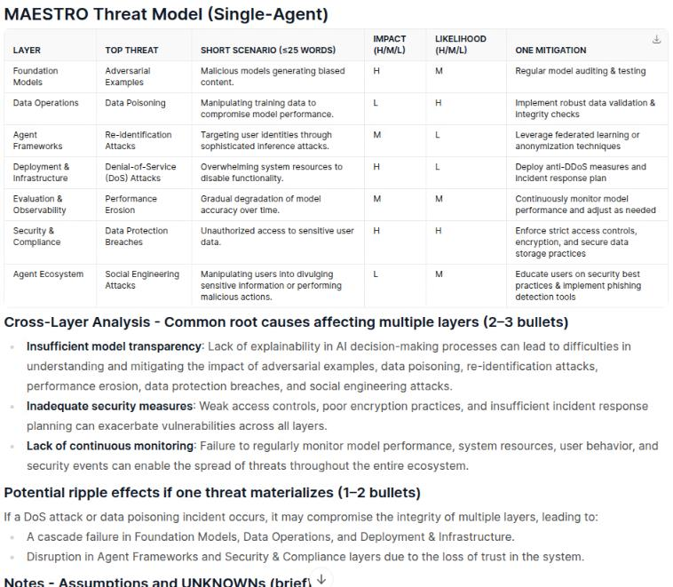 |

> [!NOTE]
> The ***MAESTRO framework*** structures AI risks across seven layers, linking technical flaws to broader ecosystem effects. Running it through the RAG pipeline adds depth and traceability-each analysis is grounded in live, authoritative sources, making the process both structured and verifiable.

> [!NOTE]
> The ***MAESTRO-enabled RAG pipeline*** can model any AI scenario you give it. Whether it's a voice assistant, medical AI, or autonomous vehicle, the pipeline applies the same framework, format, and structure automatically-making comparisons easy and outputs consistent across use cases.

| Threat Modeling through Automation 03 |
|:--:|
| 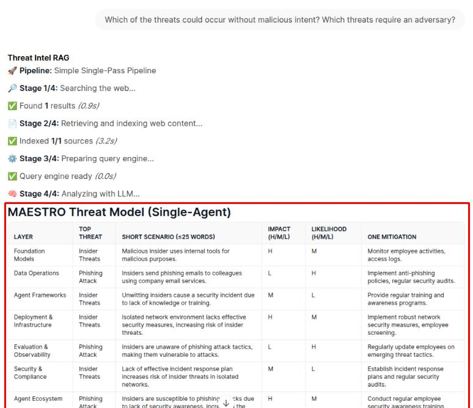 |

> [!NOTE]
> Follow-up questions don't work well in this pipeline because every new input is treated as a fresh analysis request, not a continuation of the last one. The fixed MAESTRO system prompt forces the model to rebuild a full framework table each time, which preserves structure and consistency-but prevents conversational back-and-forth reasoning.

Chatting with a model is ideal for discovery-it's flexible, exploratory, and good for brainstorming or testing ideas. But automation tools like the MAESTRO RAG pipeline prioritize consistency and repeatability. Each run enforces the same structure, format, and analysis rules, producing standardized outputs you can trust across analysts and scenarios. In practice, both approaches complement each other: chat for insight, automation for evidence.

---