# 2.1.10 Live Lab: Create and Deploy an Azure OpenAI LLM

## Scenario
You're a Security professional at a logistics and security consulting company, tasked with designing and deploying a secure Azure Large Language Model (LLM) instance for internal organizational use. You'll be utilizing Azure OpenAI Studio to deploy and configure the LLM, ensuring security best practices are observed throughout the deployment.

> [!NOTE]
> **The Mission**:
> - Create and deploy an Azure OpenAI Service instance.
> - Deploy a pre-trained LLM.
> - Customize the LLM with instructions, context, and parameters for cybersecurity tasks.

## Exam Objectives
This activity is designed to test your understanding of and ability to apply content examples in the following CompTIA SecAI+ objectives:

- 2.1 Given a scenario, use AI threat-modeling resources.

---

## Create an Azure AI LLM instance
To begin building an AI chatbot in Azure AI Foundry, the first step is to create an Azure AI service. This provides the foundational workspace where you'll configure resources, add models, and define the tools your chatbot will use.

| Create an Azure AI LLM instance |
|:--:|
| 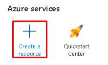 |
|  |

---

## Deploy the Model
Once the Azure OpenAI Service is set up, the next step is to add a model. Azure AI Foundry allows you to easily integrate a variety of models, depending on the project's needs.

| Deploy the Model |
|:--:|
| 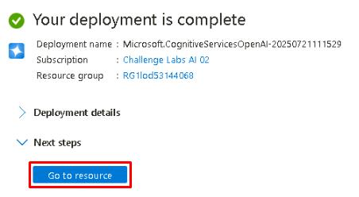 |
| 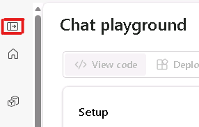 |
| 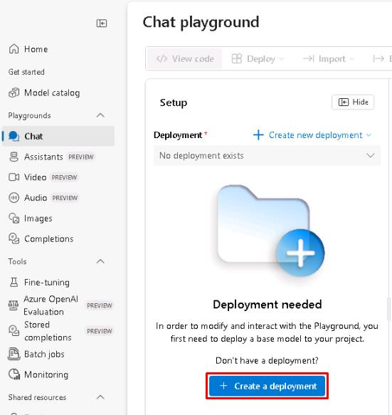 |
| 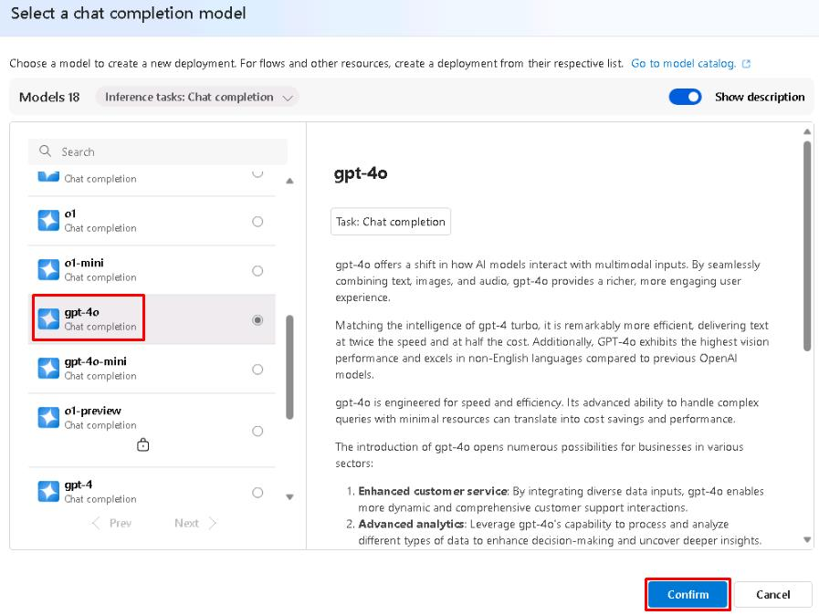 |
| 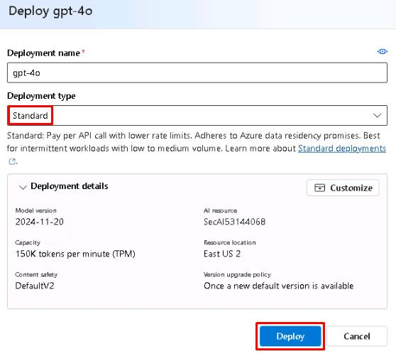 |
| 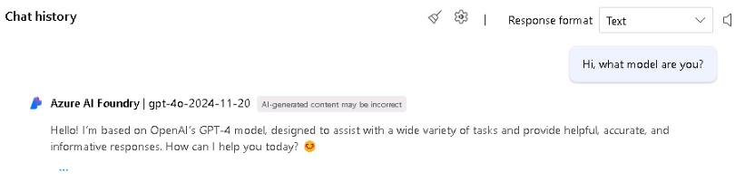 |

---

## Customize the Model
The next step is to customize the model behavior to better align with your use case.

> [!TIP]
> Configuring parameters, providing system instructions, and adding relevant context, will guide the chatbot's tone, depth of detail, and focus tuning the model to produce more consistent, domain-specific, and actionable responses.

| Customize the Model |
|:--:|
| 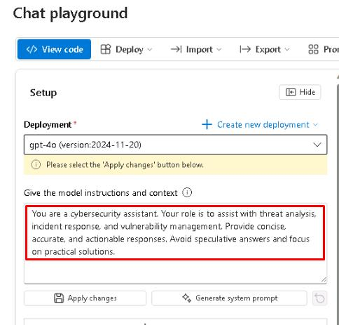 |

> [!NOTE]
> Instructions control model behavior by defining the chatbot's role, tone, or style, such as:
> - Act as a cybersecurity analyst.
> - Speak formally.
> - Provide step-by-step solutions.

> [!TIP]
> Context provides background information the model will consider when answering questions.
> - Informing about a company situation, audience, or goals.
> - Bank concerned about phishing threats.

> [!NOTE]
> **Max response** (or max tokens) limits the length of the response. A higher number equals longer potential response output.

> [!NOTE]
> **Temperature** controls response randomness.
> - Lower numbers provide more focused responses.
> - Higher numbers enable more creativity in responses.

> [!NOTE]
> **Top P** limits responses to the most likely words.
> - Lower values provide safer, more predictable responses.
> - Higher numbers result in more diverse responses.

 > [!NOTE]
 > **Frequency penalty** reduces repetition of the same phrases in responses.

 > [!NOTE]
 > **Presence penalty** encourages introducing new topics not yet mentioned in responses.

 ---

## Test the Model
With the chatbot configured, this section focuses on basic testing to see how the model responds to the applied instructions, context, and parameters.

| Test the Model |
|:--:|
| 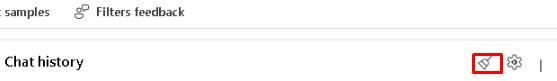 |
| 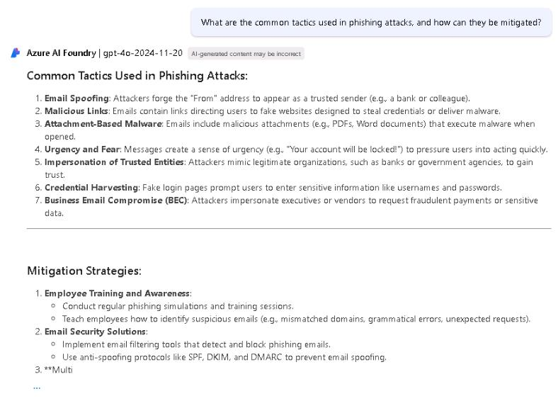 |

> [!TIP]
> Note the response. While it may differ slightly from the screenshot, it will likely be cut off. This happens because the model, even when told to be concise, still tries to provide detailed answers. There are several ways to address this, such as increasing max response, limiting the response in the prompt, or adjusting Top P to narrow the focus.

| Test the Model 02 |
|:--:|
| 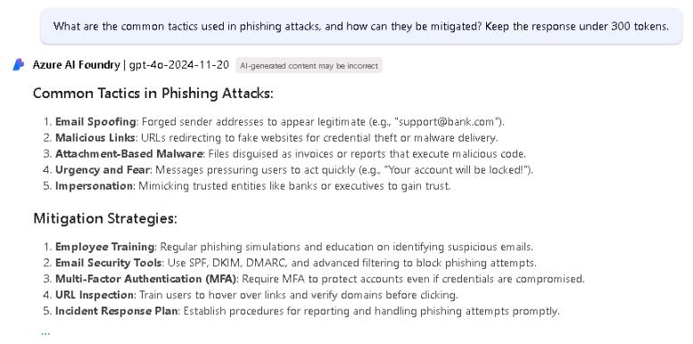 |

 > [!NOTE]
 > This time, the response should fit within the max response limit of 300. By adjusting the prompt, we're able to tell the model exactly how concise we want it to be with its response.

 > [!TIP]
 > With a higher max response value, the response can now be displayed in full without modifying the prompt. However, increasing the maximum response length may result in greater resource usage and cost. For optimal efficiency, it's best to combine thoughtful parameter settings with prompt engineering techniques.

 ---