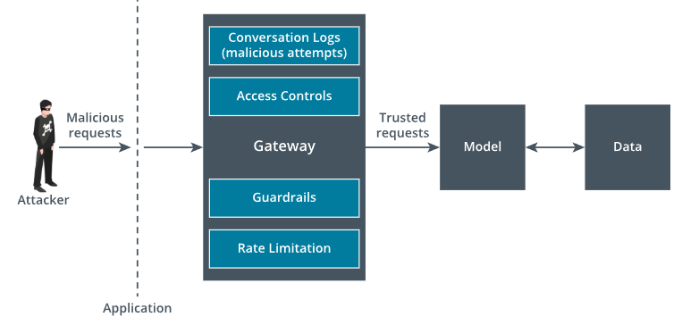

# 2.2.1 Overview of AI Security Controls

In an organization, using AI can bring both opportunities and risks. While AI can improve automation and decision-making, it also provides opportunities for misuse and introduces new attack surfaces. As discussed earlier regarding different types of threats involving AI-based applications, an attacker can trick the systems with malicious inputs, manipulating the behavior of AI, or changing the training data. A security professional must make sure to conduct a thorough evaluation of AI systems and ensure integration of responsible and safe AI. It is not only about securing the technologies, but also setting up the access controls, adding validations, and preventing attacks.

AI security controls must be implemented across multiple layers of the application and throughout the AI development life cycle. It begins with data collection, where controls are needed to verify the authenticity of the data sources and protect the sensitive data from being exposed. In the data sanitization phase, security controls such as validating the data for harmful content that can alter the responses of the AI, have to be deployed to prevent biases and hallucination risks. As we proceed to the next stages of the AI development life cycle, model development or fine-tuning the model is the crucial step. A security professional should ensure controls like authorization, strict ***access controls***, secure storing of API keys, etc., to prevent threat actors from invading the models. Logging and monitoring are the pivotal steps once the AI systems are deployed. Continuous monitoring, alerts, or auditing is required to understand and observe the model and user behavior over time for deviations.

The layered security for AI systems focuses on three main areas. They are protecting the AI model, access layer, or gateway that connects the application/users and the AI. Additionally, this protects the AI and user by deploying guardrails on what AI can and cannot do. The section below provides an overview of how security professionals can implement controls to mitigate AI threats.

## Model Controls

Model security controls should be designed to protect the model and behavior of the AI system. Upon training the model with organizational information, it becomes a critical resource, which is targeted by attackers, who try to steal, ***reverse engineer***, or manipulate the model using crafted inputs. Controls like ***input validation***, output content filtering, model watermarking, etc., must be implemented to ensure protection against adversaries. Limiting the exposure of the model or APIs at the communication layers is critical to reduce the attack surface. Ensuring that direct access to the model is prevented and allowing the authorized resources that interact with it is crucial. When organizations use pre-trained models, whether open source or third-party, it is essential to validate the model for security and ***data integrity***. A security professional should perform validation on the model to ensure that the data it is trained on is free from biases, misinformation, and moderation, according to organizational policies. These methods help ensure the model produces reliable results and is protected from attackers.

## Gateway Controls

An AI gateway acts as a middle layer between the users and AI models. It acts as a proxy and a firewall to ensure strict access controls. The gateway would provide transparency and observability by logging the usage of the AI, requests sent by users, and responses received from the AI, including timestamps. It also provides the controls to limit the usage of the AI through rate limitation, input validation, and content filtering. Also, it helps in restricting the length of the request or response and token usage. The gateway is responsible for isolating the model from direct exposure and acts as an enterprise platform for managing the interactions with AI. Through the gateway, only trusted requests reach the model, and no phishing or harmful information is sent in the responses to user. Beyond the technical controls, the gateway can be used for configuring the guardrails that can block the prompts that are not requested beyond the context or intent. This will ensure traceability during compliance and security audits.
Gateway Layer

| Gateway Layer |
|:--:|
|  |
| *A gateway layer controlling the malicious requests.* |

> [!NOTE]
> An attacker sends malicious requests which are processed by a central gateway, supported by four security controls: Conversation Logs (malicious attempts), Access Controls, Guardrails, and Rate Limitation. The gateway sends only trusted requests to the model which is developed using data.

## Guardrail Testing and Validation

***Guardrails*** in AI systems are controls that enforce ethical, safe, and responsible usage of AI. They can be implemented at input, output, and contextual layers. These help in preventing misuse and managing risk. Input level guardrails focus on screening prompts before they reach the model and blocking them. Output level guardrails inspect the models' responses and filter or redact toxic or unsafe content. Contextual guardrails evaluate the session's history and user intent based on the use case level. Some examples of guardrails are PII detection, jailbreak prompt detectors, and prompt injection detectors.

***Guardrail testing*** and validation is a critical process to ensure that applied security controls for AI systems are effective in preventing real-time attacks. Once the guardrails are designed, whether for input filtering, output moderation, or contextual/intent restrictions, they should be thoroughly tested to verify that they cannot be bypassed. Security teams should simulate harmful, unethical, and malicious inputs to test whether the guardrails block requests without affecting the designed intent of the model. Similarly, the AI responses should also be tested to ensure that the model does not generate content that violates organizational polices, compliance standards, and security guidelines. Security teams should ensure that the threat databases are regularly updated with the latest publicly available exploit prompts and bypass techniques to support effective guardrail validation.