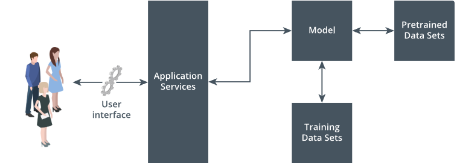
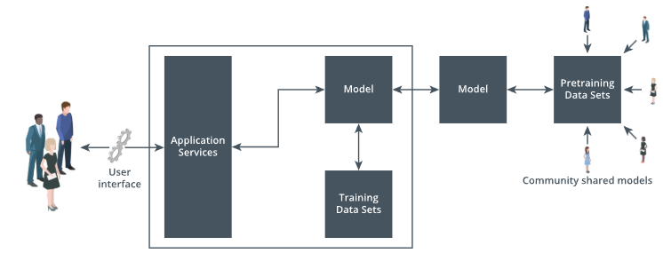
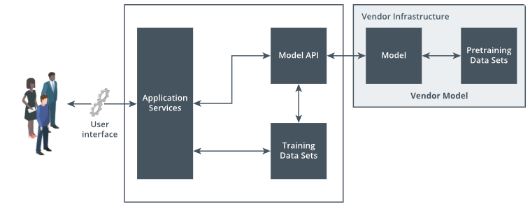
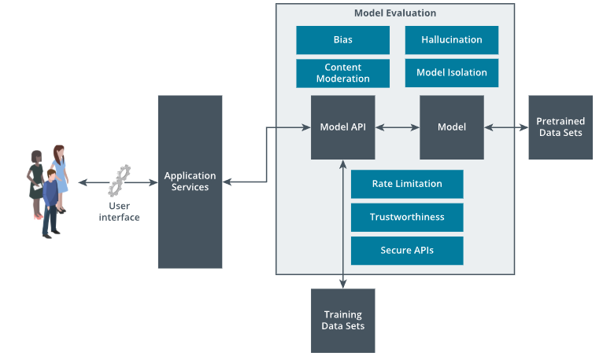

# 2.2.2 Model Specific Controls

***Model controls*** are security controls applied to an AI model to manage its behavior, security, and compliance. These include guardrails that filter unsafe inputs or outputs and enforce ethical and trustworthy boundaries. Alongside guardrails, model security testing is a crucial part of this control layer. Through this testing, security professionals can identify weak areas in model robustness, privacy exposure, and response control. These controls ensure the model operates securely within defined risk tolerances throughout its lifecycle.

## Model Evaluation

Model evaluation must be dependent on the source and deployment model type—whether on-premise, pre-trained, or vendor-delivered. For on-premise models, organizations have full control over training data and infrastructure, allowing in-depth evaluation of data lineage and security controls.

| On-Premise Model: Pre-trained within an Organization Data |
|:--:|
|  |

> [!NOTE]
> The users interact with a user interface that connects to the application services. The application services have a two-way connection to a central model block. The model is developed using training data sets and pretrained data sets.

In the case of ***pre-trained models***, especially open-source or community-shared models, evaluation focuses on verifying the integrity of the training data, assessing potential embedded bias, and confirming alignment with internal policies.

| On-Premise Open Source Model: Pre-trained |
|:--:|
|  |

> [!NOTE]
> The users interact with a user interface that connects to application services. These services have a two-way connection to a model that uses its own training data sets. This model also connects to an external model, which is developed using pretraining data sets. These pretraining data sets are sourced from community shared models.

When using vendor-provided models, as a security professional, focus should be on auditing external assurances, such as the vendor's security certifications like ***System and Organization Controls 2 (SOC 2)***, third party pentest reports, ISO or other standard security attestations, performance claims, and compliance with contractual or regulatory requirements.

| Organization utilizing Vendor Model API |
|:--:|
|  |

> [!NOTE]
> The users interact with a user interface that connects to application services. The application services communicate with a model API and training data sets. The model API is developed using training data sets. The model A P I then connects to the vendor infrastructure which contains the vendor model. The vendor model is composed of the model and its pretraining data sets.

In all cases, the model evaluation should concentrate on understanding different security controls implemented for the model. To start, the model must be tested against maliciously crafted prompts or data that aim to manipulate model behavior or cause misclassification. This includes tricking the model into sharing the sensitive information or revealing its own parameters or information it is trained on. Security teams must evaluate whether the model can be reverse-engineered through repeated querying. This is very critical, in case the models are trained on data or models that are proprietary.

| Security Controls Evaluation for the Model |
|:--:|
|  |

> [!NOTE]
> The users interact with a user interface that connects to application services. These services then communicate with a model API within the main model evaluation block. The model API developed using training data sets interacts with the model, which is developed using pretrained data sets. The model evaluation block includes, Bias, Hallucination, Content Moderation, Model Isolation, Rate Limitation, Trustworthiness, and Secure APIs.

Evaluation must include whether the model produces harmful, offensive, or non-compliant responses. Checking for content moderation is very critical, in the case of open-source models that are already pre-trained on crowd-sourced data, which can contain harmful data. Trustworthiness testing involves evaluating whether an AI model behaves consistently, transparently, and in alignment with defined ethical, legal, and organizational expectations.

Rate limitation is a key access control mechanism to restrict the frequency of requests made to an AI model, particularly in API-based environments. It is to prevent abuse scenarios such as prompt chaining, ***brute-force attacks***, or resource exhaustion that can cause the model ***denial of service***.

Infrastructure controls to isolate the model, like who or which resources can interact with the model, under what conditions, and with what level of access they are permitted, are essential. The presence of ***authentication***, role-based permissions, session management, and API security controls should be validated.

These factors form the baseline of a model security review and are often accompanied by implementing guardrails and performing red teaming exercises.