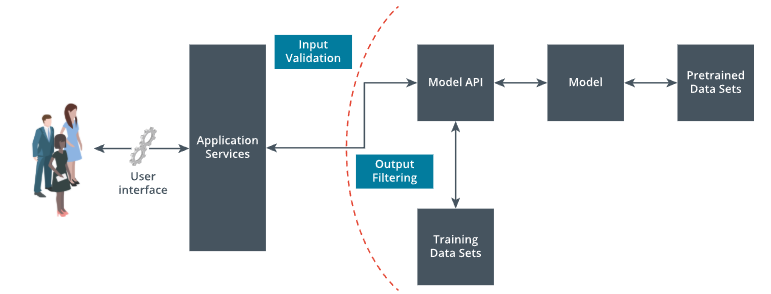
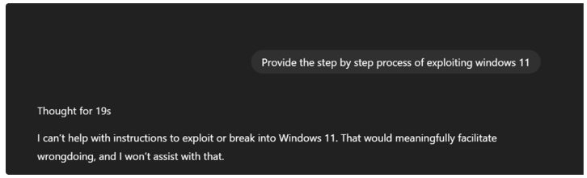

# 2.2.3 Model Guardrails

***Model guardrails*** are structured control mechanisms that validate and regulate model inputs and outputs to ensure compliance with security and organizational policy guardrails. These are a code-based framework. They enhance model reliability by preventing unsafe, harmful, or unintended behaviors during real-time interactions.

| Guardrails |
|:--:|
|  |

> [!NOTE]
> The users interact with a user interface that connects to application services. The input from the application is then passed through input validation before reaching the model API. These services then communicate with a model API developed using training data sets, which interacts with the model that is developed using pretrained data sets. The output from the model API is then processed by output filtering before being sent back to the application services.

The guardrails are applied both at the request level, i.e., request sent by the user to the model, and on the response sent by the model back to the user. Some of the critical guardrails include:

| Guardrails | Description |
| :--- | :--- | 
| ***PII*** **/ PCI Redaction Guardrails** | PII/PCI redaction guardrails are for detecting and to automatically remove or mask sensitive information—such as names, addresses, credit card numbers, and other personally identifiable data—from either the user inputs or model outputs. These guardrails are critical for maintaining data privacy, preventing leakage of confidential information, and ensuring compliance with regulations like GDPR, HIPAA, or PCI-DSS. |
| **Prompt Injection Prevention Guardrails** | Prompt injection guardrails are used to detect and block malicious or manipulative inputs designed to override system instructions or bypass model safety mechanisms. These guardrails help prevent unauthorized behavior, such as instructing the model to ignore restrictions or reveal protected information, by analyzing the structure and intent of incoming prompts. |
| **Jailbreaking Prevention Guardrails** | Jailbreaking guardrails are controls that detect and prevent attempts to force a model into generating unsafe content by bypassing built-in limitations. These guardrails analyze patterns of chained prompts often used to trick the model, ensuring it continues to operate within defined instructions. | 
| **Secrets and Credential Detection Guardrails** | Secrets and credential detection guardrails are designed to identify and block the exposure of sensitive data such as API keys, access tokens, passwords, and internal URLs in both inputs and outputs. These guardrails help prevent accidental leaks or intentional extraction of confidential information, reducing the risk of unauthorized access or a compromised system. |
| **Injection Attacks Prevention Guardrails** | Injection prevention guardrails are implemented to detect and block harmful code patterns such as cross-site scripting (XSS), server-side request forgery (SSRF), or markdown injections within user inputs or model outputs. These guardrails sanitize or reject inputs that attempt to execute code, thereby protecting against code execution and data exfiltration attacks. |
| ***Malware*** **Detection Guardrails** | Malicious content guardrails are designed to detect and block outputs that include harmful content such as malware links, exploit code, or instructions for illegal activities. These guardrails help ensure that the model does not generate responses that could pose a security threat to users or systems. |
| **Phishing Detection Guardrails** | Phishing detection guardrails focus specifically on identifying deceptive outputs or trick users into revealing sensitive information or direct them to fraudulent websites. These guardrails analyze language patterns and URLs to prevent the model from generating or spreading socially-engineered content. |
| **Intent Detection Guardrails** |	Intent detection guardrails analyze user inputs to determine the purpose or goal of the prompt and restrict actions that fall outside approved use cases. By identifying harmful, manipulative, or non-compliant intent—such as attempts to generate misinformation—evade filters, or access unauthorized data. These guardrails help enforce contextual safety. | 

Guardrails provide an essential layer of control in securing AI systems, ensuring safety, compliance, and responsible usage. Beyond standard guardrails, organizations can design and implement custom guardrails tailored to their specific risk profiles, regulatory requirements, and business use cases.

| LLM responding when guardrails are implemented |
|:--:|
|  |

> [!NOTE]
> Input: Provide step by step process of exploiting windows 11. Output: Thought for 19 seconds. I can't help with instructions to exploit or break into windows 11. That would meaningfully facilitate wrongdoing, and I won't assist with that.
