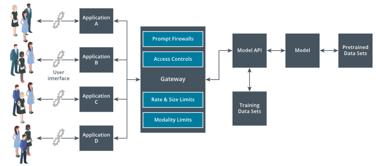

# 2.2.5 Gateway and Interface Controls

***Gateway controls*** operate as the layer for governance, security, and performance optimization between user interface and the AI models. This layer acts as proxy through which all the incoming and outgoing traffic routing takes place, enforcing usage rules, preventing abuse, and ensuring compliance with security and privacy standards. An AI gateway essentially functions as a specialized ***Application Programming Interface (API)*** gateway whose purpose extends beyond traditional API management by adding AI-specific safeguards such as prompt filtering, token management, and modality restrictions. The gateway inspects all application AI traffic and provides AI usage across the organization. The gateway can have an interface that provides observability and metrics about the AI usage, abuse, and logging of the interactions with AI models.

| AI Application Architecture including Gateway |
|:--:|
|  |
| *A diagram showing AI application architecture, including a gateway.* |

> [!NOTE]
> The users interact with a user interface that connects to the application A, B, C, and D. The input from the application is then passed through a gateway before reaching the model API. The gateway contains control layers for Prompt Firewalls, Access Controls, Rate and Size Limits, and Modality Limits. These services then communicate with a model API developed using training data sets, which interacts with the model that is developed using pretrained data sets.

## Prompt Firewalls

A ***prompt firewall*** is a critical security layer within an AI gateway. Its role is to inspect and filter both the inputs sent to the model and the outputs generated by the model, ensuring that only secure and compliant interactions are allowed. This control is necessary because the models do not inherently distinguish between safe and unsafe content. They generate responses based purely on learned patterns, which makes them susceptible to malicious instructions and queries that can cause data leakage.

In our earlier discussions on guardrails, we explored how they act as predefined rules, filters, and validation checks that govern model behavior. These guardrails can include prompt validation, output moderation, sensitive data redaction, and topic or context restrictions. These guardrails are implemented at the application level, that is, each application interacting with the AI model needs its own guardrail configuration. This works for small-scale or isolated deployments. By implementing prompt firewalls with guardrails at the gateway level, organizations can centralize these safety and compliance measures. Instead of embedding separate guardrail logic into every individual application, the AI gateway becomes the single enforcement point for all prompt and response filtering. It also eliminates the cost and complexity of maintaining separate guardrail implementations for each AI application, reduces the risk of policy gaps, and strengthens both security and compliance posture across the organization's AI ecosystem.

Implementing a prompt firewall at the gateway also enables observability. Since every request and response passes through a central enforcement point, the gateway can log, classify, and analyze interactions to detect patterns of misuse, evolving attack vectors, or model behavior. This data can be fed into Security Information and Event Management (SIEM) or compliance monitoring systems, supporting incident investigation and continuous improvement of AI governance.

## Rate Limitation

In the AI gateway, rate limits define the maximum number of requests that can be made within a given time window, ensuring stability and predictable performance. At the user level, they prevent a single user from overwhelming the system, while at the application level, they ensure that no single integrated service consumes excessive capacity. These controls are especially important in environments where load balancing distributes requests across multiple model instances. Without rate limits, a surge from one user or application could saturate all available instances, causing availability concerns and denial of service.

Model retries allow the gateway to handle transient errors, such as network or temporary model unavailability, by reattempting failed requests. This process is required to keep automated workflows and business continuity. However, without careful coordination with rate limits, retries can overload the system. The excessive retries can cause synchronized traffic spikes, overwhelming all model nodes simultaneously. To prevent this, retries are often configured with rate limits to keep total traffic within safe thresholds.

Rate limitation defines a fixed threshold, for example, a maximum of 100 requests per minute, per user. Once that threshold is reached, additional requests within that time window are either rejected or queued until the window resets. This ensures that no user/application can overwhelm the system.

A session-based rate limitation controls the number of requests or queries a user or application can send within a single active session. Unlike standard time-based rate limits, which reset after a fixed interval, session-based limits remain tied to the lifecycle of an interaction, often defined by a login period, a conversation window, or a continuous connection. At the user level, this ensures that an individual cannot overload the system within a single session, even if they remain connected for an extended period. At the application level, it restricts how many queries a specific service or workflow can execute during its active processing session, preventing runaway usage from automated scripts or batch jobs.

Rate limitation, when applied from a security perspective, acts as a protective measure against abusive or malicious request patterns, such as denial-of-service attempts or automated exploitation. By restricting the volume of requests within defined thresholds, rate limitation reduces the attack surface and helps maintain system availability under potential threat conditions.

## Token Limits

In AI models, text is processed as tokens, which are units representing words, subwords, or characters, depending on the tokenization method. Every model has a context window, defining the maximum number of tokens it can process in a single request, which includes both the user's input and the model's output. ***Token limits*** in an AI gateway are policies that restrict the number of tokens that can be sent to or generated by the model within a request, session, or defined usage period.

At the user level, token limits prevent an individual from sending excessively long prompts or requesting overly large responses that could strain computational resources. At the application level, they ensure that integrated services, especially automated ones, do not consume disproportionate processing capacity by sending high-volume prompts repeatedly. Threat actors could intentionally craft extremely large prompts to overload processing capacity, increasing latency and potentially causing service degradation for all users. They might use repeated high token requests to drive up operational costs in a pay-per-token environment, effectively performing a ***denial-of-service attack***. In some cases, large token payloads could be used to hide malicious instructions or hidden data deep within the prompt, making it harder to detect through standard inspection. By enforcing token limits at the gateway, these risks are significantly reduced, as oversized requests are blocked or truncated before they can impact the model or infrastructure.

These limits can be configured to account for both input tokens (prompt length) and output tokens (response size), ensuring that total token usage remains within safe operational boundaries.

## Input Quotas

***Input quotas*** in an LLM gateway define the maximum amount of data or the maximum number of requests a user or application can send to the AI system within a specific time frame, such as daily, weekly, or monthly. These quotas are a broader resource control compared to rate limits, which operate within short time windows.

## Endpoint Access Controls

AI gateway ensures granular, controlled access to LLM models and providers, allowing only authorized users and applications to interact with approved capabilities under predefined security policies. Gateway provides a single control point for all applications within an organization that utilize AI models and related services.

Authentication and authorization controls that can be set up on an AI gateway can prevent unauthorized access to LLM endpoints by verifying user or application identity and enforcing role-based permissions. Instead of using a single master key embedded in the application, which, if compromised, can expose the entire system, the gateway should issue virtual or scoped keys with limited permissions and expiry times. These keys can be rotated regularly, revoked instantly if misuse is detected, and restricted to specific endpoints or modalities. This approach greatly reduces the impact of a key compromise while maintaining secure, controlled access to the LLM environment.

In a centralized gateway, every request and response is logged with detailed traces that include the virtual key used, mapped to the user and the endpoint accessed. These traces serve as a complete audit trail, allowing security teams to monitor usage patterns, detect anomalies, and investigate suspicious behavior in real time. If a security incident occurs, the gateway's logs can map the compromised token directly back to the specific user or application that used it. This precise mapping not only speeds up incident response and containment but also enables targeted key revocation without disrupting other legitimate operations. By maintaining these detailed, user-linked traces, the organization can ensure accountability, support forensic investigations, and strengthen overall AI governance.