# 2.2.10 Live Lab: Apply Structured Prompt Templates

## Scenario
In this lab you will learn how structured prompt templates can standardize AI outputs, reduce ambiguity, and enforce professional formats in security operations. By working with firewall logs, you will see how predefined templates guide analysis and reporting, making it easier to compare results across analysts. You will also practice completing partially filled templates, correcting flawed examples, and adapting templates for your own needs.

> [!NOTE]
> **The Mission**:
> - Apply structured prompt templates to real security log data.
> - Compare freeform prompts against structured templates.
> - Fill in and customize template fields to enforce consistency.
> - Use helper scripts to simplify structured templates.

## Exam Objectives
This activity is designed to test your understanding of and ability to apply content examples in the following CompTIA SecAI+ objectives:

- 1.1 Compare and contrast various AI types and techniques within the context of cybersecurity.
- 2.2 Given a set of requirements, implement security controls for AI systems.

---

## Security Alert Summary
A common SOC workflow is documenting suspicious activity in a standardized format. The Security Alert Summary Template ensures no critical detail is missed and every analyst reports in the same style.

```
You are a SOC analyst. Read the INCIDENT CARD and write a concise paragraph describing what happened in plain language. Do not add facts not present in the card.

INCIDENT CARD (PHISHING - FINANCE)
- Date (CT): 2025-09-14
- First observed: 09:12:33
- Last observed: 10:05:11
- Targets: Finance staff (~25 inboxes)
- User reports: 3 (two clicked, one entered credentials is unconfirmed)
- Subject (examples): "Payment Advice - URGENT", "Invoice Past Due"
- From: accounts@billingsafe.co (Return-Path: bounce@billingsafe.co)
- Domains: billingsafe.co (registered 2025-09-10)
- Auth results: DMARC=fail, SPF=softfail, DKIM=none
- Links: https://invoice-billingsafe[.]co/login (Microsoft 365 lookalike)
- Attachments: PaymentAdvice.htm (HTML)
- Controls: Initial quarantine applied; gateway rule updated; some emails reached users
- Known impact: None confirmed; credential theft possible but unverified
```

| Security Alert Summary |
|:--:|
| 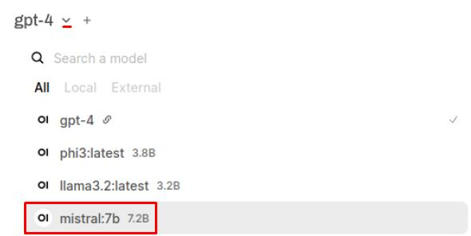 |
| 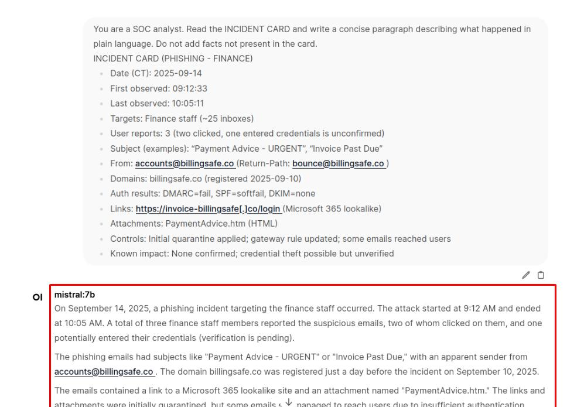 |

> [!IMPORTANT]
> Asking an open-ended question gives you a baseline. You see what the model produces without guidance-its natural level of detail, structure, and terminology. This makes it easier to appreciate the improvements once you apply a template, because you'll have something unstructured to compare against.

```
Complete the SECURITY ALERT SUMMARY TEMPLATE strictly from the INCIDENT CARD. If a field is unknown, write UNKNOWN.

SECURITY ALERT SUMMARY TEMPLATE

THREAT CLASSIFICATION:
- Severity Level: [CRITICAL/HIGH/MEDIUM/LOW]
- Threat Type: Phishing (Credential Harvesting)
- Confidence Level: [HIGH/MEDIUM/LOW]

TECHNICAL SUMMARY:
- Source: [sender/return-path]
- Target: [teams/departments]
- Attack Vector: Email, Link to fake login
- Affected Services: Email, Authentication

INDICATORS OF COMPROMISE (IOCs):
- Sender Domain(s): [list]
- URL(s): [list]
- Auth Results: [DMARC/SPF/DKIM]
- Attachment(s): [name/type]

TIMELINE:
- First Observed: [time]
- Last Observed: [time]
- Duration: [compute or UNKNOWN]

IMPACT ASSESSMENT:
- Systems Affected: [range or UNKNOWN]
- Data at Risk: Credentials (POSSIBLE)
- Service Disruption: Minimal

RECOMMENDED ACTIONS:
1. 
2. 
3. 

NEXT STEPS:
1. 
2.  
3.  
```

| Security Alert Summary 02 |
|:--:|
| 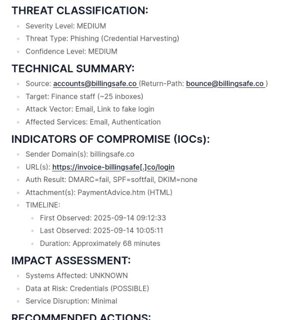 |

> [!IMPORTANT]
> This template is designed for SOC analysts and incident responders. It standardizes how security events are documented so that every alert includes key elements: classification, technical details, indicators of compromise, timeline, impact, and recommended actions. By enforcing this structure, the template ensures that alerts are complete, consistent, and actionable, regardless of which analyst prepares them.

---

## Incident Triage Template
When multiple alerts come in, analysts need a fast way to sort the noise from the real threats. The Incident Triage template helps capture the essential details right away so incidents can be classified, prioritized, and escalated if necessary.

```
Complete the INCIDENT TRIAGE ASSESSMENT strictly from the INCIDENT CARD. Use the rubric: P2-HIGH if multiple users affected and credential theft is plausible but unconfirmed.

INCIDENT TRIAGE ASSESSMENT

INCIDENT METADATA:
- Incident ID: INC-2025-0914-FIN-01
- Date/Time Reported: 2025-09-14T10:15:00 CT
- Reporter: SOC queue (user reports escalated)
- Initial Source: Email Security Alerts + User Reports

INCIDENT CLASSIFICATION:
- Category: 
- Subcategory: 
- Severity: [P1/P2/P3/P4]
- Urgency: [IMMEDIATE/4HR/24HR/48HR]

SCOPE ASSESSMENT:
- Affected Systems: 
- Affected Users: 
- Affected Services: 
- Geographic Scope: 

TECHNICAL INDICATORS:
- Attack Vectors: 
- Suspicious Domains: 
- URLs: 
- Attachments: 
- Auth Results: 

BUSINESS IMPACT:
- Service Availability: Operational
- Data Confidentiality: POTENTIALLY_BREACHED (credentials)
- System Integrity: Intact
- Regulatory Implications: UNKNOWN
```

| Incident Triage Template |
|:--:|
| 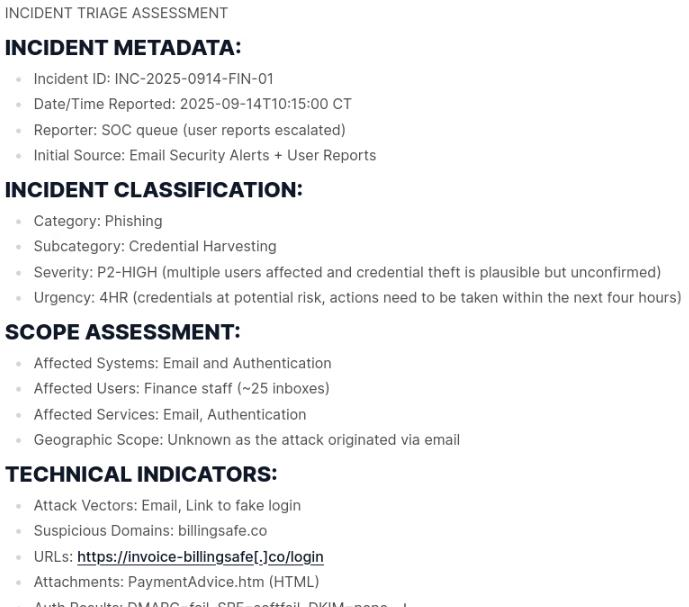 |

> [!IMPORTANT]
> This template is used by SOC analysts and shift leads during the first pass of an investigation. Its purpose is to quickly classify an incident, estimate scope, assign severity and urgency, and decide whether it needs to be escalated. By capturing this information in a consistent format, teams can prioritize incidents effectively and ensure the most critical threats are handled first.

---

## Executive Summary Template
Technical details are vital for analysts, but executives need information framed in terms of business impact and decisions. The Executive Summary template condenses complex incidents into plain language, highlighting only the most critical findings, risks, and recommended actions.

```
Produce a CYBERSECURITY EXECUTIVE SUMMARY for leadership, based strictly on the INCIDENT CARD.

CYBERSECURITY EXECUTIVE SUMMARY

EXECUTIVE OVERVIEW:
[2 sentences, plain language, no acronyms.]

KEY METRICS:
- Incidents Detected: 
- Incidents Resolved: 
- Mean Time to Detection: 
- Mean Time to Response: 
- Systems Affected: 

BUSINESS IMPACT:
- Immediate: 
- Potential:
- Financial:

ACTIONS TAKEN:
- Quarantined messages and tightened gateway rules
- Blocked sender domains/URLs
- User notifications initiated

RECOMMENDATIONS:
1. 
2. 
3. 
```

| Executive Summary Template |
|:--:|
| 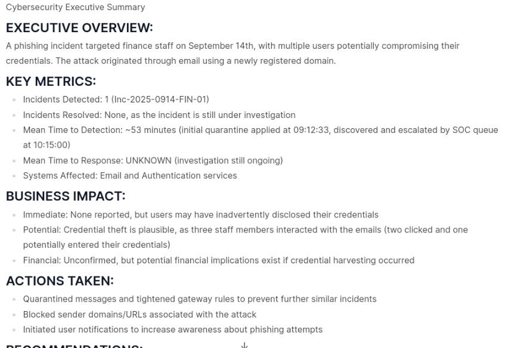 |

> [!IMPORTANT]
> This template is written for executives and senior decision-makers. It strips away technical jargon and focuses on business impact, risk, and next steps. By presenting incidents in a concise, plain-language format, it ensures leadership can make informed decisions quickly without needing to parse detailed logs or analyst notes.

---

## Prompt Templates with Internal Data
Now that you've practiced templates on general scenarios, it's time to apply one to real security data. In this step, you'll upload an alert file and use a structured prompt template to generate a standardized alert summary from actual network activity.

| Prompt Templates with Internal Data |
|:--:|
| 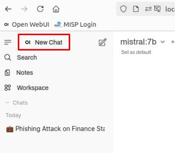 |
| 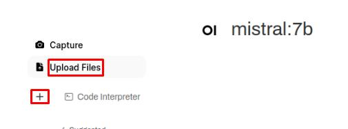 |

```
Analyze the json file, output:
1) Summary (2 sentences) using info, analysis, threat_level_id, tags.
2) Key IOCs (max 5 bullets).
3) Recommendations (3 short bullets).

If something is missing, write UNKNOWN. Do not add facts.
```

> [!TIP]
> This will run the prompt against the uploaded file.

| Prompt Templates with Internal Data 02 |
|:--:|
| 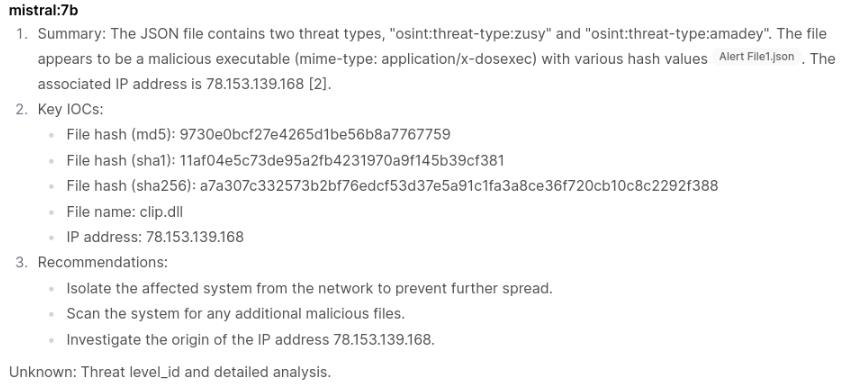 |

> [!IMPORTANT]
> When you upload a large file straight into the model, it has to read the whole dataset in one go. This makes responses slow, can cause the model to skip or oversimplify details, and often leads to inconsistent outputs. In practice, security teams use Retrieval-Augmented Generation (RAG): files are broken into indexed chunks, and the model only pulls in the most relevant pieces. RAG makes analysis faster, more accurate, and scalable, which you'll explore in a later lab.

## Templates with Helper Scripts
Now that you've seen how direct uploads work, let's try a different approach. We'll use a Python helper script to preprocess the logs and feed the model a clean, structured prompt. This makes the workflow faster and the outputs more reliable.

| Templates with Helper Scripts |
|:--:|
| 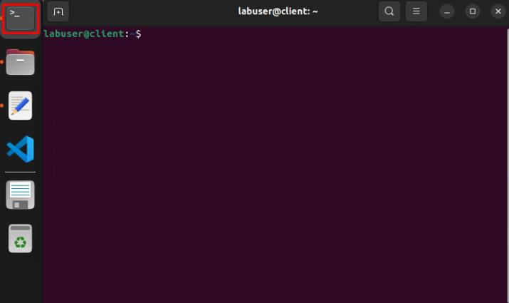 |

> [!IMPORTANT]
> The Alert File1.json raw data looks like this:
> 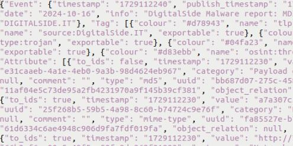
> Rather than asking the model to sift through all of this and generate a response, the python helper script is processing it, building a prompt from a template, and sending the prompt to the model for analysis.

| Templates with Helper Scripts 02 |
|:--:|
| 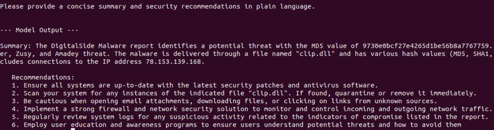 |

```
python3 /home/labuser/Labfiles/security_template1.py
```

> [!IMPORTANT]
> The helper script talks directly to the model backend through its API. You run it in the terminal, but behind the scenes it sends a structured prompt and collects the model's response. This approach unlocks the power of Python scripting-you can preprocess data, fill in template variables automatically, enforce formats, and even generate different prompts depending on thresholds or filters.

```
python3 /home/labuser/Labfiles/security_template2.py
```

> [!IMPORTANT]
> This script works a bit differently from the first one. It runs in an interactive chat mode where responses are streamed in real time, so you can watch the model generate its answer. It also supports multi-turn conversations, meaning you can reply to the model's initial output and continue the dialogue about the analyzed file.

| Templates with Helper Scripts 03 |
|:--:|
| 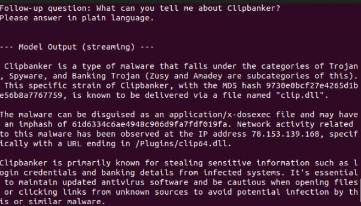 |

> [!IMPORTANT]
> Enabling multi-turn chat allows you to ask follow-up questions in the terminal session, providing further clarification and detail for investigation or reporting.

---

## Templates with OpenWebUI Tools
You've seen how the Python helper script can analyze the JSON alert file from the terminal, with support for multi-turn conversations. Now, let's look at how that same logic has been integrated directly into Open-WebUI as a custom Python tool.

| Templates with OpenWebUI Tools |
|:--:|
| 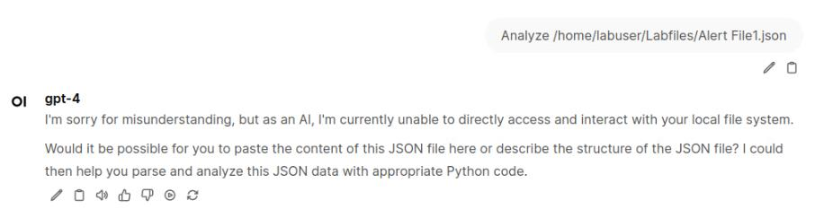 |

> [!TIP]
> GPT-4 will not be able to open the file, since it has no access to your filesystem.

| Templates with OpenWebUI Tools 02 |
|:--:|
| 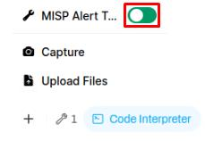 |

> [!IMPORTANT]
> This will enable the MISP Alert Template tool in the chat. This tool was built from the Python script you used in the previous exercise, combining the flexibility of Python scripting with the convenience of running everything directly inside Open-WebUI.

| Templates with OpenWebUI Tools 03 |
|:--:|
| 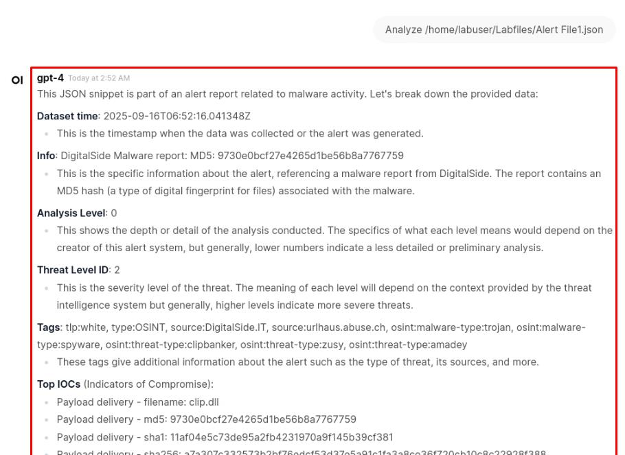 |

> [!IMPORTANT]
> How this works:
> - The tool code wraps the helper script logic into a Python function with one input: logfile.
> - When you pass the file path, the tool loads the JSON, extracts metadata, and builds a structured prompt for the model.
> - The model never directly "opens" the file. Instead, it receives a carefully crafted text summary of the contents.
> - This is a bridge approach - not as scalable as RAG, but still effective for one-off analysis tasks.

The tools used in this lab inherently enable remote code execution (RCE). That capability is powerful and valuable, but it also underscores the importance of using only trusted tools and sources. Even when execution is deliberate and beneficial, you must ensure the code being run comes from secure, verified origins and that the level of access granted is appropriate for your environment.

By extending the helper script into an Open-WebUI tool, you've seen how structured prompt templates can be operationalized beyond the terminal. The same template logic is now accessible directly in chat, where it benefits from consistent formatting, repeatable analysis, and seamless integration with your AI workflows.

---