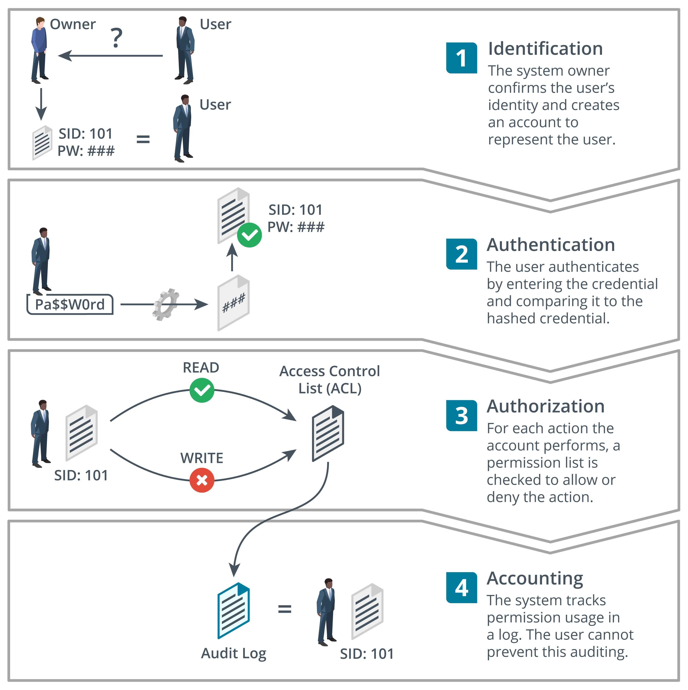

# 3.1.1 Access Control Principles for AI

An ***access control*** system for AI is implemented in a similar manner as for any other resource in an enterprise environment. This ensures that an information system meets the goals of the CIA triad and can be considered secure. Access control principles govern how a subject may interact with other objects. Subjects are people, devices, software processes, or any other system that can request and be granted access to a resource. Objects are the resources. An object could be a specific model, data set, or prompt within the AI system. Subjects are assigned rights or permissions to resources based on a variety of factors.

Modern access control is typically implemented as an ***identity and access management system (IAM)***. IAM comprises four main processes:

- ***Identification***—creating an account name or identity that uniquely represents the user, device, or process.
- ***Authentication or authN***—proving that a subject is who or what it claims to be when it attempts to access the resource. An authentication factor determines what sort of credential the subject can use. For example, people might be authenticated by providing a password; a computer system could be authenticated using a token such as a digital certificate or software token.
- ***Authorization or authZ***—determining what rights subjects should have on each resource, and enforcing those rights. An authorization model determines how these rights are granted. For example, in a role-based model, permissions are based on your role within the organization. This can vary from limited prompt access for an AI system user to the AI system administrator having full access to all models and data sets.
- ***Accounting***—tracking authorized usage of a resource or use of rights by a subject and alerting when unauthorized use is detected or attempted. This is where logs of access and use can be created for auditing.

| Differences among Identification, Authentication, Authorization, and Accounting |
|:--:|
|  |

> [!NOTE]
> The processes are as follows:
> 1. Identification: The system owner confirms the user's identity and creates an account to represent the user.
> 2. Authentication: The user authenticates by entering the credential and comparing it to the hashed credential.
> 3. Authorization: For each action the account performs, a permission list is checked to allow or deny the action. The actions include reading or writing. The list checked is Access Control List (ACL).
> 4. Accounting: The system tracks permission usage in a log. The user cannot prevent this auditing.

While there are general controls that all information systems can be secured with, there are specific controls that are used to address issues within AI systems specifically. These include enforcing access controls that allow for users, engineers, and the model itself to interact with various data sets. Some of those data sets may include sensitive data such as PII, PHI, and financial records. Careful implementation of controls should restrict access as much as possible in accordance with the principle of least privilege.