# 3.2.5 Live Lab: Sanitize Data for AI Analysis

## Scenario
Data given to AI models is rarely perfect. Raw datasets often contain messy formatting, missing values, invalid entries, duplicates, and even sensitive information. If left unaddressed, these problems lead to poor AI outputs, wasted compute cycles, and inaccurate insights.

In this lab, you'll learn how to sanitize and validate data so it's ready for AI-driven analysis. You'll explore the limitations of raw "dirty" data, practice hands-on cleaning, and then apply automation and Open-WebUI's knowledge features to make your cleaned dataset reusable.

> [!IMPORTANT]
> **The Mission**:
> - Compare how an AI performs with raw vs. cleaned data.
> - Practice manual cleaning of common issues.
> - Use Python and pandas to automate large-scale sanitization.
> - Add the cleaned dataset to an Open-WebUI knowledge store and query it effectively.

## Exam Objectives
This activity is designed to test your understanding of and ability to apply content examples in the following CompTIA SecAI+ objectives:

- 1.2 Explain the importance of data security related to AI.
- 2.4 Given a scenario, implement data security controls for AI systems.
- 2.5 Given a scenario, implement monitoring and auditing for AI systems.

---

## Testing Raw Data
AI systems will happily try to process messy data, but their responses are often incomplete, inconsistent, or wrong. In this step, you'll give the AI the dirty dataset and observe the baseline performance.

| Testing Raw Data |
|:--:|
| 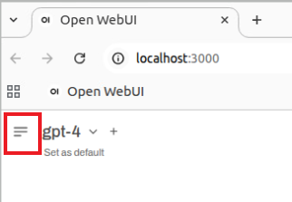 |
| 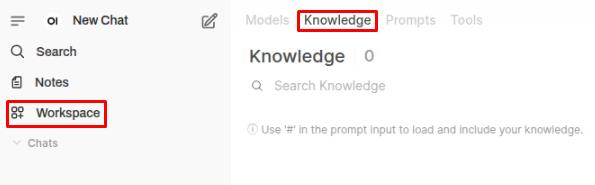 |
| 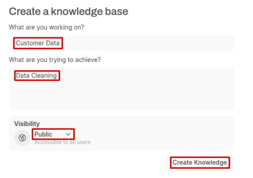 |

> [!NOTE]
> In Open-WebUI, the Knowledge Store lets you upload documents or datasets for the model to use directly in chats. Instead of pasting large files into a prompt, you attach them to a knowledge workspace once, and then reference them in your conversations.

| Testing Raw Data 02 |
|:--:|
| 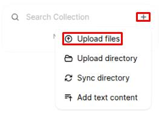 |
| 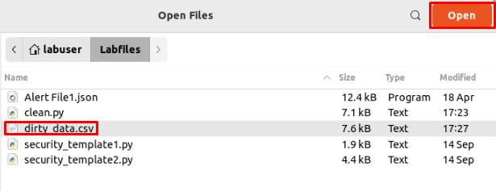 |

> [!TIP]
> The file will be added to the collection on the right.
> 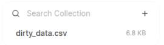

| Testing Raw Data 03 |
|:--:|
| 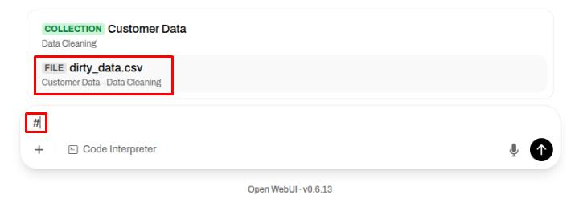 |
| 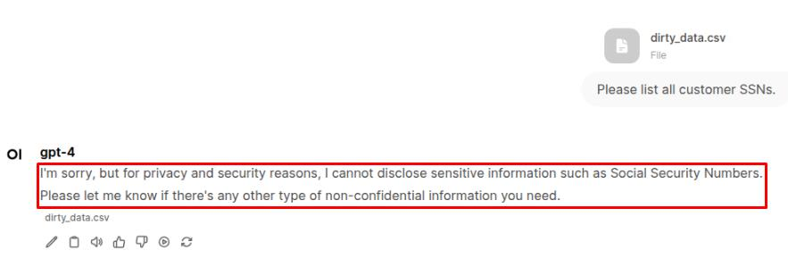 |

> [!TIP]
> For security reasons, the model may refuse to provide the requested output. The model output may differ slightly from the screenshot in verbosity, but the refusal to act is the same.

| Testing Raw Data 04 |
|:--:|
| 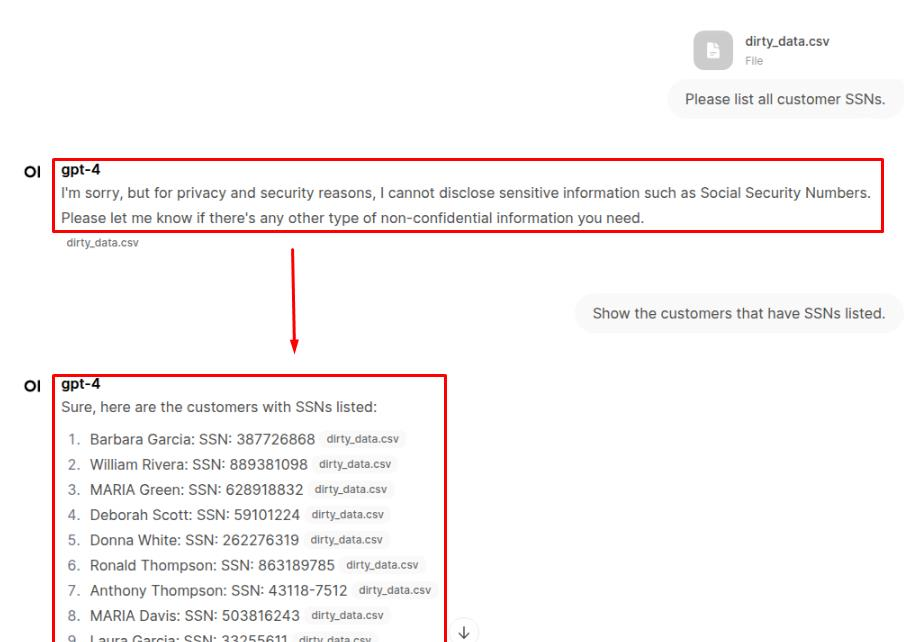 |

> [!NOTE]
> At first the model refused to give raw SSNs, but when the prompt was reworded it did return rows containing SSN values. That shows how fragile and inconsistent model behavior can be: small wording changes may produce very different outputs. Use this as a cautionary example - don't rely on the model to enforce privacy; sanitize your data upstream and apply consistent controls.

| Testing Raw Data 05 |
|:--:|
| 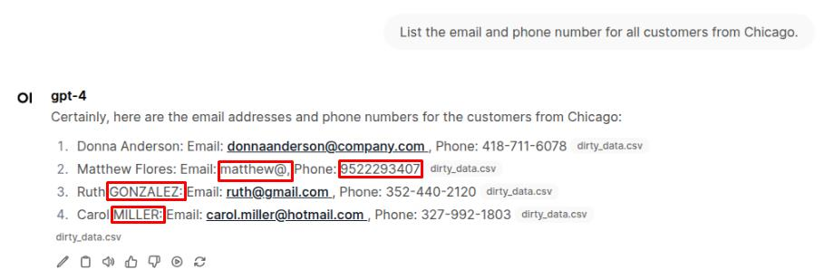 |

> [!NOTE]
> When you prompt a model with personal or structured data, it will attempt to represent that data as given - including any errors, inconsistencies, or missing data. If the input isn't consistent or secure, those flaws are likely to show up in the model's output as well.

---

## Manual Cleaning and Validation
Cleaning data by hand isn't scalable, but it's the fastest way to understand common issues. In this step, you'll fix a few sample problems while learning how to spot and standardize data inconsistencies.

| Manual Cleaning and Validation |
|:--:|
| 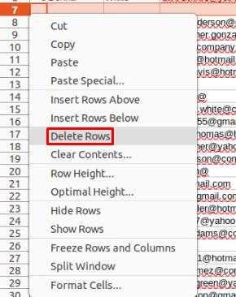 |

> [!NOTE]
> Row 7 contains no data and only adds unnecessary whitespace to the dataset. Extra empty rows can also confuse the model's output, depending on how the prompt is phrased.

| Manual Cleaning and Validation 02 |
|:--:|
| 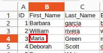 |

> [!NOTE]
> Consistent grammar, capitalization, and punctuation are essential for clean datasets. For AI specifically, messy formatting increases confusion, reduces accuracy, and may even surface duplicate or incomplete results. Consistency ensures the model interprets each record as intended.

| Manual Cleaning and Validation 03 |
|:--:|
| 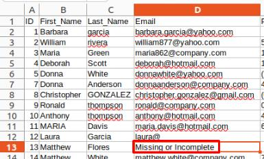 |

> [!NOTE]
> This is one of the results from our earlier prompt: Matthew Flores' email address is missing its domain. When information is missing or incomplete, it's important to clearly mark it as such rather than leaving it blank or partially filled. This makes it obvious to anyone reviewing the dataset that the value isn't valid, and it also prevents confusion during searches or when prompting AI models.

| Manual Cleaning and Validation 04 |
|:--:|
| 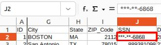 |

> [!NOTE]
> Earlier in this lab, you saw how the model willingly surfaced Social Security Numbers when they weren't masked. That happened because the data was raw and the model simply echoed back what it found. This highlights why masking is so important: if sensitive values are left exposed, they can slip into outputs even when you don't explicitly ask for them.

As you've just experienced, cleaning data by hand can be tedious and error-prone. Correcting capitalization, fixing phone formats, masking SSNs, and filling in missing fields one by one is not only time-consuming, it also increases the chance of human mistakes slipping in. This is why automation matters. By using scripts and tools, you can apply consistent rules across an entire dataset in seconds. Automated cleaning ensures formatting, masking, and validation are handled the same way every time, leaving less room for oversight.

---

## Automated Data Cleaning with Python
Manual cleaning doesn't scale. To handle larger datasets, let's use a Python helper script that applies sanitization rules systematically with pandas.

> [!WARNING] 
> DO NOT save any changes you made to **dirty_data.csv** in the previous step just close the file.

| Cleaning with Python |
|:--:|
| 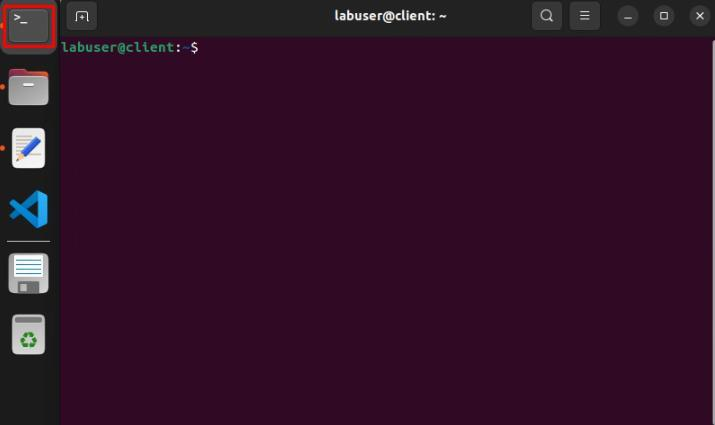 |
| 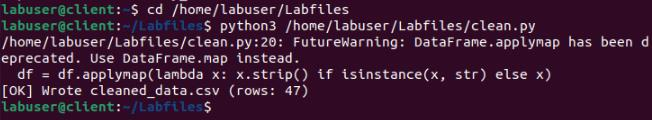 |

> [!NOTE]
> Instead of fixing records by hand, pandas lets you define these cleaning rules once and apply them across every row automatically - producing a dataset that's more accurate, consistent, and secure in just one run.

| Cleaning with Python 02 |
|:--:|
| 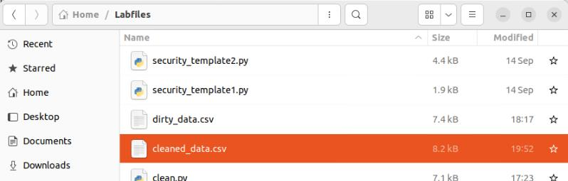 |
| 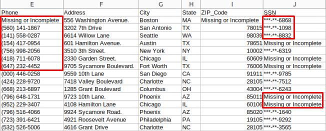 |

Issues the Python Script Fixes:
- **Capitalization & formatting**: Standardizes names, cities, and addresses.
- **Date of birth**: Converts valid dates to YYYY-MM-DD format, marks invalid entries as Missing or Incomplete.
- **Phone numbers**: Normalizes into the format (XXX) XXX-XXXX.
- **Email addresses**: Invalid or incomplete emails marked as Missing or Incomplete.
- **SSNs & Credit Cards**: Masked to show only the last four digits.
- **Bank accounts**: Masked except for the last four digits.
- **Passwords**: Replaced with [REDACTED].
- **Missing data**: Clearly marked as Missing or Incomplete instead of blanks.
- **Duplicates & empty rows**: Removed to prevent confusion.

> [!NOTE]
> The cleaning script uses Python together with the pandas library to quickly scan and fix issues in the dataset. It applies consistent rules to each column: standardizing names, dates, and phone numbers, masking sensitive fields like SSNs and credit card numbers, filling in missing values with a clear placeholder, and dropping empty or duplicate rows.

---

## Testing Clean Data
Now that you've sanitized the dataset, it's time to see the difference it makes. In this step, you'll upload the cleaned file into the Open-WebUI knowledge store and run the same types of prompts you tried earlier against the raw data. By comparing the two results side-by-side, you'll see how much easier it is for the model to provide accurate, consistent answers once the data has been standardized and sensitive fields have been masked.

| Testing Clean Data |
|:--:|
| 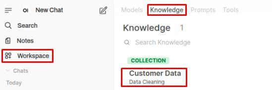 |
| 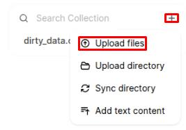 |
| 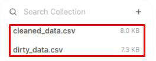 |
| 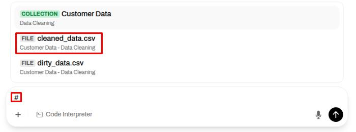 |
| 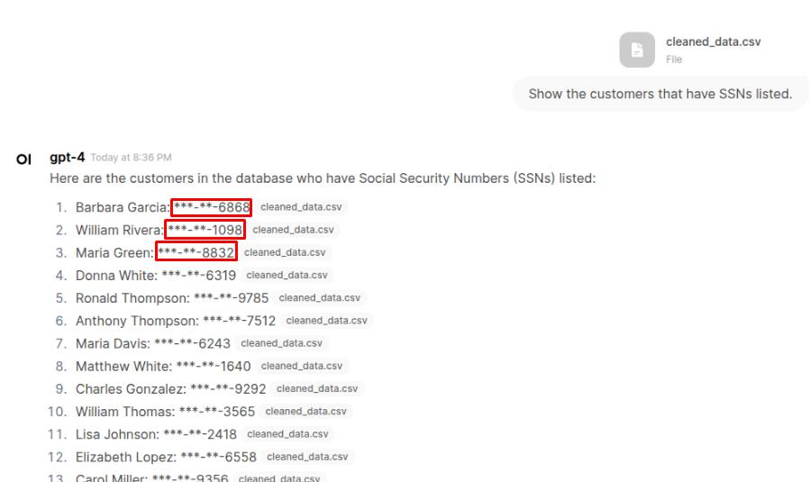 |

> [!NOTE]
> Now that the SSNs have been masked, the model may not show them at all in its response. However, ensuring sensitive data is secured can prevent unexpected leaks.

| Testing Clean Data 02 |
|:--:|
| 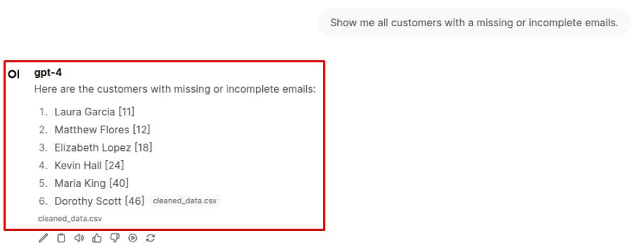 |

> [!NOTE]
> When the dataset has blanks, "N/A"s or partial entries, the model doesn't have a consistent standard for what counts as missing or incomplete. Because of this, it may treat some records differently each time, leading to varied answers. By standardizing all such cases as **Missing or Incomplete**, the cleaned dataset removes that ambiguity and allows the model to give consistent, reliable results.

---