# 3.3.6 Live Lab: Analyze Logs with AI

## Scenario
In modern systems, logs are one of the most important sources of security and operational insight. They record authentication attempts, application errors, user behavior, and unexpected conditions that may indicate abuse or compromise. At the same time, logs often contain sensitive data, making access to them a high-risk activity.

In this lab, you will analyze application logs using a local AI model. Rather than giving the model unrestricted access to files, you will use a controlled tool interface built on the Model Context Protocol (MCP). This approach mirrors how AI systems are integrated into real environments, where access to operational data must be explicitly defined, validated, and audited.

> [!IMPORTANT]
> **The Mission**:
> - Explain how MCP enables controlled access to system data.
> - Interact directly with an MCP server to retrieve logs.
> - Learn how MCP servers, proxies, and AI clients work together.
> - Safely expose logs to an AI model for analysis.

## Exam Objectives
This activity is designed to test your understanding of and ability to apply content examples in the following CompTIA SecAI+ objectives:

- 2.5 Given a scenario, implement monitoring and auditing for AI systems.

---

## Exploring the MCP Log Reader
MCP, or Model Context Protocol, is a standardized way for an AI application to safely connect to external tools and data sources (like logs). Instead of giving a model unrestricted file access, MCP creates a clear, controlled interface:

- The model can ask for data.
- The tool decides what to allow.
- The tool returns results in a predictable format.

An MCP server is a small service that exposes one or more tools to AI clients using the Model Context Protocol. In this lab, the MCP server's only responsibility is to read entries from a specific log file and return them. It does not browse the filesystem, modify logs, or execute arbitrary commands. Its capabilities are intentionally limited.

| MCP Log Reader |
|:--:|
| 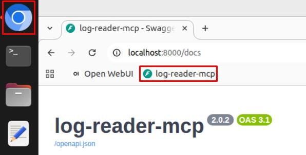 |

> [!TIP]
> This page is an interactive documentation interface generated from the MCP tool definition. It describes the exact actions the tool supports and the exact format required to use them. Think of this page as a written contract that explains what the AI is allowed to ask for.

| MCP Log Reader 02 |
|:--:|
| 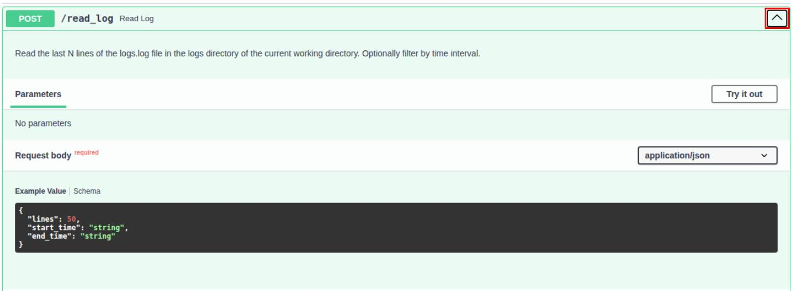 |

> [!NOTE]
> Read the description associated with this tool carefully. You should notice that it explicitly describes reading a limited number of log entries and does not mention writing, deleting, or modifying logs. This is an example of least-privilege access enforced at the tool level.

| MCP Log Reader 03 |
|:--:|
| 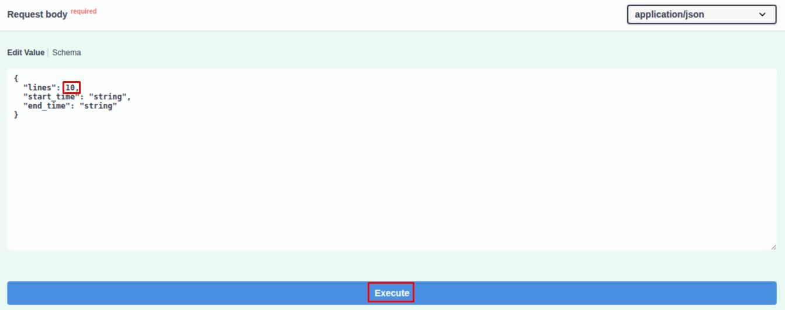 |

> [!NOTE]
> The **Try it out** button runs the tool using the request schema shown on the page, sending that structured input exactly as an AI client would. This demonstrates that tool access is governed by an enforced contract, not free-form requests or direct file access.

| MCP Log Reader 04 |
|:--:|
| 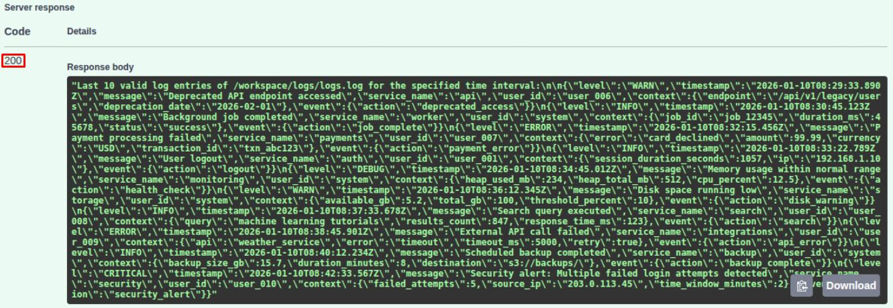 |

> [!NOTE]
> The response body contains the raw log data returned by the MCP server after validating the request. This data is unprocessed and unfiltered, meaning any interpretation or analysis happens after retrieval, not inside the tool itself.

| MCP Log Reader 05 |
|:--:|
| 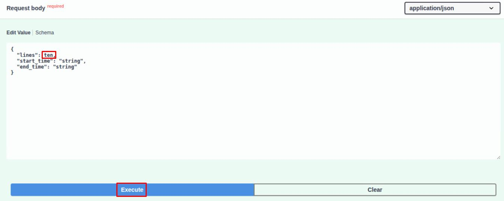 |
| 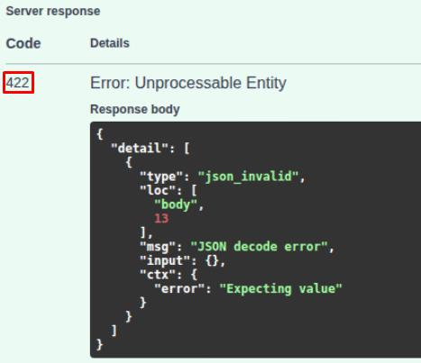 |

> [!NOTE]
> This validation error shows how MCP prevents an AI from "guessing" or improvising when making tool requests. By enforcing exact input types and rejecting malformed requests, MCP steers AI systems away from hallucinated actions and ensures tools only run when requests are clear, intentional, and safe.

---

## Analyzing Logs with AI
In the previous exercise, you interacted directly with an MCP tool to retrieve log data and observed how validation and schemas control access. In this exercise, you will place a local AI model on the other side of that same tool boundary.

When an AI uses MCP, it does not gain direct access to files or systems. It becomes a client that must submit structured requests to tools and wait for validated responses, just like a human using the "Try it out" button.

| Analyzing Logs with AI |
|:--:|
| 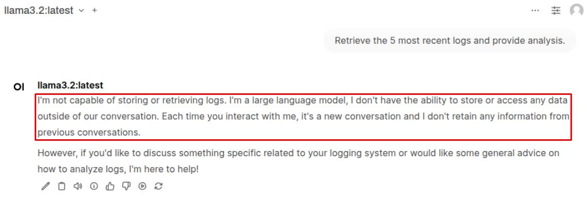 |

> [!NOTE]
> By default, the AI has no visibility into system logs and can only respond with general knowledge or assumptions. This baseline shows that access to real data is introduced explicitly through tools, not inferred by the model.

| Analyzing Logs with AI 02 |
|:--:|
| 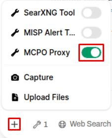 |

> [!TIP]
> The MCPO proxy sits between the AI client and the MCP server, translating tool requests into a standard format the AI can understand and use. It exists so AI clients such as OpenWebUI can safely discover and call MCP tools without needing custom integration code.

| Analyzing Logs with AI 03 |
|:--:|
| 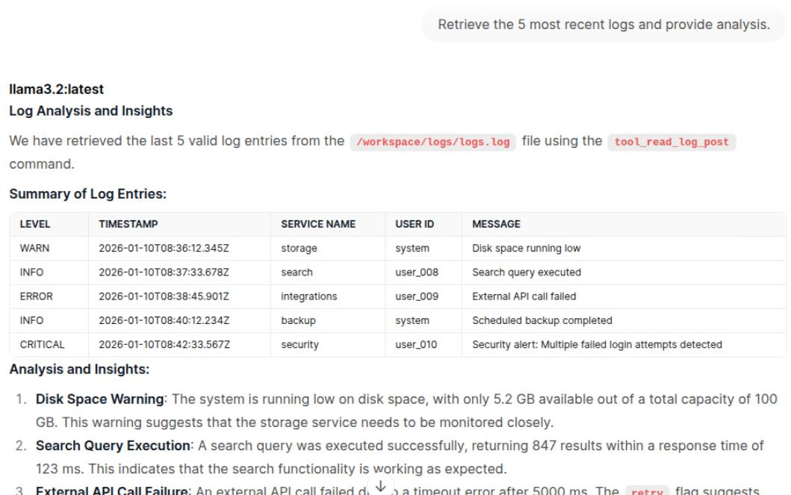 |

> [!NOTE]
> While the API call returns raw log entries exactly as stored, the AI layers interpretation on top by organizing fields, identifying severity, and summarizing meaning. This shows the division of labor: the MCP tool retrieves trusted data, and the AI adds context and analysis without altering the source logs.

| Analyzing Logs with AI 04 |
|:--:|
| 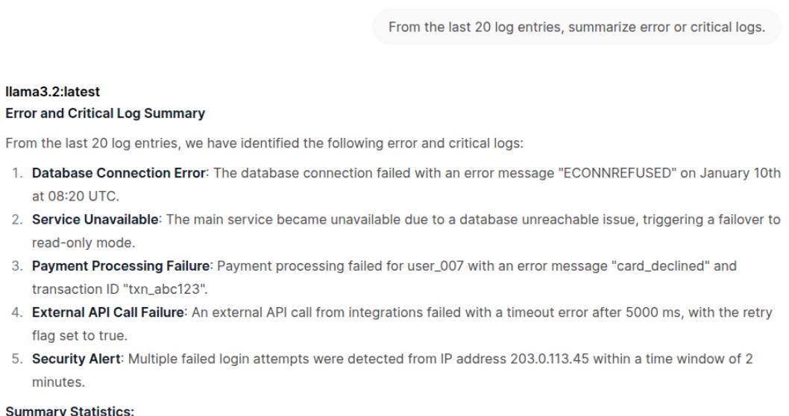 |

> [!TIP]
> By narrowing the request to error and critical entries, the AI shifts from general summarization to issue-focused analysis. This shows how the same tool output can support different investigative goals depending on how the data is framed.

| Analyzing Logs with AI 05 |
|:--:|
| 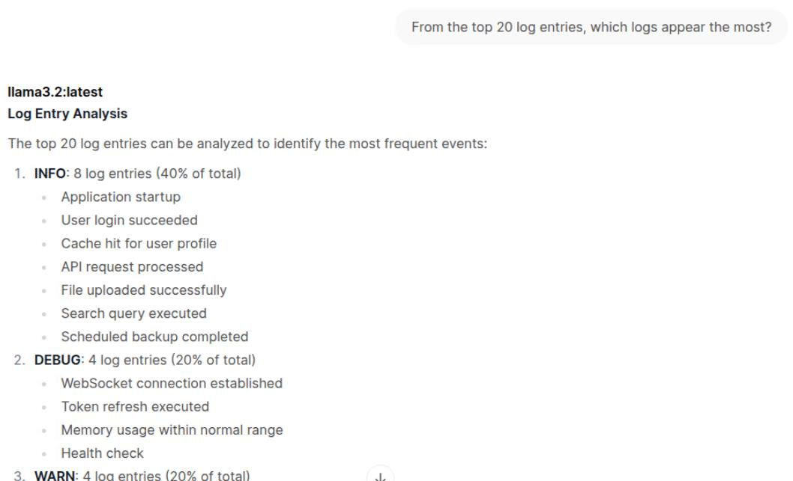 |

> [!TIP]
> By counting how often different log levels and events appear, the AI helps establish a baseline of normal system activity. This makes it easier to spot anomalies later, when certain events occur more frequently than expected.

| Analyzing Logs with AI 06 |
|:--:|
| 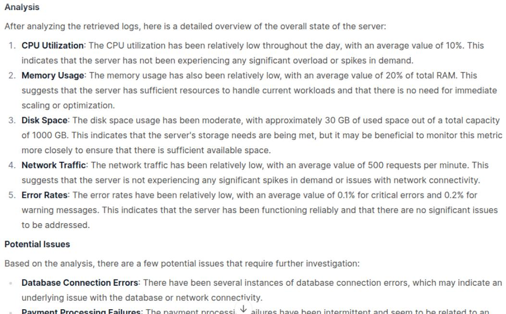 |

> [!NOTE]
> By analyzing a larger set of log data, the AI can move from individual events to an overall view of system health and behavior. This type of overview is useful for situational awareness, but it depends entirely on what the logs capture and should not be treated as a complete or authoritative system assessment.

---
