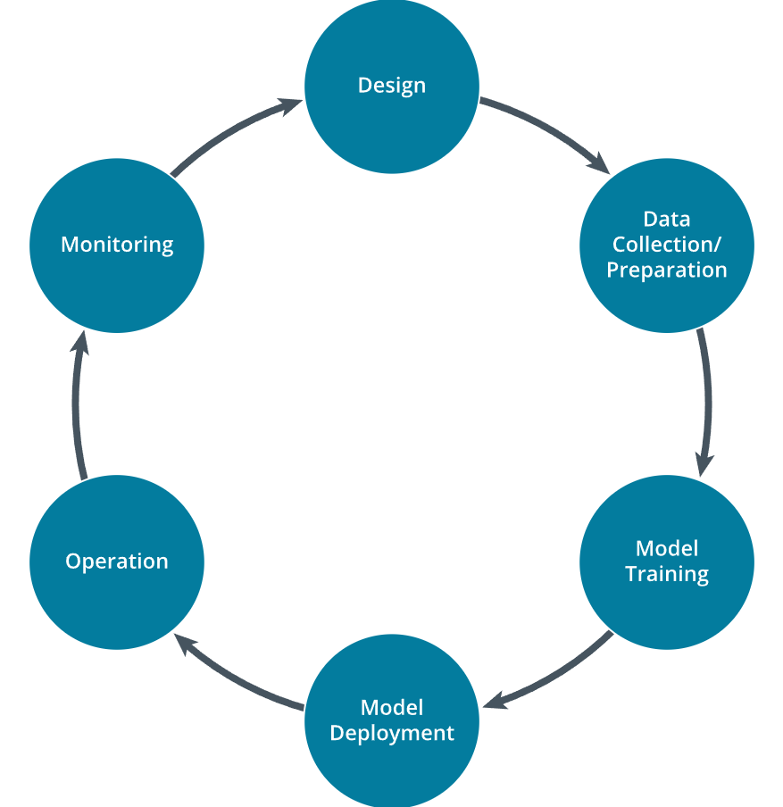

# 4.1.3 Data Security Considerations

Artificial intelligence now plays a central role in modern cybersecurity strategy, functioning both as a defensive tool that transforms vast amounts of telemetry into timely intelligence and as a new type of digital asset requiring innovative protection methods. Managing security throughout the AI lifecycle enables organizations to leverage AI's potential while minimizing its attack surface.

The AI lifecycle consists of several distinct stages where security and risk controls should be implemented. The typical stages in an AI lifecycle include:

1. Design
2. Data Collection and Preparation
3. Model Development/Training
4. Model Deployment/Integration
5. Operation/Inference
6. Monitoring and Maintenance

| The AI Lifecycle |
|:--:|
|  |
| *Each phase of the AI lifecycle ensures security controls from design through maintenance phases.* |

> [!NOTE]
> An arrow moves from Design to Data Collection or Preparation, then to Model Training, then to Model Deployment, then to Operation, then to Monitoring, and then back to design.

## Design
The lifecycle begins with the design phase, where business value and risk appetite intersect. Here, architects outline desired outcomes such as faster incident response or automated anomaly classification, aligning them with measurable corporate objectives such as mean time to detect and reducing false positives. Incorporating security measures at this stage means performing threat modeling, identifying potential training data tampering, assessing the impact of outages on regulated services, and understanding compliance obligations that dictate data handling procedures. Clearly articulating these constraints early on can save costly re-engineering efforts later.

## Data Collection and Preparation
After objectives are established, the focus shifts to data collection and preparation. Security professionals should recognize that attackers can poison data even when they cannot access it directly, making controls for data provenance, integrity, and confidentiality essential. Implementing hash-based immutability checks on raw log archives, tokenizing personally identifiable information, and utilizing other similar privacy techniques safeguards both the business and its customers. Publicly available datasets allow teams to prototype threat-detection models without exposing internal telemetry. Tools like IBM's Adversarial Robustness Toolbox make it possible to examine the dataset for outliers that could signal poisoning before training begins.

## Model Development/Selection
During the model development and training phase, the emphasis shifts to code hygiene and environment hardening. Conducting dependency scanning of machine learning frameworks, ensuring reproducible builds, and creating isolated training networks helps prevent supply-chain attacks. Security professionals can enhance resilience through adversarial training, where samples are injected to verify the model's tolerance to evasion techniques. Model selection is equally crucial to ensure they align closely with organizational governance and audit needs, such as speed and explainability.

## Model Deployment/Integration
Even with a trained model ready, the deployment and integration phase presents new challenges. Before going live, it's important to use a blue-green rollout or a canary release to validate the model's predictions against a reference environment. This ensures that detection rates remain consistent under production-level traffic conditions. Additionally, integrating the model into a security information and event management (SIEM) platform is crucial to establishing a feedback channel for the alerts generated by the model. This helps ensure that alerts are logged and facilitates continuous verification.

## Operation/Interference
The operation or inference phase is where the AI system generates its value. Runtime monitoring watches for features that drift beyond established training distributions, spikes in inference latency that could indicate denial-of-service attacks, or unexpected calls to infrequently used elements. Automated response playbooks can isolate suspicious inputs for human review, combining the speed of AI with the judgment of security analysts.

## Monitoring and Maintenance
Monitoring and maintenance complete the lifecycle. Concept drift, new attack vectors, and evolving business priorities require regular retraining and redeployment of models. Secure feedback pipelines collect **false positives**, analyst annotations, and post-incident reports, channeling them back to the data preparation phase. Conducting regular red-teaming of models, managing patches for underlying libraries, and periodically reassessing threat models ensures continued alignment with corporate objectives and evolving regulatory requirements, resulting in a lifecycle that is a process of continuous improvement rather than a linear process.

When each phase integrates well-defined security controls, organizations can enjoy the benefits of AI-driven speed and accuracy without incurring unmanaged risks. On the other hand, overlooking controls at any stage (such as lax access management around data lakes or unpatched inference servers) can turn a useful model into a liability. By thoughtfully managing design, data, development, deployment, operation, and monitoring, organizations can optimize their AI initiatives effectively.