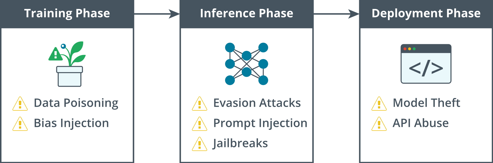

# 4.1.4 AI Life Cycle Security Considerations

Artificial intelligence systems rely heavily on the quality of the data they use. When security measures address potential risks in data collection from the beginning, they help protect the confidentiality, integrity, and provenance that downstream systems depend on to produce reliable outputs. In contrast, if malicious or poorly curated data slips through the intake process, all subsequent controls will struggle because the foundational data is untrustworthy.

The first line of defense is verifying the authenticity of data. Whether collecting logs from security appliances, scraping open-source threat intelligence, or digitizing historical records, teams should establish a clear ***chain of custody*** and incorporate tamper-evident mechanisms at each step. Authenticity checks should apply to both human-generated and machine-generated data.

The trustworthiness of data also relies on the reputation of its sources and its accuracy. Automated crawlers should maintain allow lists of pre-vetted domains, while partners should sign legal agreements that outline ownership and permitted use of data. Even open-source licensed datasets should be verified against known-bad indicators and potentially sanitized of personally identifiable information. Logging the work done to perform these checks in immutable audit trails facilitates later investigations to identify precisely when and where questionable records entered the pipeline.

Data labeling and enrichment introduce additional security concerns. For example, if labels are crowd-sourced, robust identity verification and continuous quality scoring can help prevent subtle poisoning campaigns, where adversaries mark malicious samples as benign. Internally curated labels, reviews, and statistical anomaly detection approaches reduce the likelihood of accidental misclassification. Additionally, keeping raw and labeled data versions available allows future retraining tasks to revert to the original state, especially if tampering is discovered.

> [!NOTE]
> Organizations should operate a model registry (an auditable system of record for model, dataset, and evaluation versions) and a formal ***change-control process*** for any AI change that affects security posture. Promotions of high-impact rules or models require documented human approvals (such as SOC manager, model owner, risk owner), execution in defined "change windows", active monitoring, and rollback plans. These controls ensure provenance, accountability, and safe operation of AI-assisted security.

Models can only produce reliable insights when the data stream feeding them is both complete and clean. During a cyberattack, adversaries may try to starve or poison a pipeline used for network analysis. For example, a denial‑of‑service (DoS) aimed at traffic collection endpoints could overwhelm them so that little or no data is sent. The resulting silence might be translated as legitimate inactivity, thereby tricking downstream analytics to redefine "normal" traffic patterns. Defensive measures such as rate-limiting inbound requests, routing traffic through redundant sensors, and exchanging cryptographically signed heartbeat messages with sequence numbers and expiry information help the ingest layer distinguish between a true lull and data that is stalled or delayed.

| Common AI Threats |
|:--:|
|  |
| *An illustration of the phases for common AI threats.* |

> [!NOTE]
> **AI Security Threats by Lifecycle Phase**
>
> **Training Phase**
> - Data Poisoning
> - Bias Injection
>
> **Inference Phase**
> - Evasion Attacks
> - Prompt Injection
> - Jailbreaks
>
> **Deployment Phase**
> - Model Theft
> - API Abuse

Attackers may also flood the pipeline with carefully crafted but bogus records that hide among real events and gradually push a model's decision threshold in their favor. To catch this tactic, reference inputs with known outputs are included in the stream. If the outcome for these known cases drifts without a legitimate business reason, the system immediately flags that the training distribution is under attack.

Trust is also established through transparency. Documenting data provenance, validation metrics, and cleansing decisions provides stakeholders with confidence that the model is defensible. This approach also aligns with the EU AI Act's data-governance and record-keeping obligations for high-risk AI, including documenting training/validation/testing datasets, their provenance, and quality controls.

Secure collection practices ensure that data is authentic, complete, and legally compliant, allowing subsequent stages such as training, deployment, and monitoring to focus on delivering value. Investing in authenticity controls and trust mechanisms provides tangible benefits throughout the entire AI lifecycle.