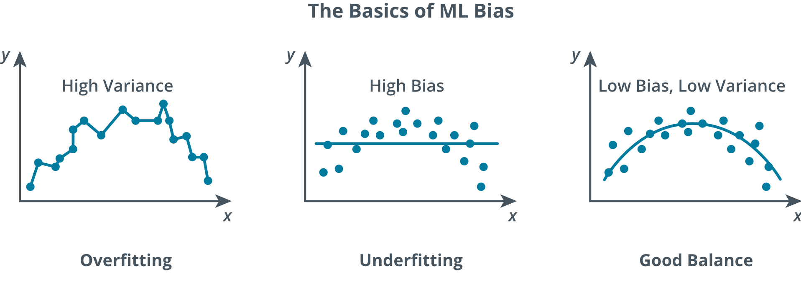

# 4.2.1 Analyzing AI Attacks

Cybersecurity programs must defend two interdependent areas: the traditional enterprise environment and the AI systems that now read, write, and act within it. An effective way to manage this is to anchor analysis using a standard catalog of adversary behaviors and then connect each behavior to controls that span AI system design, training, deployment, and operations. MITRE ATLAS is a popular tool because it translates real attacks on machine learning systems into techniques security practitioners already understand. When combined with guidance such as the NIST AI Risk Management Framework, this approach helps organizations decide which risks to accept, which to mitigate, and how to verify that mitigations work as required.

***Prompt injection***, jailbreaking, and other forms of guardrail circumvention are common and attempt to override system instructions by inserting commands through user input, documents, emails, or web pages. Typical signs of these attacks include models revealing hidden configuration details, ignoring guardrail policies, or performing unintended actions. Effective defenses for these attacks, like other types of attacks before the era of AI, are layered and predictable. Examples include treating external text as untrusted, clearly delimiting and encoding anything the model reads, constraining which tools the model may call, requiring explicit human approval for sensitive actions, and recording every tool invocation. Resources such as OWASP's LLM Top 10 and specific vendor product guidance from OpenAI, Microsoft, and others can be valuable sources of information when deciding where to filter, where to constrain, and where to implement confirmation-type controls.

- **Poisoning attacks** shift the focus "upstream" by polluting training data so the model learns from a distorted perspective. With ***model poisoning***, attackers tamper with gradients or weights used during training or in the supply chain resources used for training to influence outputs or potentially embed instructions that result in backdoor access to model data, code, or the platforms they run on. Practical compensating controls include ensuring strong data lineage validation, creating reproducible training pipelines, automated similarity and drift checks on incoming data, and identifying small canary record entries that can be evaluated during each training stage. Fortunately, MITRE ATLAS provides realistic techniques that teams can utilize to leverage the benefits these controls represent.

- **Input manipulation attacks** focus on subtly modifying images, audio, and other similar data so that humans cannot detect the changes despite producing tangible impacts on model outcomes. Because filtering alone is imperfect, critical input processing workflows must include checks. For example, allowing a model to draft an email but reserving send privileges for humans, or to let an AI agent suggest a ticket update but gating the changes behind a human-centric review and approval process. These types of controls reflect human-in-the-loop and segmentation controls for workflows that represent high levels of risk.

- **Hallucinations**, which describe when a model generates completely false but very believable output, become a big problem when other systems act on hallucinated model output as if it were fact. A hallucinated Application Programming Interface (API) endpoint or command, for example, can cause processes to fail or result in even more severe issues such as widespread outages, data breaches, or data corruption. Separating model output generation processes from execution processes can reduce this type of risk. Systems should validate model outputs using cross-model checks or human review processes to validate their accuracy. OWASP provides guidance that translates these concepts into developer-friendly examples such as sanitizing tool arguments, isolating retrieval processes from prompting, and validating outputs before any further actions occur.

- **Bias** describes when automated systems, such as pipelines designed to gather data from public sources, are intentionally manipulated. For example, the material may include misleading content that is incorporated into a training set or when prompts are carefully crafted to produce outputs loaded with harmful stereotypes. To effectively combat bias, organizations should use only carefully curated datasets that have clear sources and documented histories to ensure the data is reliable and includes healthy and balanced perspectives. Additionally, periodic evaluations of data can validate that it is free from bias. In support of these objectives, model cards provide transparency about a model's capabilities, limitations, and the types of data it has been trained on. When things don't go according to plan, escalation paths define the incident response protocols for effectively addressing unexpected results.

- **Poorly controlled AI assistants** that read inboxes, browse knowledge bases, or otherwise mimic the use of software by human users can be tricked into exfiltrating data or performing malicious actions. Least-privilege permissions can help prevent abuse, and audit controls support creating timelines of all actions.

- **Manipulating application integrations** refers to maliciously altering or exploiting the connections between AI systems and external applications to compromise their functionality or outputs. Attackers may inject malicious data, modify API calls, or tamper with integration points to manipulate AI model behavior, bypass security, or extract sensitive information. For example, altering input data fed through an API can cause a model to produce incorrect predictions or reveal training data. Attacks like these exploit the trust in the connections established between systems. Defending against the manipulation of application integration requires implementing controls such as input validation, API authentication, and monitoring to support the detection of anomalous behaviors.

- **Chain of thought (CoT)** refers to the step-by-step internal reasoning that many large language models generate (sometimes explicitly in a visible text stream) before arriving at a final answer, or performing an action. This reasoning enables models to solve complex problems, use tools correctly, and produce coherent multi-step plans. Models treat their own previous reasoning as part of the context for the next step. As a result, any injected or altered text within the chain can permanently shift the model's behavior, making CoT a prime target for prompt injection and jailbreak attacks. Additionally, chain-of-thought details may contain sensitive information, such as API keys, private data from retrieval steps, or confidential intermediate results that the model repeats "to keep them in mind." If these traces are logged, returned to users, or stored without protection, they become a source of accidental data leakage. In regulated or high-risk environments, the CoT often serves as the only auditable record describing why the model made a particular decision. Protecting the integrity and confidentiality of chain-of-thought reasoning is therefore critical.

## Detection Methods

- **Poisoning attacks** can be detected by monitoring for unexpected shifts in training data quality or model behavior. By comparing new data against historical baselines, abnormal trends can be identified using data drift detection (the process of identifying changes in data distributions over time.) Detection methods can also focus on calculating similarity scores between new and trusted datasets to help flag outliers. Also, during the training phase, the ability to reproduce checks can verify whether the same inputs consistently produce the same expected results, which helps reveal potentially poisoned data.

- Detection of **input manipulation attacks** involves scanning incoming data for subtle inconsistencies that humans would not typically notice, but algorithms often can. For example, automated integrity checks can flag modified images, while other mechanisms can be incorporated to alert when inputs statistically differ from previously established patterns. For systems handling text or speech, language or acoustic analysis tools can identify unnatural elements that often point to deliberate manipulation.

- **Schema validation** is a relatively simple yet highly effective defensive measure for securing AI. When an AI system is required to return structured data (such as JSON), the exact schema that describes the allowed fields, types, ranges, and patterns is pre-established. Any output from the model that does not correctly match the predefined schema can be immediately rejected, silently blocking most prompt injections, jailbreaks, and data-exfiltration attempts, as those attacks almost always require adding unexpected fields, changing types, or adding extra instructions. A spike in validation failures becomes a clear, high-confidence indicator that something has gone wrong, such as an attacker, a misbehaving model, or data modification.

- Detecting **hallucinations** relies on comparing AI-generated outputs to verified sources or the outputs generated by similar but different models. Cross-model validation describes having two or more models independently answer the same query to help identify when one model's response diverges significantly from anticipated outputs. Factual consistency checks compare model outputs against well-established knowledge sources.

- **Bias** detection typically involves periodic audits of model outputs to test fairness across demographic or other similar classes. Auditors often utilize benchmark datasets designed to measure "fairness" or analyze model responses for disproportionate error rates among various pre-established groups. Generating visualizations of data distributions can also help identify potential issues or bias.

| The Basics of ML Bias |
|:--:|
|  |
| *The basics of ML bias including overfitting, underfitting, and good balance.* |

> [!NOTE]
> An infographic titled, the basics of ML bias displays three scatter plots. The first plot, labeled overfitting (high variance) shows a complex, jagged line passing through every single data point. The second plot, labeled underfitting (high bias) shows a horizontal line that fails to capture the data's trend. The third plot, labeled good balance (low bias, low variance) shows a concave down curve that models the general trend of the data.

- **Poorly Controlled AI Assistants**—AI assistant actions must log all automated actions to generate audit trails that include a record of every file read, message sent, or command executed. These audit trails help support the identification of any unauthorized actions. Behavioral analytics can help utilize this data to detect unusual usage patterns, which can indicate abuse or compromise.

- **Manipulated Application Integrations**—API monitoring and input validation can help to verify that incoming API requests match expected information and actions, and anomaly detection can help to identify irregular traffic patterns or unusual sequences of API requests.