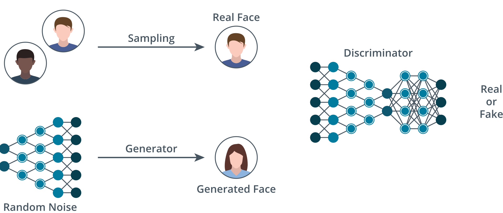

# 5.2.1 AI for Deception and Social Engineering

AI is used to enhance or enable additional attack vectors by allowing a quick and easy method to generate realistic content. This content may include video and audio by impersonating people or creating videos of fictitious events that seem to be real. This can be used to fraudulently target individuals and organizations. This can further enhance blackmail and influence campaigns. Eventually, this can lead to distrust of legitimate content by the general public.

***Impersonation*** is the act of representing or pretending to be a person or company for the purpose of fraud. ***Deepfake*** videos can be created that look and sound like a particular person. *Misinformation*, or false information can be spread through the use of this type of fraudulent content. Additionally, ***disinformation*** can also be generated. The difference is that disinformation is created to intentionally cause harm or deceive. There are plenty of videos of examples of AI-generated content on the web. One example is of an AI-generated video of Morgan Freeman speaking on video. AI systems were used to analyze millions of samples of his voice, mannerisms, and facial structure, and that data was used to generate the deep fake. This could be used in any manner the developer wishes, including faking an endorsement of a product or that he has a particular viewpoint and opinion on a subject.

This is possible because today's AI systems include the ability to perform a high-functioning synthesis of content to produce realistic imagery and audio, including voice cloning. This also enables an AI system to capture mannerisms such as facial muscle movement recognition, voice tone, and inflection that are unique to each individual. This can all be easily created by ingesting publicly available content from interviews and social media websites like Facebook and Instagram. These deepfake videos and audio can then be fed back into social media platforms for dissemination across the globe or used as part of an elaborate ***social engineering*** attack.

These deepfakes can be used to enhance email-based attacks where an AI system generates very personalized emails based on public and open source information gathering about the victim. The system can analyze social media contacts, employment records, and even corporate video postings to generate up-to-date scenarios and talking points for the scam to be effective. Gone are the days of being able to identify a scam by seeing grammar and spelling mistakes. The deepfakes used in modern phishing 3.0 attacks, where AI is used to enhance the scam, might even be of a trusted employee or executive that the victim has interacted with in real life, and through this careful analysis, makes the attack seem more plausible.

The attacks also benefit from LLMs that have been trained are large datasets to generate variations of a single story template based on the victim, their work or field of study, and even the cultural differences from various locations. This is also used to improve zero-shot training of the system, where the LLM is able to recognize new objects from the data set that it has not seen or processed before, through the various attributes of the new input being provided, compared to the existing dataset it was trained on.

Obfuscation techniques within the content can also make the content difficult to process and understand. Obfuscation techniques can also be used to hide information in plain sight by using alternative language or code words. These techniques can also be used in software code, where the outcome is still the same, but the code itself has been modified. This can make detection of malicious content difficult because signature and pattern recognition may not be able to detect the issue since the code has been modified. Signature-based detection also suffers from its lack of ability to remain up to date as new attack content is generated and modified more quickly than it can train to detect issues.

Another area in which AI systems can enable or enhance attacks is through the use of adversarial networks. Adversarial networks can be used to confuse or mislead learning models, thus creating incorrect predictions and outcomes. One such example is the use of a ***generative adversarial network (GAN)***. This configuration uses two separate neural networks that work against each other. One network is used to generate content, and then the other network is used in an attempt to identify if the generated images, video, or audio can be identified against legitimate content. GANs can also be used to generate spam content that is harder to detect and identify by normal spam filters by changing the content slightly with character changes or adding extra spaces into an email address.

| Generative Adversarial Network (GAN) |
|:--:|
|  |
| *An illustration of a generative adversarial network (GAN).* |

> [!NOTE]
> A diagram illustrating the process of a Generative Adversarial Network (GAN). The diagram shows two inputs for a discriminator network. The first input is a generated face, created by a generator network that processes random noise. The second input is a real face obtained by sampling from images of real people. The discriminator network's task is to analyze these faces and determine if they are real or fake.

The risk involved in these types of malicious use of AI systems includes loss of trust by the public and companies, and additional security risks from the content being used to bypass normal security controls. It also opens the door for ethical concerns if the content is used to manipulate decision-making processes in certain industries like the financial and legal systems.