# 5.2.6 Live Lab: Explore AI-Assisted Attack Vector Identification

## Scenario
Penetration testing is the ethical practice of probing a system for weaknesses with permission, defined scope, and the goal of improving security. It uses many of the same techniques as malicious hacking, but the intent is completely different: hackers try to compromise a system for their own benefit, while penetration testers identify vulnerabilities so they can be fixed.

This lab focuses on the early stages of pentesting - mapping the application's attack surface and spotting potential paths an attacker might explore. AI can't replace a full vulnerability scanner, and it isn't capable of autonomously exploiting an application. What it can do is help you interpret what you discover, highlight areas of concern, and reason about which parts of the system are most likely to contain security flaws.

You'll use AI as an analytical partner rather than a hacking engine. By combining your own hands-on testing with AI-assisted interpretation, you'll see how modern tools can accelerate the identification of attack vectors while keeping human judgment and ethical practice firmly in control.

> [!IMPORTANT]
> **The Mission**:
> - Explore the OWASP Top 10 web vulnerabilities.
> - Use AI to identify promising attack vectors.
> - Test those ideas through hands-on investigation.

## Exam Objectives
This activity is designed to test your understanding of and ability to apply content examples in the following CompTIA SecAI+ objectives:

- 3.2 Explain how AI enables or enhances attack vectors.

---

## Exploring the OWASP Top 10
Before you begin probing the application, you'll ground yourself in the OWASP Top 10 - the most widely referenced list of critical web application vulnerabilities. The Top 10 is focused specifically on risks that appear in web servers and APIs, which aligns directly with the kind of system you'll be testing in this lab. Understanding these foundational concepts will help you make sense of the attack vectors you identify later in the lab.


| Exploring the OWASP Top 10 |
|:--:|
| 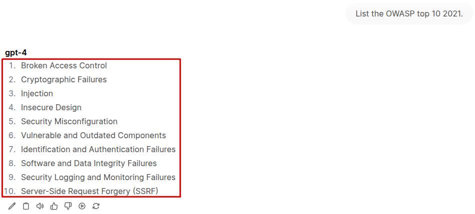 |

> [!NOTE]
> The OWASP Top 10 is presented as a ranked list, with the items at the top representing the risks most frequently seen and most likely to be exploited in real-world web applications. Keeping this ranking in mind helps you understand where attackers - and penetration testers - tend to look first.

| Exploring the OWASP Top 10 02 |
|:--:|
| 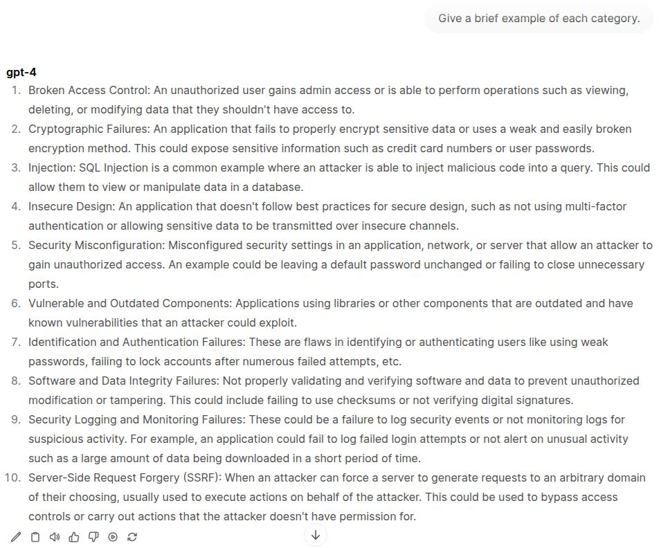 |

> [!NOTE]
> The OWASP Top 10 describes broad categories of risk, not single exploits. The brief examples you received help anchor each category in something concrete, showing the kinds of mistakes that make these vulnerabilities possible. They aren't meant to cover every scenario-just to illustrate the pattern behind each risk. As you continue the lab, focus on recognizing these patterns, since they're what guide a penetration tester toward likely attack vectors.

| Exploring the OWASP Top 10 03 |
|:--:|
| 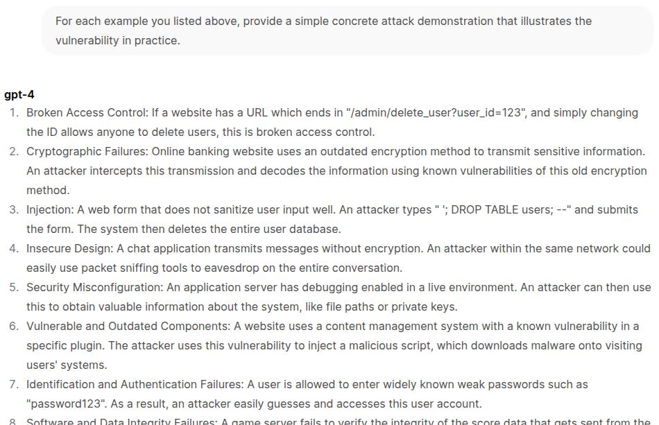 |

> [!NOTE]
> These short demonstrations show what each vulnerability can look like in the real world. They're simplified on purpose-just enough to reveal the underlying weakness without getting into full exploit chains. The key takeaway is the pattern each example represents, since recognizing those patterns is what helps you spot real attack vectors later.

## Introducing OWASP Juice Shop
For the rest of the lab, you'll be working against OWASP Juice Shop, a deliberately insecure e-commerce site created by OWASP as a safe playground for learning and practicing web attacks. It's built to contain examples of every OWASP Top 10 web risk-along with many additional flaws drawn from real applications-covering issues like broken access control, injection flaws (including SQL injection), cross-site scripting, weak authentication, and security misconfigurations.

| OWASP Juice Shop |
|:--:|
| 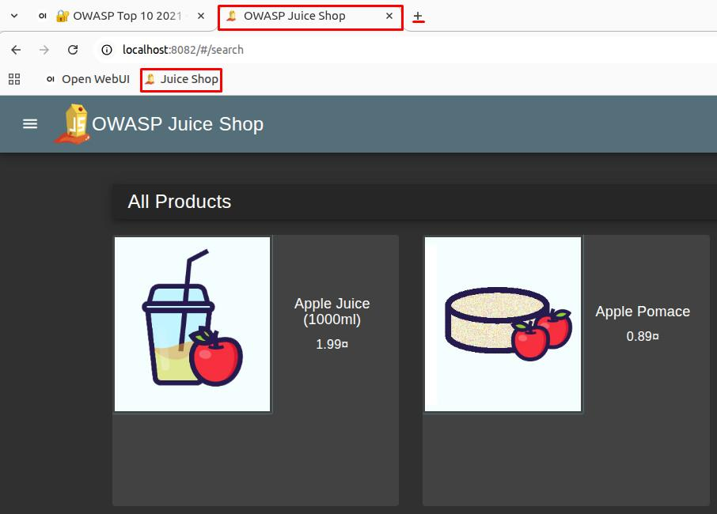 |

> [!NOTE]
> The Products page is the default landing view in Juice Shop and represents a typical e-commerce catalog. Even though it looks simple, it connects to several backend APIs for search and product retrieval, making it a common place where real applications expose vulnerabilities.

---

## Enumerating Attack Surfaces with AI Assistance
Before an attacker attempts any exploit, they start by learning how the application is structured: which endpoints exist, which paths respond, and which features are exposed even when they aren't linked anywhere in the UI. This discovery phase often reveals functionality the developers may not have intended to expose.

In this exercise, you'll use the **Red Team Agent** to map out accessible paths on the Juice Shop server, then pivot into the browser to investigate what the tool uncovered. By navigating directly to these unlinked pages, you'll see firsthand how missing access controls and exposed functionality create entry points for deeper testing later in the lab.

| Enumerating Attack Surfaces with AI Assistance |
|:--:|
| 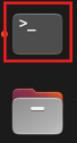 |
| 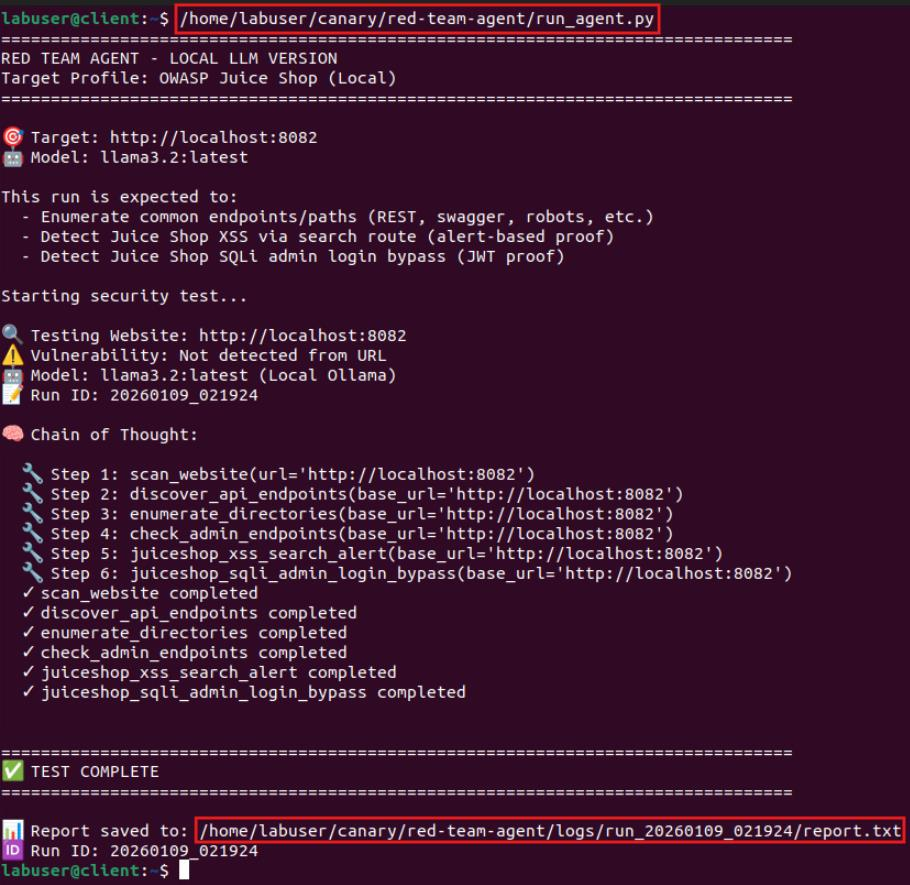 |

> [!NOTE]
> When you run **run_agent.py**, you're launching a local red-team "agent runner" that coordinates a short, repeatable security check against the OWASP Juice Shop target. The goal isn't to do a full penetration test - it's to run a fixed set of verification steps and then produce a clean report you can review afterward.

| Enumerating Attack Surfaces with AI Assistance 02 |
|:--:|
| 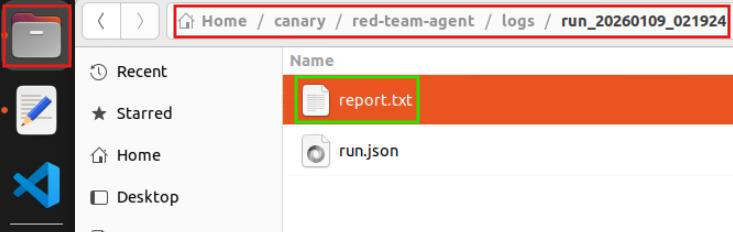 |
| *At the end of each run, the agent generates a report that captures what was actually tested and observed, including which application paths were reachable, whether XSS or SQL injection indicators were detected, and a brief high-level explanation of the checks performed. It also includes a short AI synopsis of the overall findings.* |
| 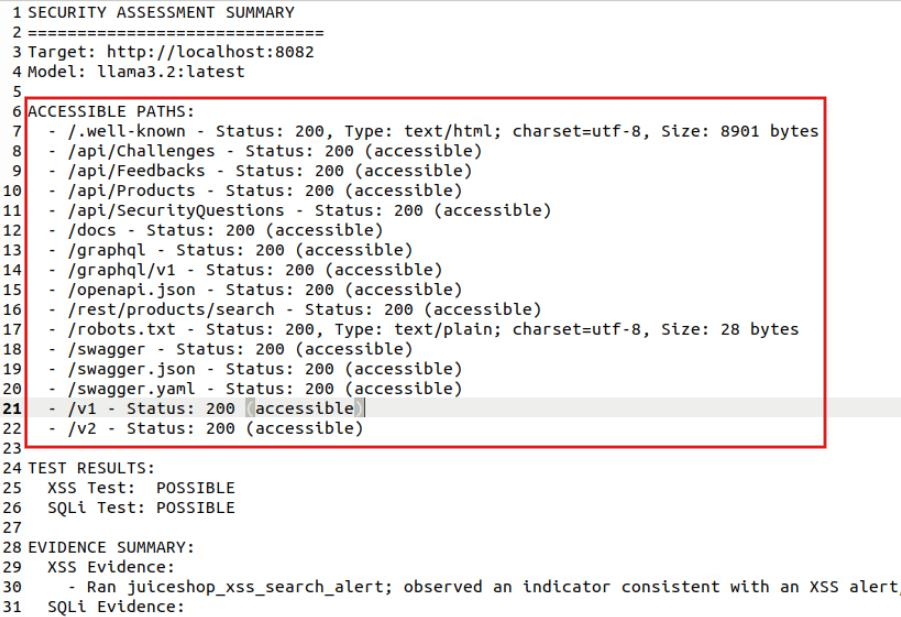 |
| *The Accessible Paths section lists only the routes that were confirmed reachable during the run, typically returning a successful response. This gives a clear view of the application's exposed surface area, including APIs, documentation endpoints (such as Swagger or OpenAPI), GraphQL routes, and supporting files like robots.txt. Reviewing these paths first helps frame the rest of the report by showing which parts of the application were actually accessible and relevant for testing.* |
| 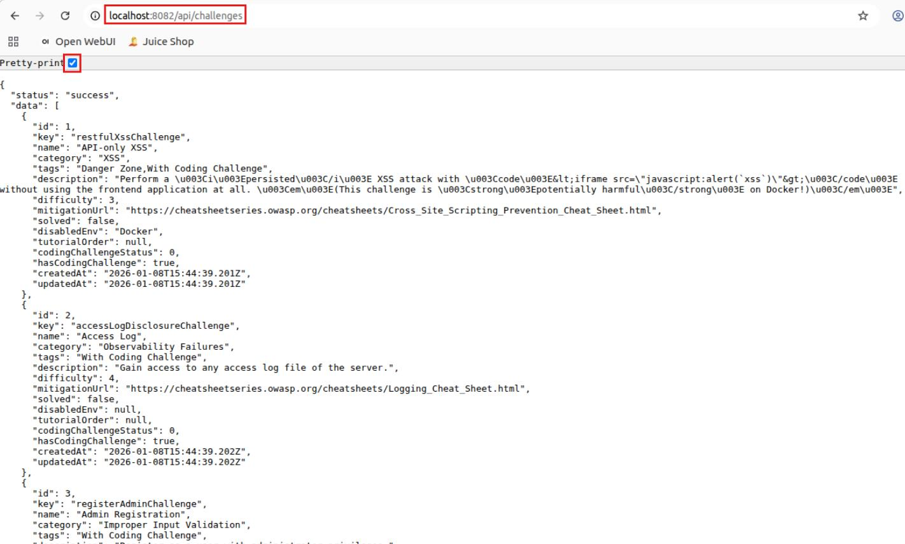 |
| ***/api/challenges** is a Juice Shop-specific API endpoint that exposes challenge/scoreboard data. It's a direct window into the app's "training objectives," and it often reveals internal structure about what the app is designed to demonstrate. In a real system, endpoints that reveal internal feature flags, test hooks, or "challenge catalogs" can leak implementation details that make security testing and abuse easier.* |
| 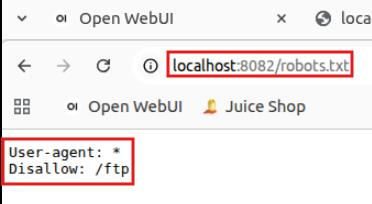 |
| ***robots.txt** is a file used to give guidance to search engines about which paths should not be indexed. It does not enforce access controls and does not prevent users from visiting those paths directly. When a file like robots.txt explicitly disallows a path such as /ftp, it can actually draw attention to it. Listing a directory suggests it exists and may contain something the application owner wanted hidden, making it a natural pivot point for further investigation rather than a protection.* |
| 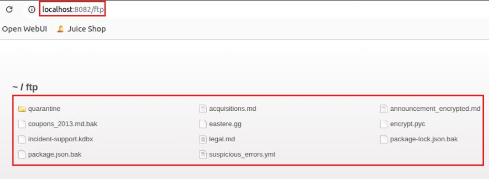 |
| *The **/ftp** directory is publicly accessible and displays a list of files that appear to be internal or sensitive, such as backups and configuration-related artifacts. Directories like this are typically meant for internal file storage or transfers, not public browsing. When exposed, they can leak information about an application's internals and provide another pivot point for further investigation, making them a common source of information disclosure issues.* |
| 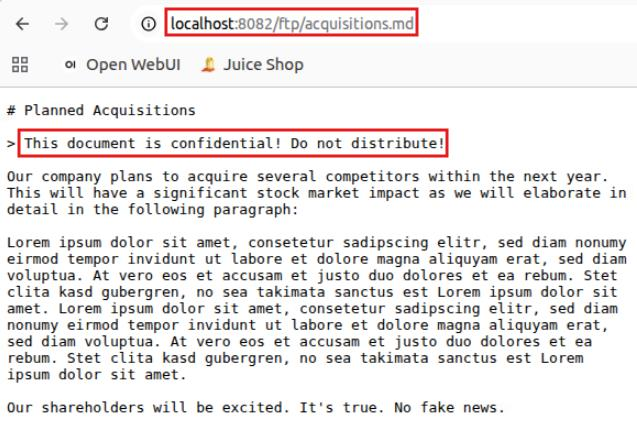 |
| *A file like acquisitions.md is high-impact because it appears to contain non-public financial and business information, such as planned acquisitions that could affect stock prices and market behavior. If exposed in a real organization, this kind of data could be exploited for insider trading, market manipulation, or targeted social engineering, with serious legal and financial consequences. From an attacker's perspective, finding information like this without any authentication is a major win and a clear sign of poor internal controls.* |

This exercise demonstrates how real-world security investigations often begin: not with complex exploits, but with simple enumeration and careful observation. By following exposed paths, reviewing accessible directories, and examining publicly available files, we were able to uncover information that clearly was not intended for external users. From here, the same process can be applied to the remaining files in the /ftp directory and to other accessible paths identified by the agent. This combination of enumeration and investigation forms the foundation of most security assessments, where small, seemingly harmless exposures can quickly lead to much larger security concerns.

---

## Manual Vulnerability Verification
In this exercise, you move from automated discovery into hands-on validation, manually interacting with the application to observe how XSS and SQL injection vulnerabilities manifest in the user interface. Rather than relying on tool output alone, you'll use the browser to reproduce the same behaviors the agent detected, reinforcing how input handling flaws translate into real, visible impact. This step mirrors a natural progression in security testing: once enumeration highlights likely weaknesses, targeted manual testing is used to confirm, understand, and contextualize those vulnerabilities from an attacker's point of view.

| Manual Vulnerability Verification |
|:--:|
| 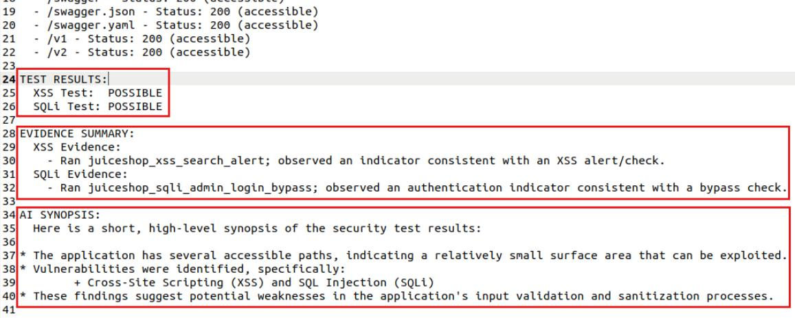 |
| *The remaining sections of the report summarize what the agent verified and what was observed. The test results show whether indicators of XSS or SQL injection were detected, the evidence summary explains which checks produced those signals, and the AI synopsis provides a brief, high-level interpretation. Together, these sections help guide where manual testing and deeper investigation should focus next.* | 

Switch to Chromium and go to the Juice Shop home page.
From the home page, select the search icon in the upper-right.
In the search bar, enter the following:
```

```

| Manual Vulnerability Verification 02 |
|:--:|
| 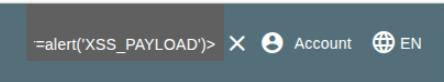 |
| 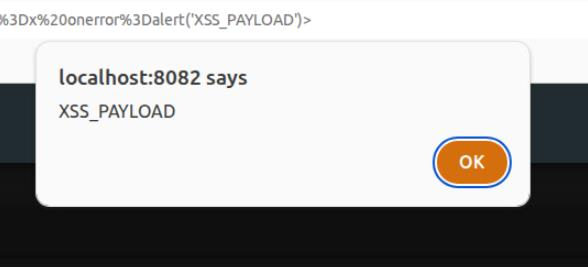 |
| *Cross-site scripting (XSS) happens when an application reflects user input back to the browser without proper validation, allowing it to be executed as code. In this example, a simple script caused a popup to appear, proving that untrusted input was treated as executable content. While the popup is harmless, the same flaw could be abused to steal data, manipulate the page, or act on behalf of a logged-in user, which is why XSS is considered a serious vulnerability.* |

| Manual Vulnerability Verification 03 |
|:--:|
| 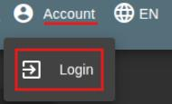 |
| 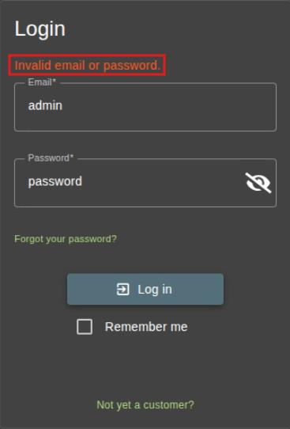 |

At the login page, replace the email with `admin' or 1=1 --`. Leave the password the same and sign in.

> [!TIP]
> You will be logged in as admin.

> [!NOTE]
> The `OR 1=1` SQL injection works by changing the logic of the authentication query instead of providing valid credentials. The condition 1=1 is always true, and when it's added with an OR, the database no longer requires the username and password check to succeed. As long as one part of the query evaluates as true, the database returns a positive result, and the application treats the login as successful. This shows how unsafe query construction allows attackers to bypass authentication entirely by rewriting the rules the database uses to decide who gets access.

| Manual Vulnerability Verification 04 |
|:--:|
| 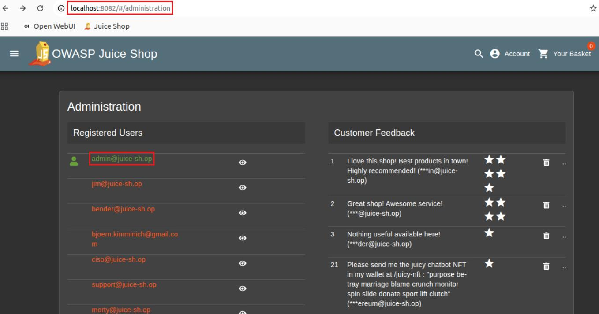 |
| *Accessing the Administration page confirms that the SQL injection bypass granted real admin privileges, not just a visual change in the UI. This is both proof of successful authentication bypass and a serious threat, since admin access exposes sensitive data and critical application functions that attackers can directly control.* |

---