# 5.3.2 Live Lab: Accelerate Scripting with AI

## Scenario
In security work, automation often starts small - a quick Python script to parse output, filter alerts, or check system configurations. But those scripts rarely run perfectly the first time. Using AI as a coding assistant can accelerate your workflow, helping you debug issues, improve reliability, and extend functionality safely.

In this lab, you'll explore how to use an AI assistant to fix, test, and iterate on Python scripts in a structured way. You'll see how AI can help you troubleshoot syntax errors, refine logic, and harden your code through better validation and documentation - all while maintaining control over what the script actually does.

> [!IMPORTANT]
> **The Mission**:
> - Use AI to diagnose and correct common scripting issues.
> - Iteratively test and refine your script in VS Code until it runs gracefully.
> - Extend the working script by adding new capabilities.
> - Use AI assistance to plan for large-scale code refactors.

## Exam Objectives
This activity is designed to test your understanding of and ability to apply content examples in the following CompTIA SecAI+ objectives:

- 3.3 Given a scenario, use AI to automate security tasks.

---

## AI-assisted debugging
Even simple automation scripts can break for small reasons - a stray space, a missing import, or a mismatched function name. In this exercise, you'll practice using AI as a debugging partner to identify and correct issues within an existing Python script. You'll work inside VS Code, alternating between prompting the AI for guidance and running the script locally to test your fixes.

Your goal is to iteratively bring a broken or incomplete script back to full functionality, learning how to communicate problems clearly to the AI and validate its suggestions through hands-on testing.

| AI-assisted debugging |
|:--:|
| 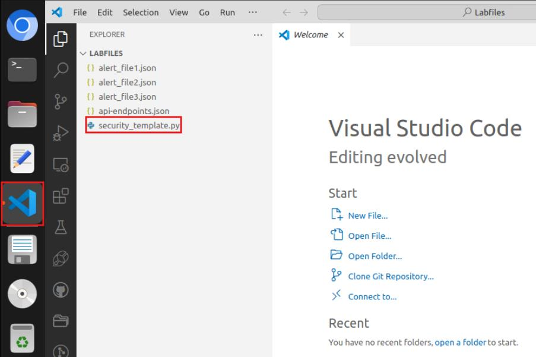 |
| 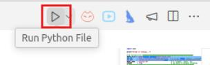 |
| 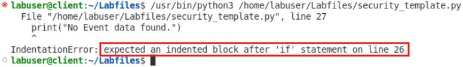 |
| *This is the same security template you used in an earlier lab - but this time, you'll be looking at the underlying code itself. The version provided here contains issues that prevent it from running as intended. You should notice an indentation error appear right away, signaling that there's a structural problem in the script.* |

| AI-assisted debugging 02 |
|:--:|
| 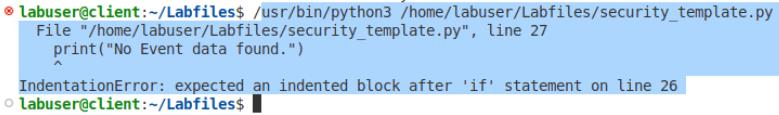 |
| 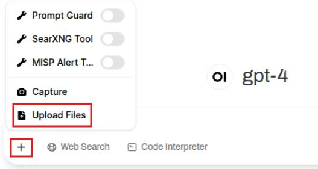 |
| 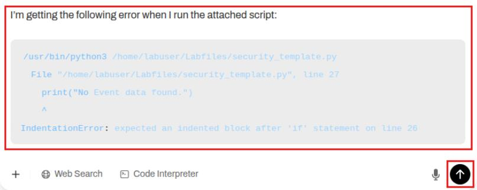 |
| 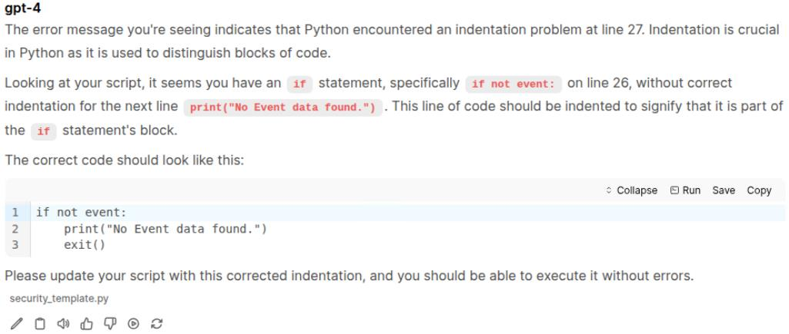 |
| 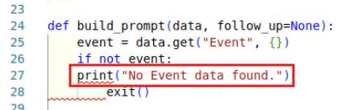 |
| 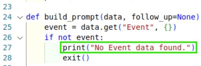 |
| *In Python, indentation defines code structure - not just readability. Each block must use consistent spacing so Python knows which lines belong together. An IndentationError happens when one line's spacing doesn't match the rest of its block, and even a single misplaced space or tab can cause the script to fail.*|

| AI-assisted debugging 03 |
|:--:|
| 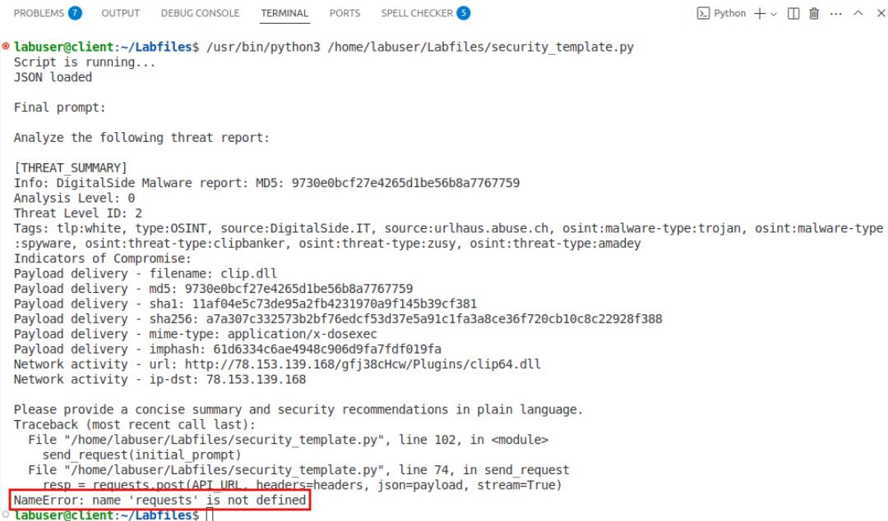 |
| *This time, the script got past the JSON parsing step and formulated a request to send to the model. However, it should fail at this step due to the requests module being undefined.*|
| 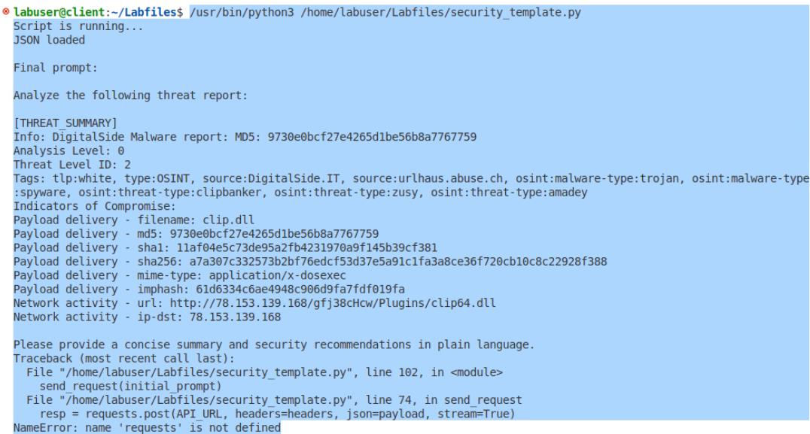 |
| 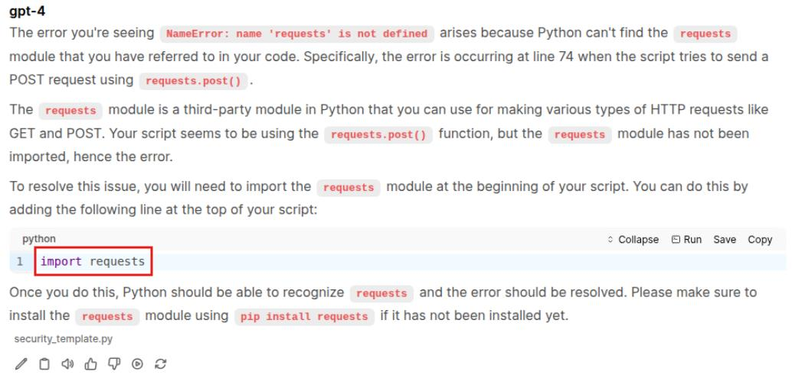 |
| 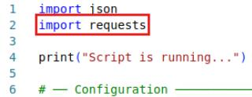 |
| *In Python, the import statement makes external code available to your script. Without it, Python doesn't recognize functions from that library and raises a NameError. Adding import requests lets your script use the **Requests** library to send and receive data from web resources or APIs.* |

| AI-assisted debugging 04 |
|:--:|
| 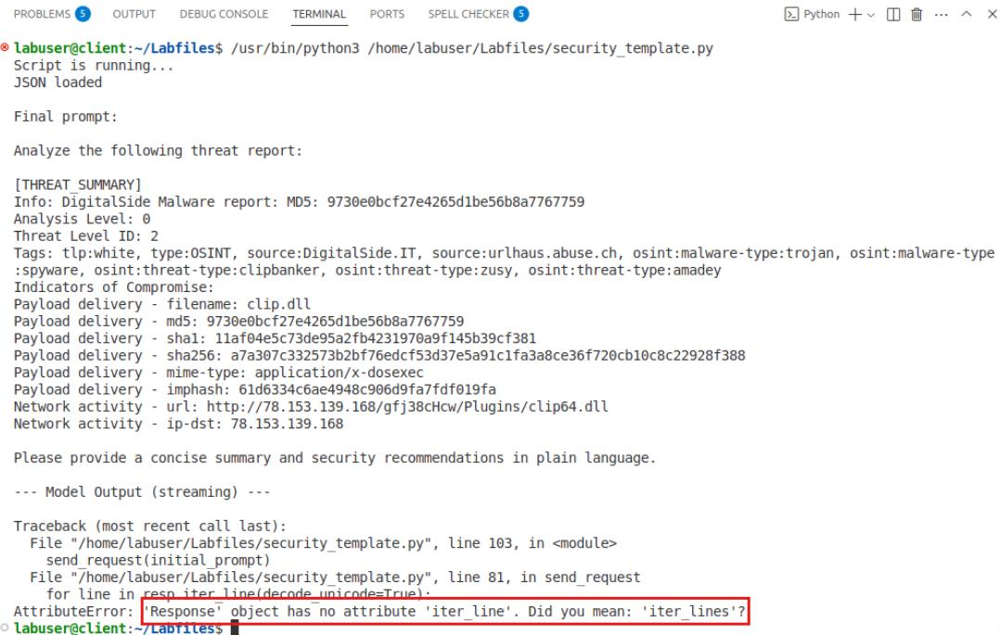 |
| *While you've fixed two different issues, there should still be something stopping the script from working properly. The error should mention the attribute **iter_line** as the culprit.* |
| 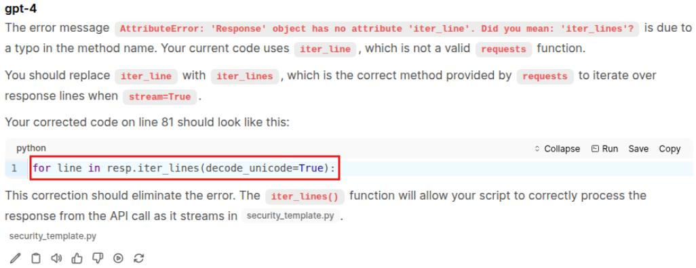 |
| *This time the model should identify that the **iter_line** function has a typo on line 81 and should be **iter_lines** instead.*|
| 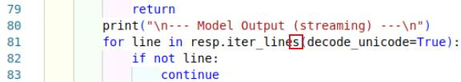 |
| *Python is case-sensitive and expects exact method names. If a function or method is misspelled, like using iter_line instead of iter_lines, Python will raise an AttributeError because that name doesn't exist in the library. Always double-check method names against documentation to ensure they match exactly.* |
| 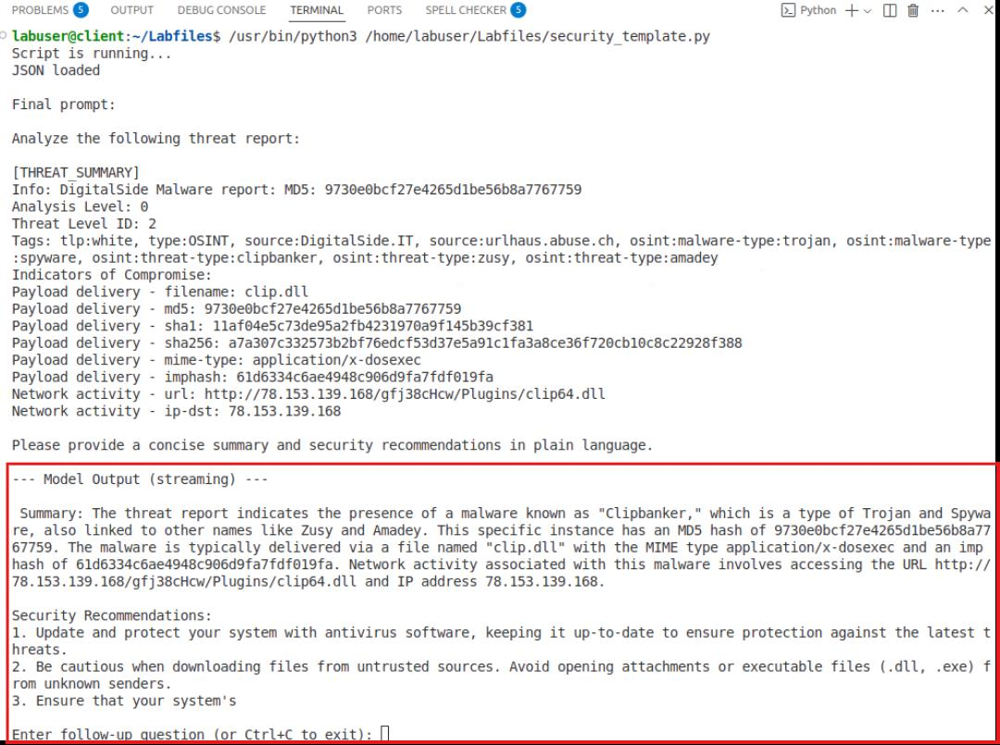 |
| *With the final issue resolved, the script should now run as intended - parsing a JSON alert file, creating a structured prompt, sending it to the model through the API backend, and initiating a multi-turn chat about the analyzed alert.* |

---

## AI-assisted optimization
In this exercise, the focus moves beyond "making it run" toward "making it right". This is where code starts to mature - where reliability, clarity, and intent matter as much as functionality. You'll start to think about what it means for a script to handle the unexpected gracefully, to communicate with its user clearly, and to be readable to someone other than its author. This marks the turning point from quick fixes to thoughtful engineering, where design and documentation become an essential part of the craft.

### Interactive file selection
Right now, the script always analyzes the same file because its path is hard-coded directly into the code. It runs fine - but only ever on that one JSON alert, no matter how many others you have. By replacing that static path with a simple prompt that asks which file to analyze, you'll make the script dynamic and reusable. Instead of editing code every time you want to test a new file, you'll just type its name and let the script handle the rest.

| Interactive file selection |
|:--:|
|  |
| 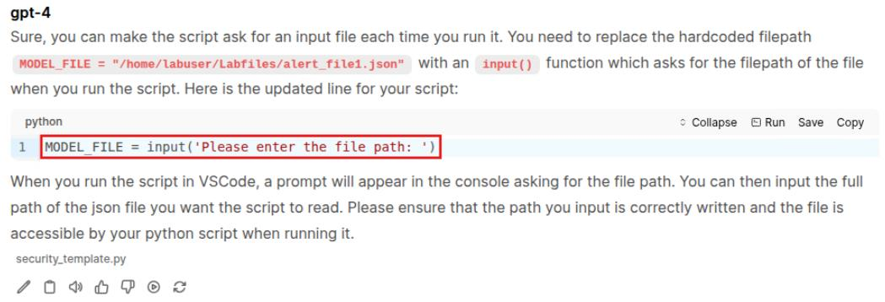 |
| *You'll begin by using AI to plan how the script should handle input. The goal isn't to pass a filename as a command-line argument, but to make the script ask the user which file to analyze when it runs. Framing the prompt this way gives the model clear direction about the kind of interaction you want, not just the feature itself.* |
| 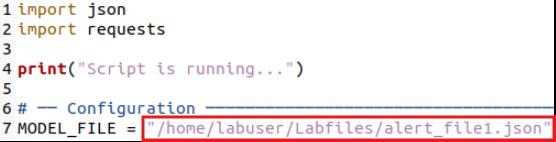 |
| 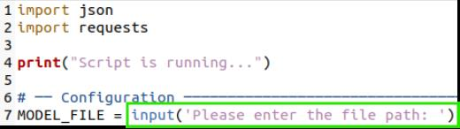 |
| 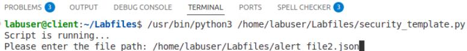 |
| 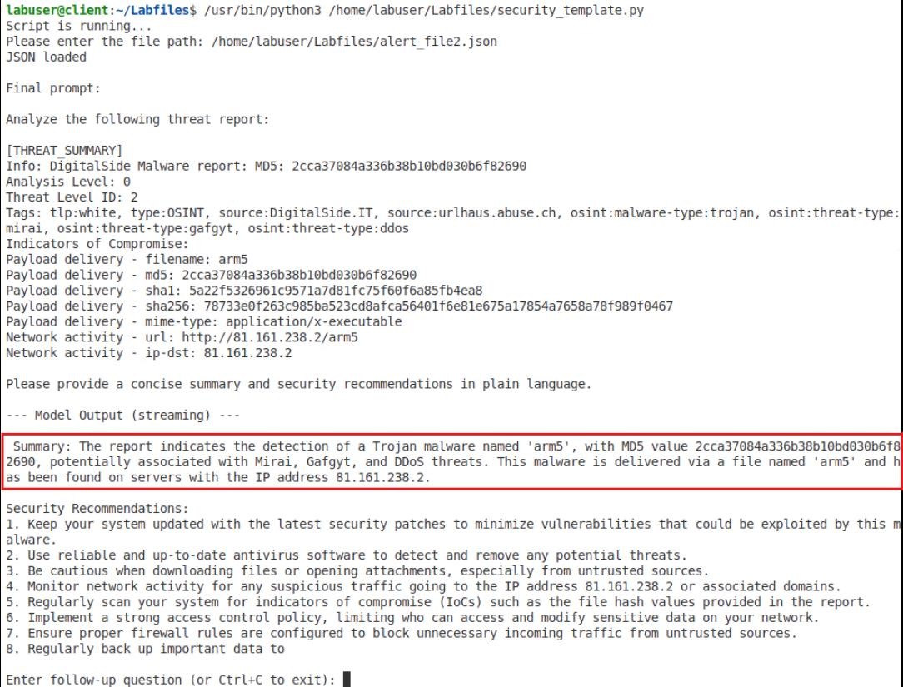 |

### Cleaner error handling
Error handling is what separates a quick script from a reliable one. Right now, when something goes wrong, the script reports it in a way that's technically correct but not very readable. In this section, you'll make the output clearer and more user-friendly - so instead of a confusing traceback, users get a simple message that tells them exactly what happened and why.

| Cleaner error handling |
|:--:|
| 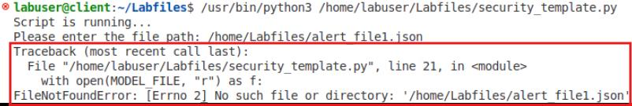 |
| *Because the **/labuser** directory was left out of the file path, the code can't locate the alert file. The resulting error message isn't very user-friendly - it includes a full traceback that could easily confuse someone just trying to run the script.* |
| 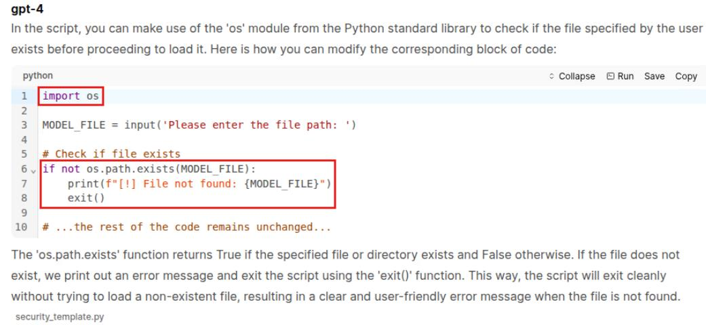 |
| *The exact code the model returns might look a little different, but the key pieces should be there - importing os, checking whether the file exists, and printing a clear error message before exiting gracefully.* |
| 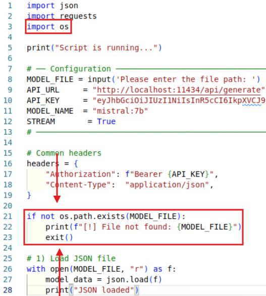 |
| 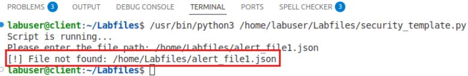 |
| *The script now displays your custom failure message instead of a long traceback. This confirms that your error handling is working as intended - Python still catches the same issue, but the program intercepts it and exits gracefully before the noisy traceback ever appears.* |

### Data format validation
Even when a file has the right extension, there's no guarantee its contents match what your script expects. Instead of letting bad input trigger confusing errors deeper in the code, you'll add a small check up front to confirm the data is in the correct format. This creates a single, clear failure point and keeps the rest of the script predictable and stable.

| Data format validation |
|:--:|
| 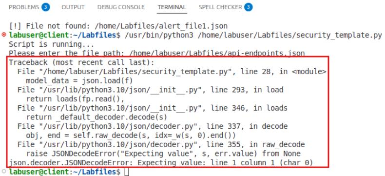 |
| *The api-endpoints.json file isn't actually a JSON-formatted file - it's an unstructured .md file that was just renamed with a .json extension. The result is an even more confusing traceback than the previous error.* |
| 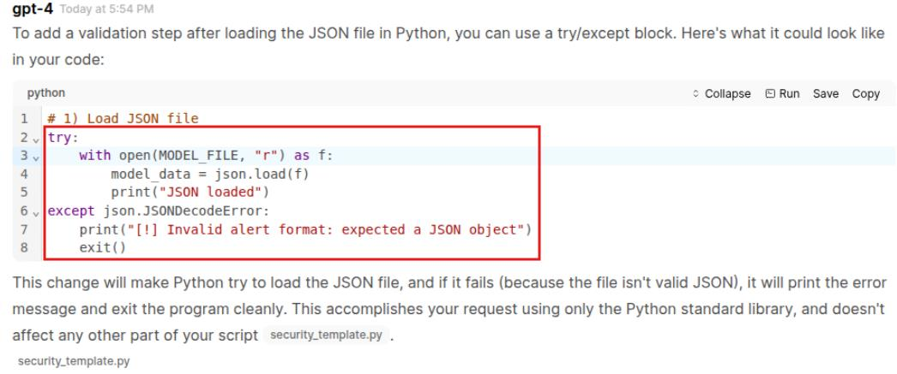 |
| *The exact code may look a bit different, but the core idea should be the same-after loading the file, check that the data is a JSON object and exit gracefully if it isn't.* |
| 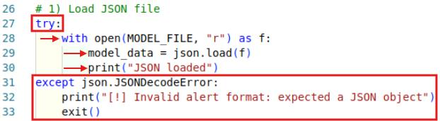 |
| 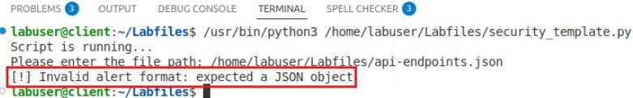 |
| *This check verifies that the loaded data is actually a JSON object before the script tries to use it. If the file contains plain text, malformed JSON, or anything other than a dict, the script stops immediately with a clear message.* |

### Comments and documentation
Good scripts explain *what* they do; great scripts explain *how* and *why*. Clear documentation turns one-off code into something that can be understood, reused, and safely modified - even months later. In this task, you'll use AI to generate concise docstrings and comments that describe the script's purpose, assumptions, and behavior. The goal isn't to rewrite the code, but to make its intent visible at a glance.

| Comments and documentation |
|:--:|
| 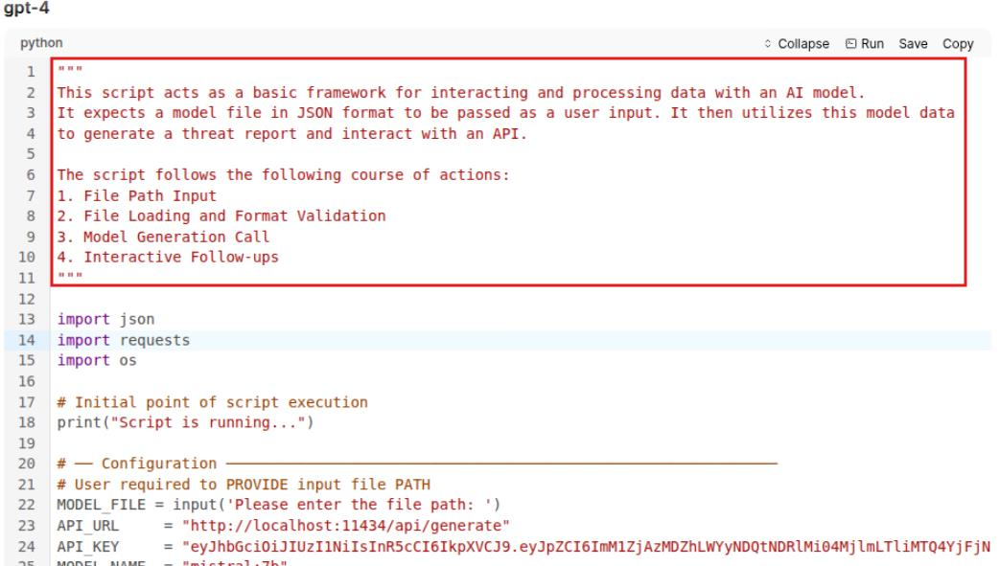 |
| 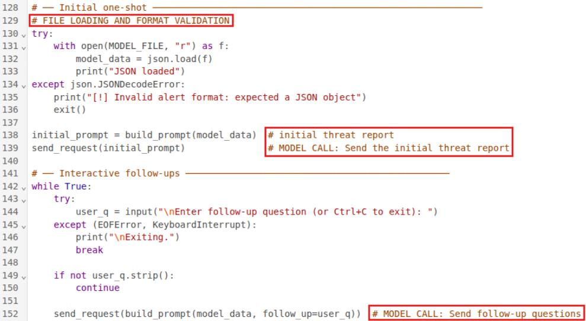 |
|  |
| 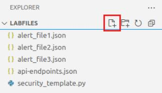 |
| 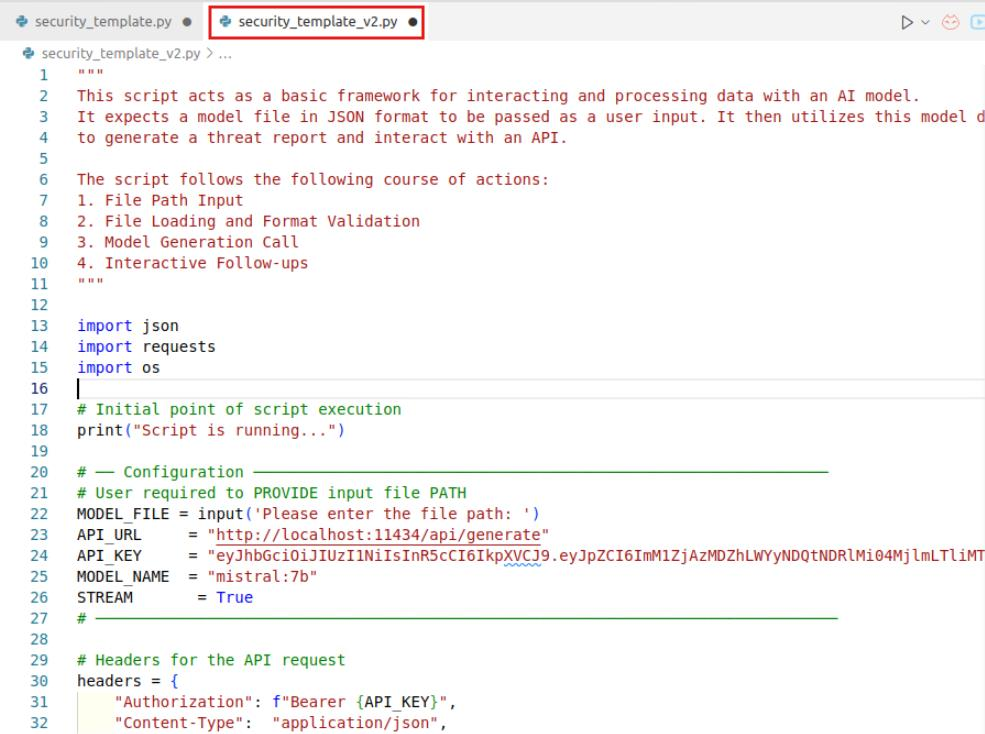 |
| 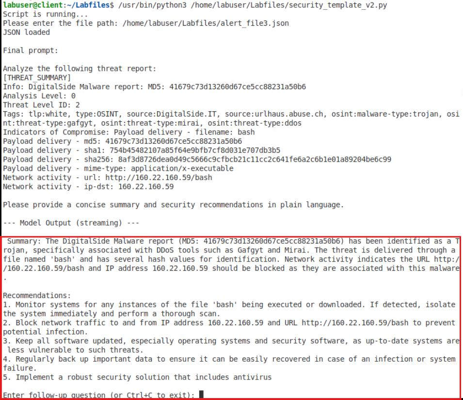 |
| *Having the model produce the entire script at once avoids the hassle of pasting scattered snippets and ensures the documentation appears in all the right places. It's a good idea to save the output as a separate file and test it first - so if the model accidentally changed logic instead of only adding comments, you catch it without risking your working version of the script.* |

---

## Using AI to plan larger code changes
In this final exercise, you'll explore how to work with AI to design a more complex modification - one too big to complete during the lab. Rather than writing code, you'll focus on reducing uncertainty by clearly defining the problem, the constraints, and the structure of the change. This is where AI becomes a planning partner instead of a code generator.

| Using AI to plan larger code changes |
|:--:|
| 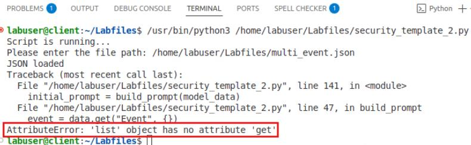 |
| *The **multi_event.json** file contains an array of JSON objects rather than a single one like the previous alert files. Since our script cannot currently parse JSON arrays, it will fail.* |

### Architectural analysis
Before you can change code in a meaningful way, you need to understand the structure it already has-and the assumptions buried inside it. Architectural analysis gives you the ability to zoom out from individual lines of code and see the shape of the system: how data flows through it, what the script expects to be true, and where those expectations might break as requirements evolve. This step isn't about writing code, or even fixing anything yet. It's about building a clear mental model so that the solution you eventually choose is grounded in how the script actually works, not how you hope it works.

```
The attached Python script parses security threat data from JSON files. Currently it only handles a single JSON object, but I need to extend it to handle both:
- Single object format: { "Event": {...} }
- Array format: [ { "Event": {...} }, { "Event": {...} } ]

Please analyze and provide a structured analysis:
1. What architectural assumptions does this code make?
2. Why will it fail with an array input?
3. At a high level, what needs to change to support both formats?
4. What backward compatibility concerns exist?

```

| Architectural analysis |
|:--:|
| 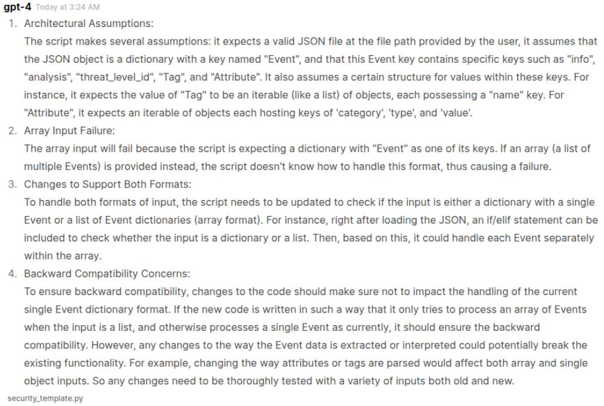 |
| *This prompt deliberately shifts the model out of "fix-it" mode and into analysis. By asking specific high-level questions and avoiding any request for code, you guide the model to examine assumptions and structure rather than propose solutions. This is how prompt engineering shapes how the model thinks, not just what it outputs.* |

### Solution approaches
Now that you understand why the script breaks, the next step is to explore different ways it could be improved. Instead of zeroing in on the first idea that comes to mind, this stage is about widening the field - mapping out multiple viable approaches, the tradeoffs behind each, and how they'd affect the script's structure going forward. The goal isn't to write code yet, but to see the landscape of options clearly enough to make an informed choice.

```
Based on your analysis, let's explore solution approaches. Please brainstorm 3-4 different approaches for making this code handle both single objects and arrays of events.
For each approach, provide:

Name: [Descriptive name for the approach]
How It Works: [2-3 sentence explanation]

Pros:
[Advantage 1]
[Advantage 2]

Cons:
[Tradeoff 1]
[Tradeoff 2]

Complexity: [Low/Medium/High]

Backward Compatible: [Yes/No]

Focus on different architectural strategies, not complete code implementations.

Example approaches might include: type detection, wrapper functions, etc. But don't limit yourself to these.
```

| Solution approaches |
|:--:|
| 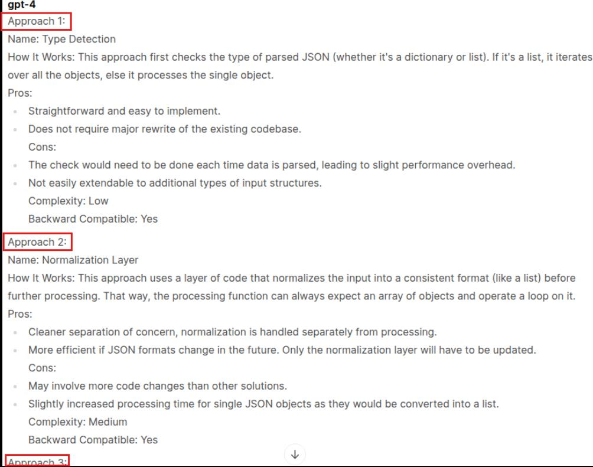 |
| *This prompt forces the model to treat each idea as an approach rather than a patch. By requiring names, pros/cons, complexity, and compatibility, the model has to break the problem into conceptual strategies and evaluate them side-by-side. This shifts it from "write code" to "compare architectures," which is exactly the thinking pattern you want at this stage.* |

### Implementation planning
Once you've chosen an approach, the next step is turning that idea into a realistic path forward. This phase is about sequencing the work - breaking the change into small, testable steps that keep the script in a working state as you go. Instead of thinking in terms of final code, you're designing the roadmap: what to change first, what to verify, and how each phase builds on the last.

```
I've decided to go with the wrapper functions approach. Please help me break the implementation into small, testable phases.

For each phase, provide:

Phase [N]: [Phase Name]
Goal: [What this phase accomplishes]
Changes Needed: [Specific change 1], [Specific change 2]
Files Modified: [Which files/sections]
Testing: [How to verify this phase works]
Estimated Time: [Minutes/hours for a junior developer]

Guidelines:
Keep phases small (each should be completable in under 30 minutes)
Each phase should leave code in a working state
Later phases should build on earlier ones
Include a phase for testing backward compatibility
Aim for 3-5 phases total
```

| Implementation planning |
|:--:|
| 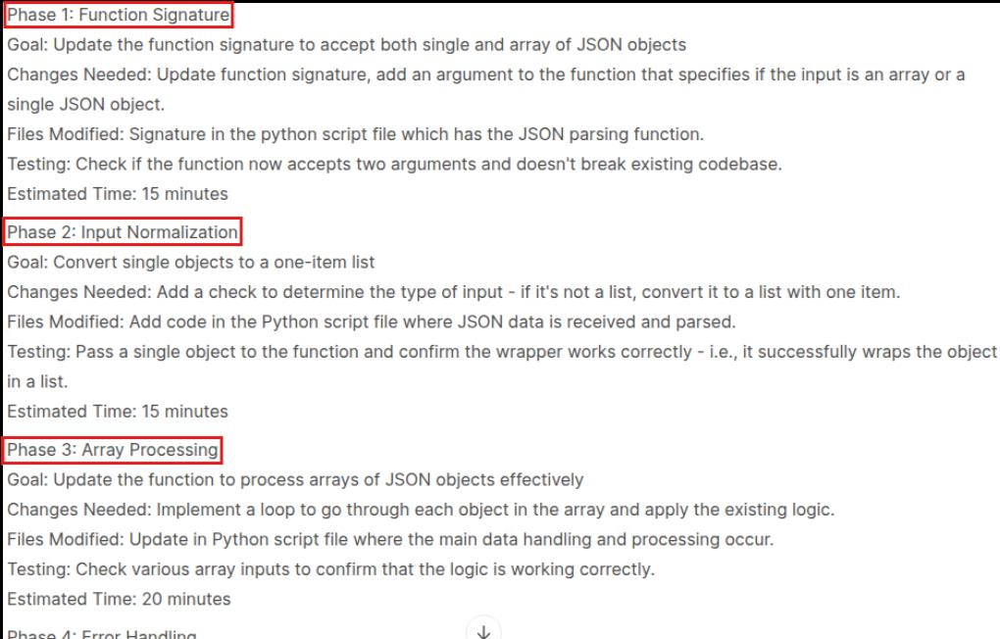 |
| *Pseudocode strips away the exact syntax of Python and focuses on the logic of what needs to happen. Because it reads like structured English, it's easier for anyone - developers, analysts, reviewers - to understand and verify the flow without getting caught in implementation details. This makes it highly transferable: the same plan can be implemented in Python, Bash, JavaScript, or anything else, because it captures intent, not syntax.* |

At this point, you've built something more valuable than a quick fix: a clear, phased plan for how to evolve the script without breaking its existing behavior. In a real project, this is where planning hands off to implementation. Each phase you outlined could now become its own prompt - small, focused, and easy for the model to translate into real code. While we won't implement the changes here, you now have the blueprint for how to move from high-level design to concrete changes, one deliberate step at a time.

---