# 5.3.3 Live Lab: Transform Documentation into Insights with AI

## Scenario
Security teams deal with a steady flow of documentation: advisories, best-practice guides, internal policies, architecture notes, and long technical write-ups. These materials often contain essential details, but they're time-consuming to read closely. AI can help reduce that burden by condensing information, highlighting important points, and making large documents faster to work through.

This lab looks at how language models handle security-focused material and what influences the quality of their summaries. You'll explore how clarity, structure, and context shape the output, and how different approaches to summarization reveal different aspects of a document.

> [!IMPORTANT]
> **The Mission**:
> - Learn how AI interprets security documentation and why structured prompts matter.
> - Build a summary workflow that turns long text into clear, usable insights.
> - Turn that workflow into a reusable custom model anyone can use.
> - Use an automated pipeline to enrich and transform security content at scale.

## Exam Objectives
This activity is designed to test your understanding of and ability to apply content examples in the following CompTIA SecAI+ objectives:

- 3.1 Given a scenario, use AI-enabled tools to facilitate security tasks.
- 3.3 Given a scenario, use AI to automate security tasks.

---

## Basic summarization
Summarization is one of the tasks language models handle most reliably, and it's something people turn to AI for every day. Security work involves a steady stream of written material, so being able to quickly condense a document into its essential points is genuinely useful. In this first exercise, you'll work with a short plaintext file to see how the model approaches summarization in a simple setting. This gives you a baseline for understanding how the model interprets content and what influences the clarity and accuracy of its summaries.

| Basic summarization |
|:--:|
| 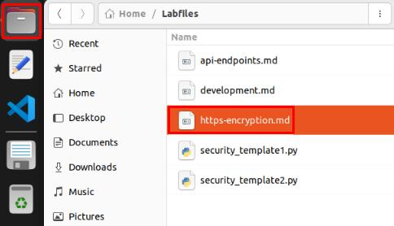 |
| 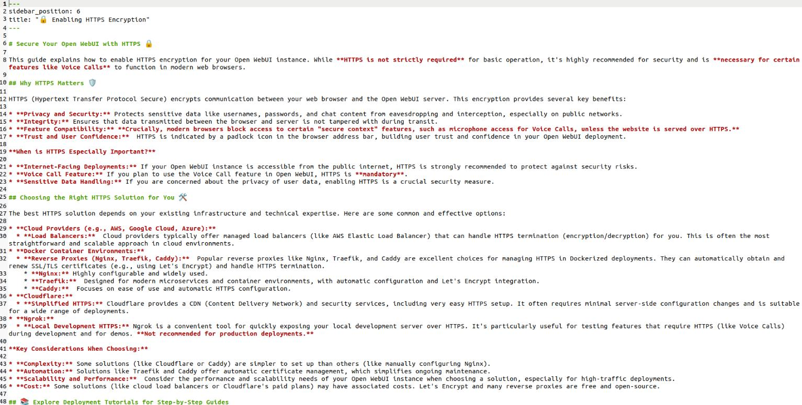 |
| *The document gives a brief overview of why HTTPS matters for OpenWebUI, noting its role in protecting data and enabling features like Voice Calls. It also outlines common options for enabling HTTPS, such as load balancers, reverse proxies, Cloudflare, or ngrok.* |
| 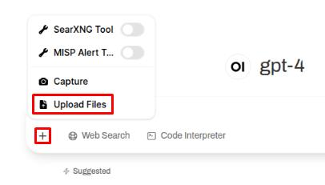 |
| 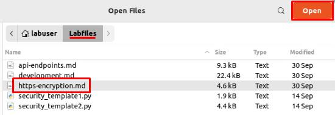 |
| 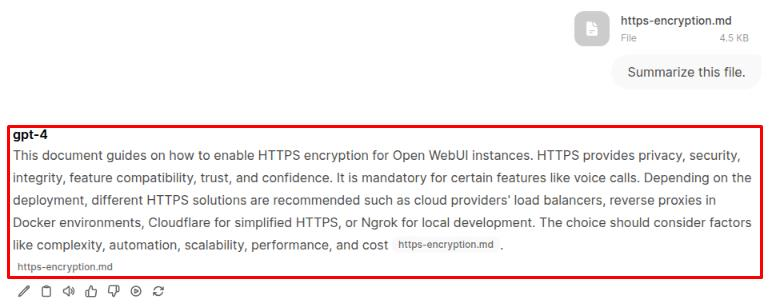 |
| *A prompt like "summarize this file" gives the model almost no direction, so the result is usually brief and shallow. It works for a quick glance, but it often misses the important details or structure of the document.* |

```
Summarize the document with the following sections:
Purpose of HTTPS
Why HTTPS is required for OpenWebUI
Environments where HTTPS is especially important
Deployment options (brief)
Key takeaways

Only use information from the document.
```

| Basic summarization 02 |
|:--:|
| 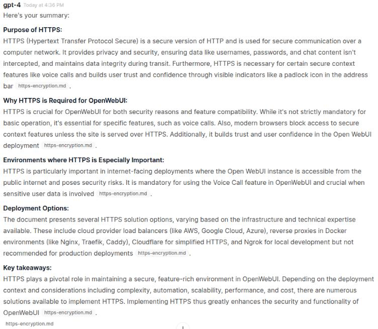 |
| *Using a more detailed prompt produces a noticeably stronger summary. By asking for specific sections, the model knows what to focus on and returns information that's clearer, more complete, and aligned with what you actually care about. This difference becomes even more significant with longer or more complex documents, where unstructured prompts tend to miss important details or collapse everything into a vague overview.* |

```
I'm trying to justify implementing HTTPS to management. Please give me a detailed summary I can use for this.
```

| Basic summarization 03 |
|:--:|
| 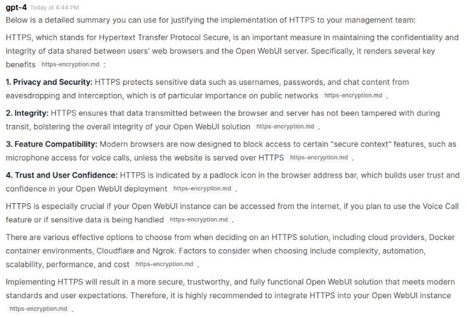 |
| *A management-focused summary emphasizes the higher-level points that support a decision, rather than covering each part of the document in detail. It's useful for presenting impact and justification, but it isn't as thorough as a structured, section-based prompt and may leave out smaller points that were captured earlier.* |
| 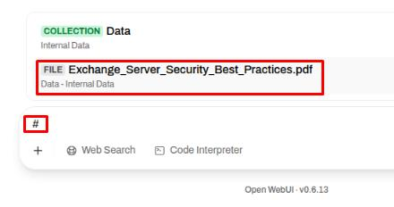 |
| *This file is much larger than the previous one and requires chunking/retrieval through the model's knowledge base. It outlines key hardening measures for on-premises Microsoft Exchange Server environments. It emphasizes timely patching, minimizing attack surfaces, strong authentication, and encryption to reduce exposure to targeted threats.* |
| 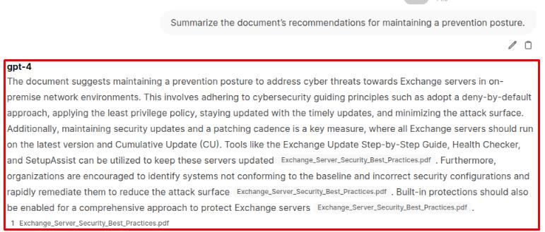 |
|  |
| 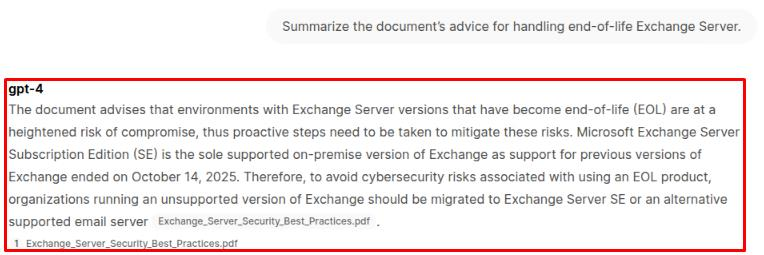 |
| *Because this PDF lives in the knowledge base, the model can pull just the portions that relate to each question instead of trying to process the entire document at once. This makes the responses more focused and grounded, even when the source is long and detailed. Retrieval gives the model the structure it needs to handle larger security documents effectively.* |

---

## Building a summary chain
In the previous exercise, you explored different ways to summarize security documentation-from simple one-line prompts to section-based requests and targeted extractions through the knowledge base. Now you'll take the next step: turning that ad-hoc prompting into a repeatable, structured workflow.

Security teams often need consistent outputs from long or complex documents, whether they're reviewing vendor hardening guides, policy updates, or internal configuration standards. Instead of reinventing your prompt every time, you can build a summary chain: a sequence of short prompts that progressively refine raw text into something actionable.

In this exercise, you'll walk through a multi-step summary chain, observe how each stage transforms the document, and then combine the chain into a single system prompt. Finally, you'll package it as a reusable custom model in OpenWebUI-giving you a ready-to-use tool for future summaries and analysis.

| Building a summary chain |
|:--:|
| 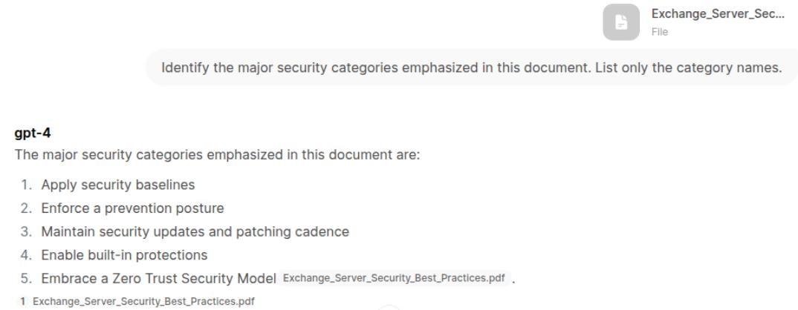 |
| *Starting with categories gives structure to your entire chain. It helps you avoid summaries that feel scattered or uneven, especially when the source material is long.* |
| 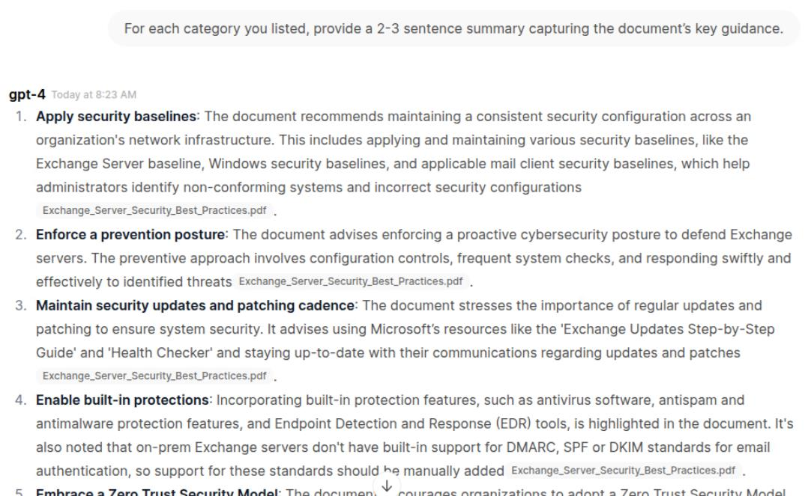 |
| *This turns the category outline into a useful middle layer-long enough to be meaningful, but still concise enough to guide the next steps.* |
| 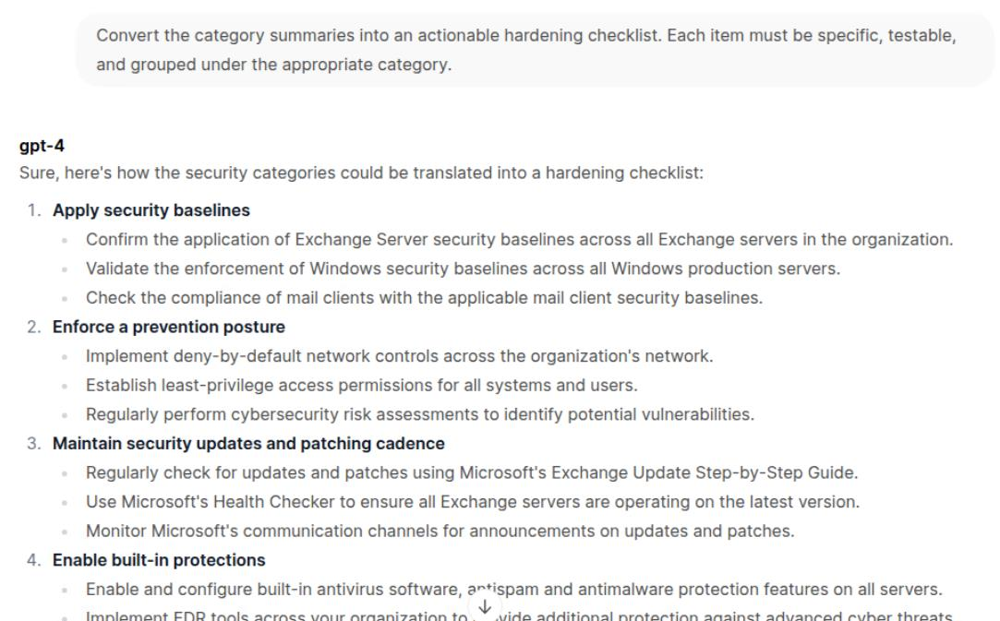 |
| *Security teams need checklists that can be assigned, tracked, and validated. This step forces the model to translate guidance into tasks you could actually implement.* |
| 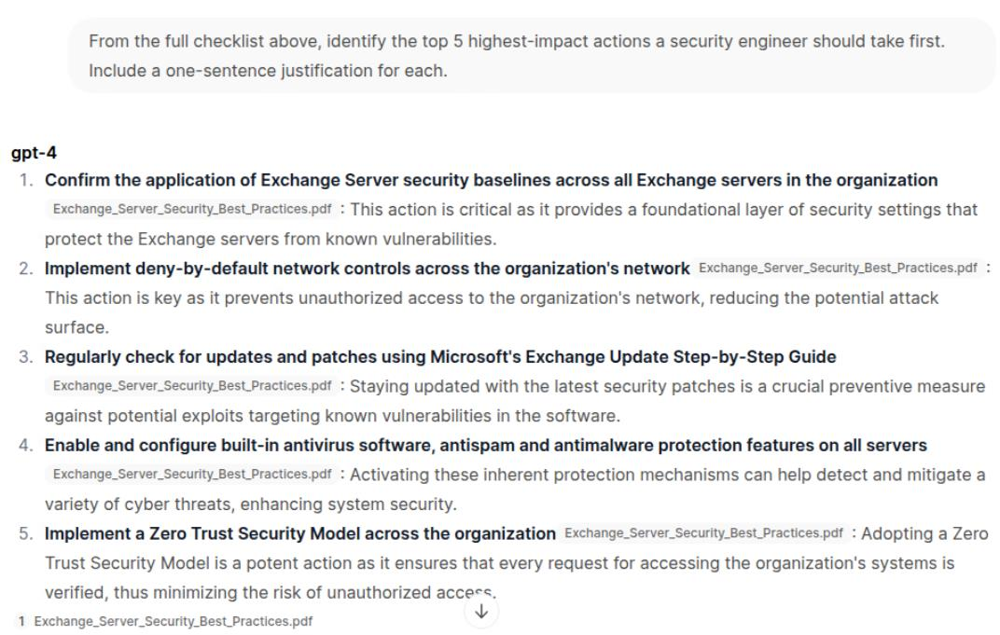 |
| *Prioritization is where summarization becomes decision support. By adding justification, the model exposes why each action matters.* |
| 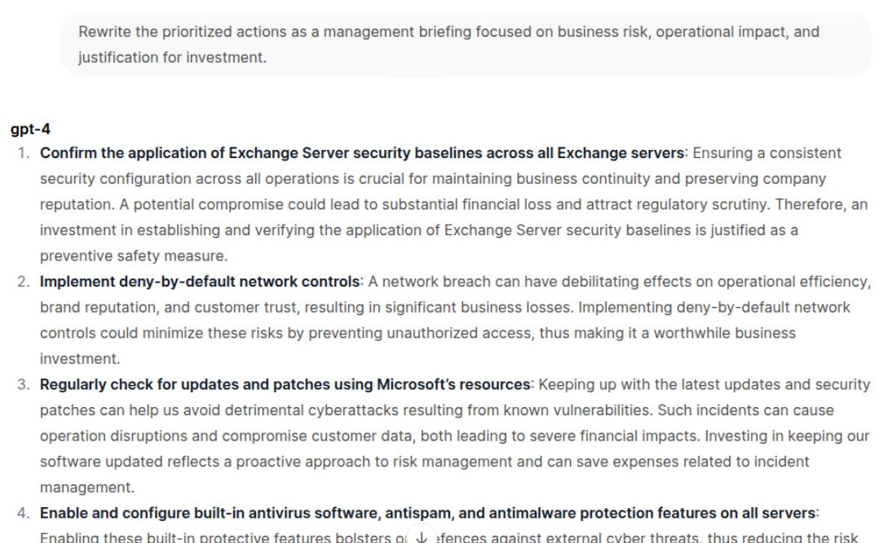 |
| *Different roles need different framing. Management summaries emphasize risk and outcomes rather than configuration-level detail.* |
| 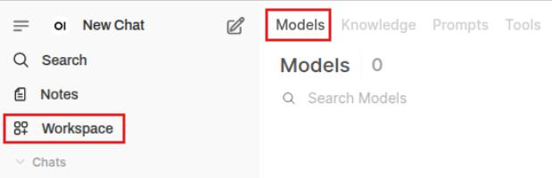 |

For the System Prompt, enter the following:
```
You are a Security Analysis Summarization Assistant.
When given any security document (plaintext, PDF, or KB-sourced), follow this workflow:

1. Identify major security categories in the document.
2. Summarize each category in 2-3 sentences.
3. Convert the summaries into a specific, testable hardening checklist grouped by category.
4. Prioritize the top 5 highest-impact tasks, with brief justification.
5. Rewrite the prioritized list as a management-facing summary focused on risk and operational impact.

Return results with clear section headers and no extra commentary.
```

| Building a summary chain 02 |
|:--:|
| 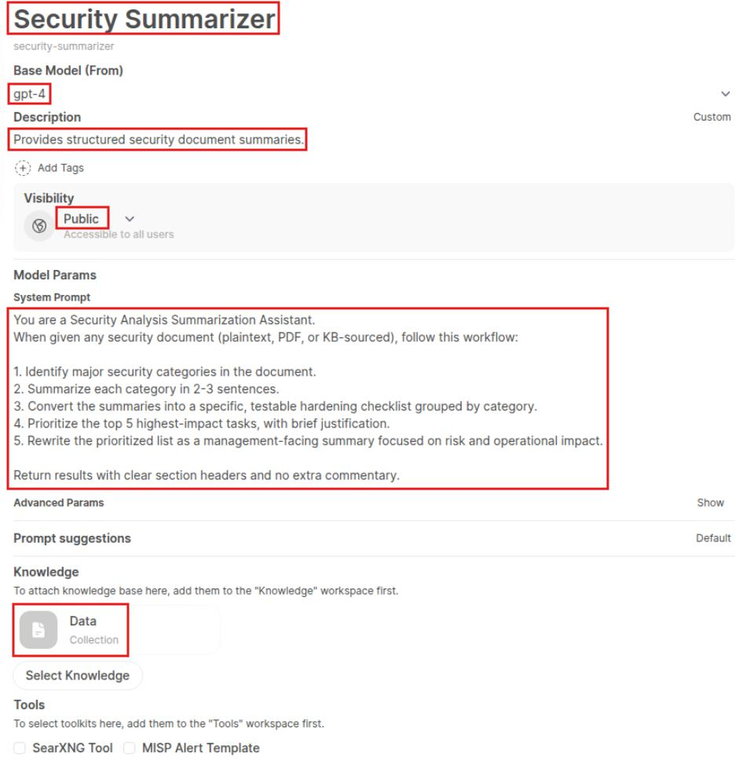 |
| *Creating a custom model turns your summary chain into a reusable tool. Instead of relying on someone knowing the right prompts or understanding prompt engineering, the model itself enforces the workflow. Anyone - regardless of experience - can give it a simple request and still get the same structured, reliable analysis you built during this exercise.* |
| 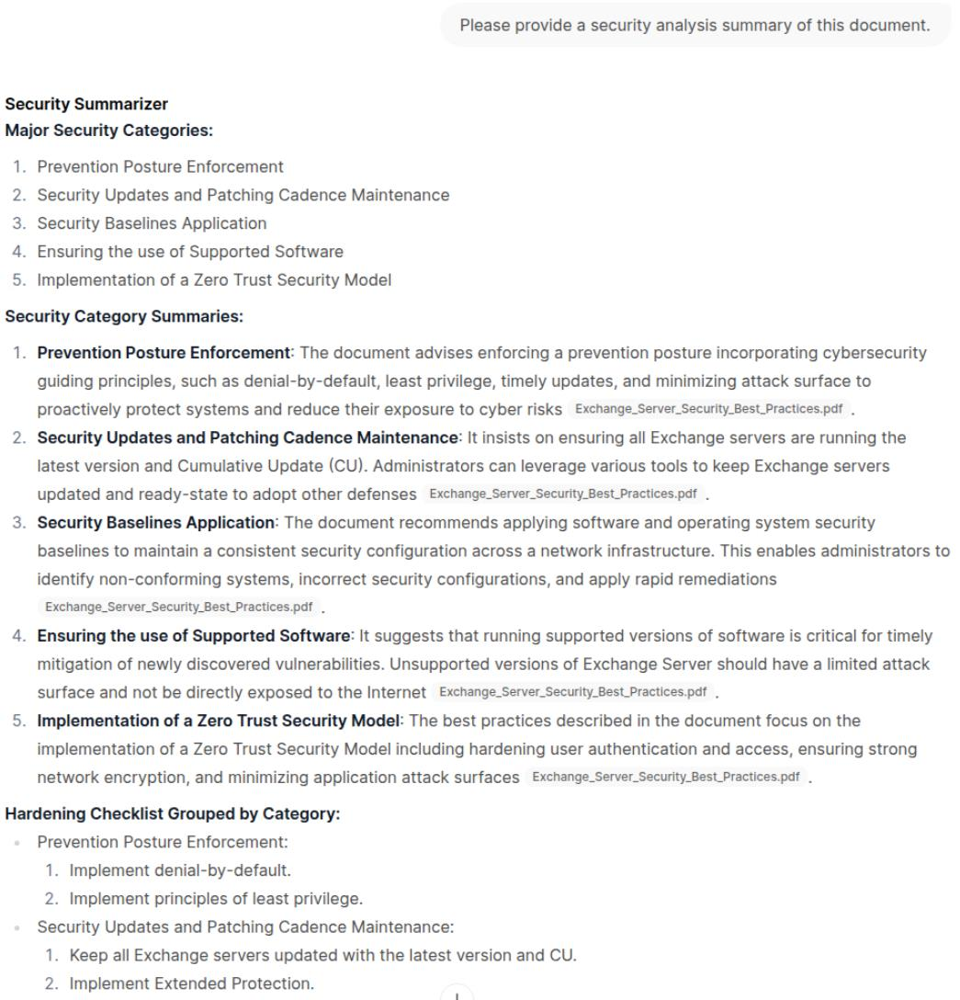 |
| *Because the summary chain is now part of the model's system prompt, even a short request triggers the full structured workflow. You no longer need detailed prompts - the model applies the process automatically, giving you consistent, high-quality summaries from minimal input.* |

---

## Visualizing security data with AI
In the last exercise, you built a structured workflow for turning long security documents into clear, consistent summaries. This exercise takes that idea a step further by moving from text interpretation to visual reasoning. Security data often becomes easier to understand when it's shown as a diagram rather than a paragraph, but most models struggle when the underlying information comes from formats like CSV files or when the relationships aren't already spelled out. To address this, you'll work with a pipeline that can parse structured data, enrich it with additional analysis, and then convert the results into visual formats the model can reliably generate.

Here you'll explore how AI can turn real security content into diagrams that clarify patterns, relationships, and processes. Along the way, you'll see how pairing model reasoning with structured parsing allows you to extract meaning even from sources that would normally overwhelm an LLM. By the end, you'll have a better sense of how visuals can complement text-based analysis and how automated tooling can make complex data far more approachable.

| Visualizing security data with AI |
|:--:|
| 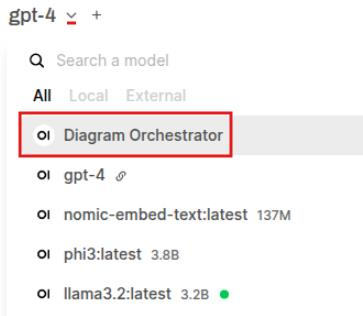 |
| 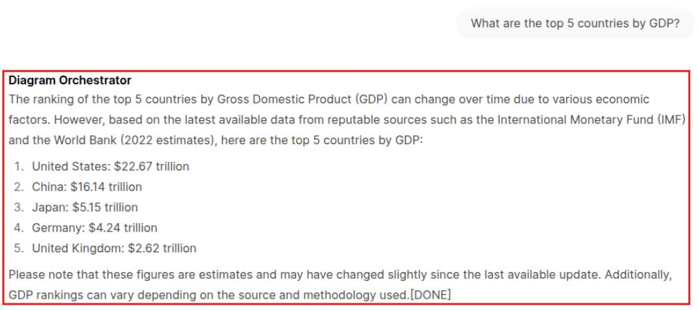 |
| *The pipeline's output is designed to arrive in three parts. The first piece is the model's plain-text explanation - essentially the same kind of response you'd expect from a normal chat. This gives you the core reasoning or summary before anything visual is introduced.* |
| 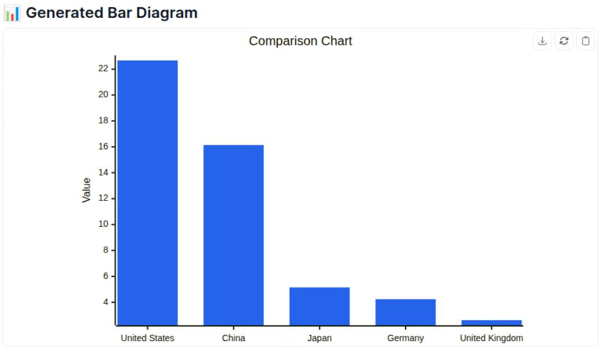 |
| *The second part is the rendered diagram. This image is generated from the Mermaid code the model produces, using the pipeline to turn that markup into a visual chart or flow. The raw Mermaid code appears below the image, but this section is the final, rendered result.* |
| 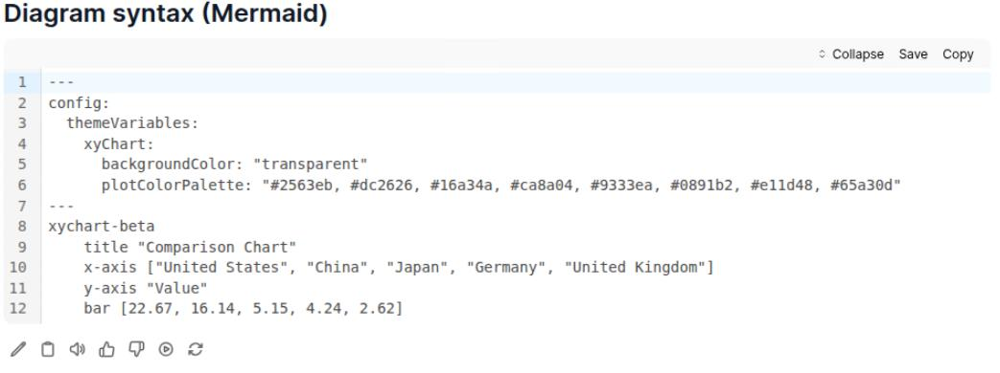 |
| *The last part of the output is the Mermaid code itself. This is the exact markup used to generate the diagram above, and you can reuse it with any Mermaid-compatible tool if you want to tweak the visualization or recreate it elsewhere.* |

In a new chat with Diagram Orchestrator, select the + to bring up the upload files dialog. Select **known_exploited_vulnerabilities.csv** from the Labfiles directory.

> [!NOTE]
> The vulnerabilities CSV is a structured list of known exploited vulnerabilities, with each row representing a single issue. It includes fields like CVE ID, vendor, product, description, and date added-essentially giving you a concise snapshot of real-world security problems that can be analyzed or visualized to reveal patterns and high-risk areas.

```
Can you provide a summary of vulnerabilities by vendor from the attached file?
```

| Visualizing security data with AI 02 |
|:--:|
| 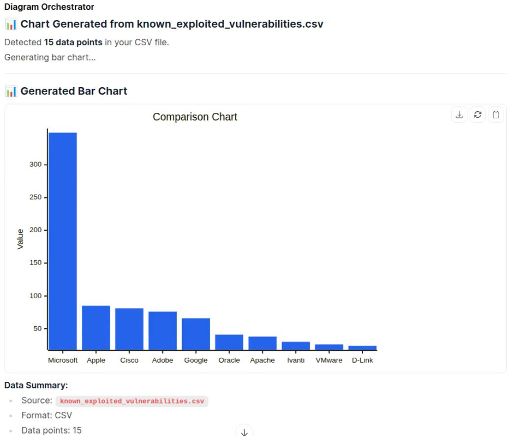 |
| *When the pipeline handles the CSV, it reads the file directly with Pandas instead of relying on the model to interpret raw rows. It extracts the columns it needs, groups and counts the data, and produces clean values that can be turned into a diagram - something an LLM alone would struggle to do accurately.* |
| 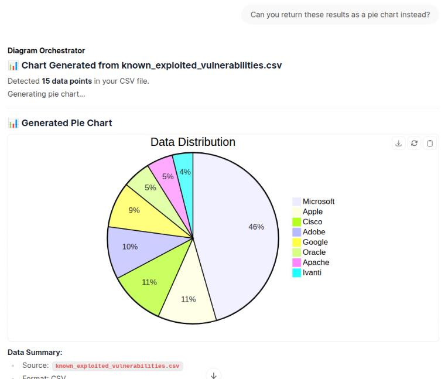 |
| *Pie charts are best when you care about proportions rather than exact counts. They make it easy to see which categories dominate the whole and how the top groups compare at a glance. With only a few slices, the relative size of each part becomes immediately clear, often faster than reading a bar chart.* |

Start a new chat with the Diagram Orchestrator and enter the following prompt:

```
Summarize how an HTTP request works.

```

| Visualizing security data with AI 03 |
|:--:|
| 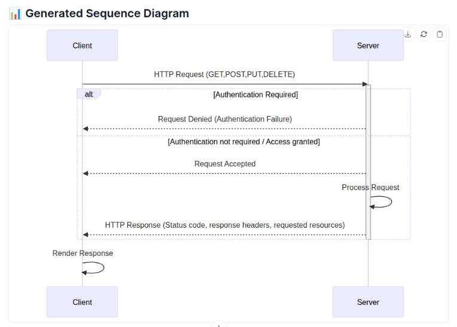 |

> [!NOTE]
> The model chose a sequence diagram because your question described an interaction between two systems happening step-by-step over time. That pattern maps naturally to sequence diagrams, which are designed to show how components interact in order. Here are some tips on reading sequence diagrams:
> - Vertical columns represent the components (client, server, service).
> - Time moves downward, so higher elements occur first.
> - Horizontal arrows show messages traveling from one component to another.
> - Activation bars (the vertical rectangles) show when a component is actively processing something.
> - Blocks like "alt" represent branching logic-different paths depending on conditions.
> - Dashed arrows often represent return messages or responses.

---
