# 5.3.8 Live Lab: Automate Workflows with AI

## Scenario
The objective of this lab is to design and implement a CI/CD pipeline for automating threat intelligence workflows using Azure Logic Apps and Large Language Models (LLMs). Participants will learn how to ingest threat feed data, analyze and enrich it using AI, store the enriched data in a threat intelligence platform, and generate actionable reports. The lab will also focus on testing and optimizing the workflow for performance and scalability.

> [!IMPORTANT]
> **The Mission**:
> - Understand the integration of Azure Logic Apps with LLMs for automating workflows.
> - Design and implement a CI/CD pipeline for ingesting, analyzing, and enriching threat feed data.
> - Learn how to store enriched threat intelligence data in a platform and generate reports.
> - Test and optimize the workflow for performance and scalability.

## Exam Objectives
This activity is designed to test your understanding of and ability to apply content examples in the following CompTIA SecAI+ objectives:

- 3.3 Given a scenario, use AI to automate security tasks.

---

## Design and Implement an Azure Workflow
In this step, you'll create the foundation of your threat intelligence workflow using Azure Logic Apps. You'll build a new Logic App, define a trigger to start the process, and configure an action to ingest sample threat feed data. This forms the entry point for the automated pipeline you'll enhance in later steps.

| Design and Implement an Azure Workflow |
|:--:|
| 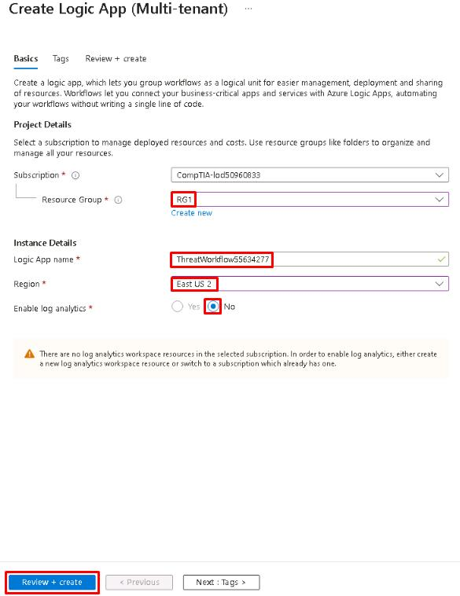 |

> [!TIP]
> Logic Apps allow you to build automated workflows by connecting triggers (what starts the process) and actions (what the workflow does). In this lab, you'll use it to ingest, analyze, and store threat feed data.

| Design and Implement an Azure Workflow 02 |
|:--:|
| 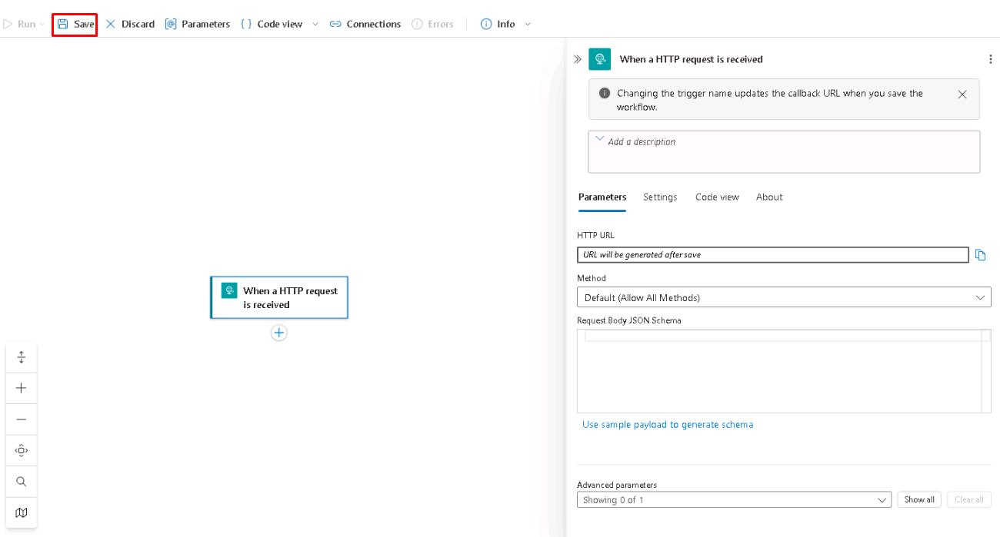 |

> [!TIP]
> Leaving the JSON schema blank means the Logic App will accept any payload. You can define a schema later if you want to validate incoming data.

| Design and Implement an Azure Workflow 03 |
|:--:|
| 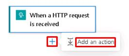 |
| 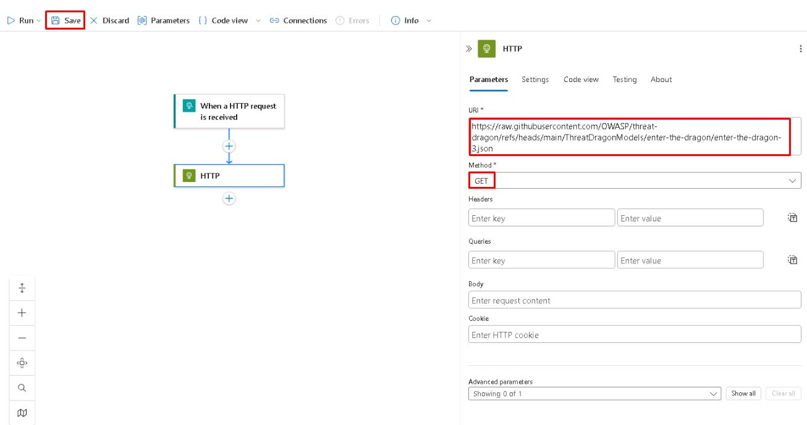 |
| *The **HTTP** trigger lets you manually run the workflow, while the **HTTP GET** action pulls sample threat feed data from an external source. You can later replace this with your own feed or API.* |

| Design and Implement an Azure Workflow 04 |
|:--:|
| 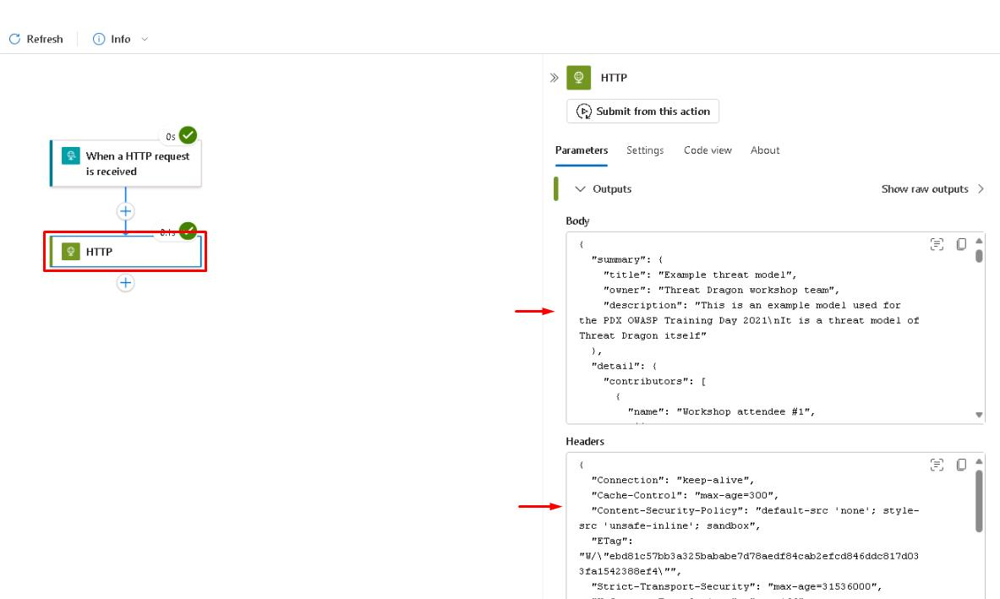 |

> [!TIP]
> Testing the workflow ensures the Logic App can ingest raw threat feed data before you integrate AI or storage steps.

---

## Use AI to Analyze and Enrich Data
In this step, you'll integrate Azure OpenAI into your Logic App to analyze and enrich the threat feed. The workflow will send the ingested data to an LLM for contextual analysis, add severity and mitigation details, and parse the AI output into a structured format for storage and reporting.

| Use AI to Analyze and Enrich Data |
|:--:|
| 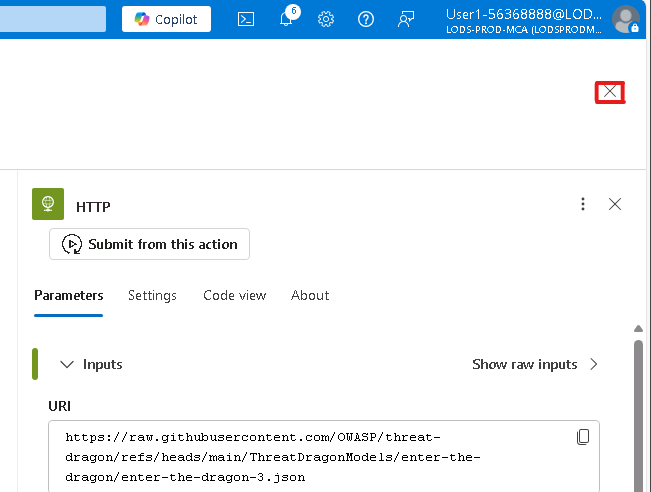 |
| 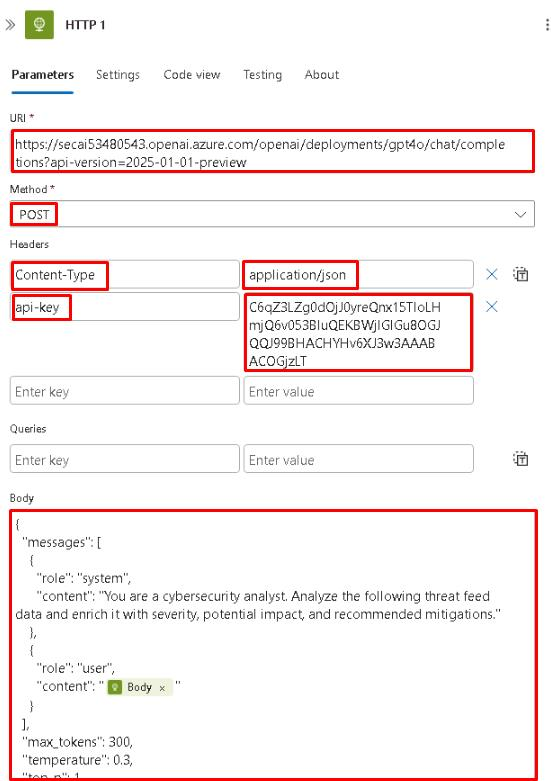 |
| 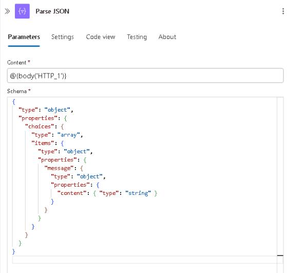 |
| 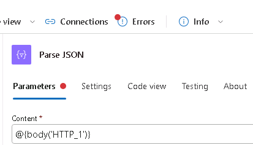 |
| *Parsing the JSON response makes the AI's enriched text available as structured data for storage or reporting in the next step.* |

| Use AI to Analyze and Enrich Data 02 |
|:--:|
| 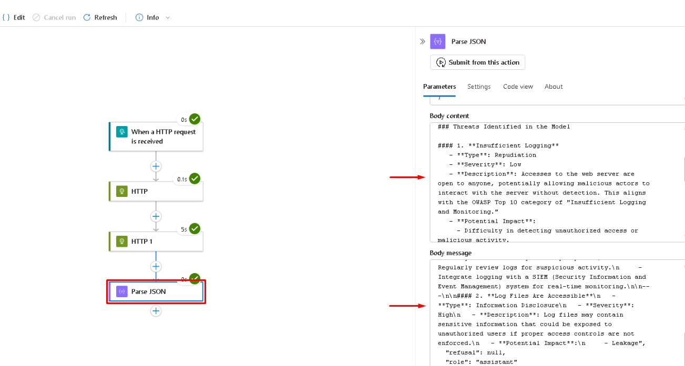 |

---

## Store Enriched Data
For this step, you'll use Azure Blob Storage to save the enriched threat feed as a JSON file. This simulates storing threat intelligence data for later review or integration.

| Store Enriched Data |
|:--:|
| 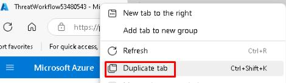 |
| 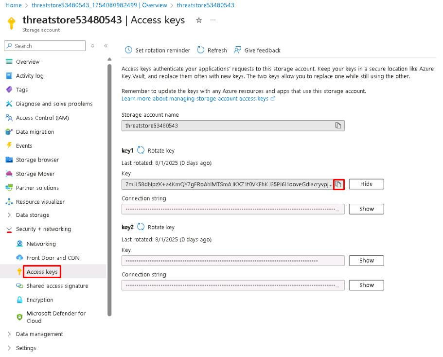 |

> [!TIP]
> The storage account provides a simple location to save enriched threat intelligence data in Blob format for later use.

| Store Enriched Data 02 |
|:--:|
| 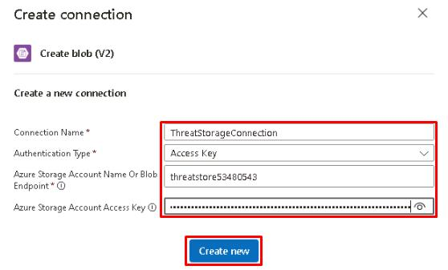 |
| 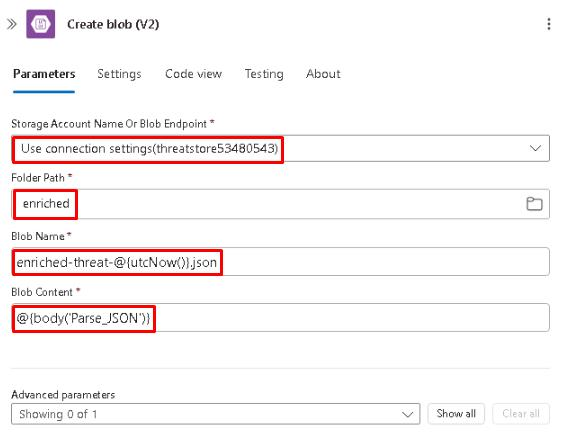 |

> [!WARNING]
> Using @{utcNow()} in the blob name ensures each run creates a unique file with a timestamp.

| Store Enriched Data 03 |
|:--:|
| 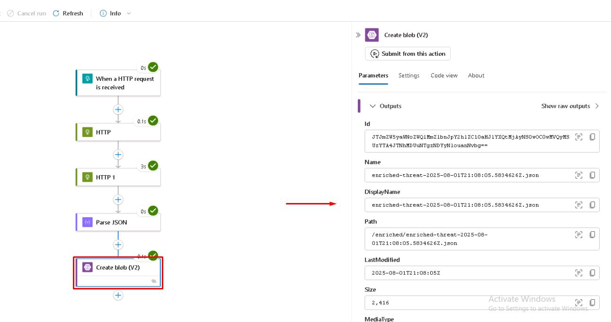 |
| 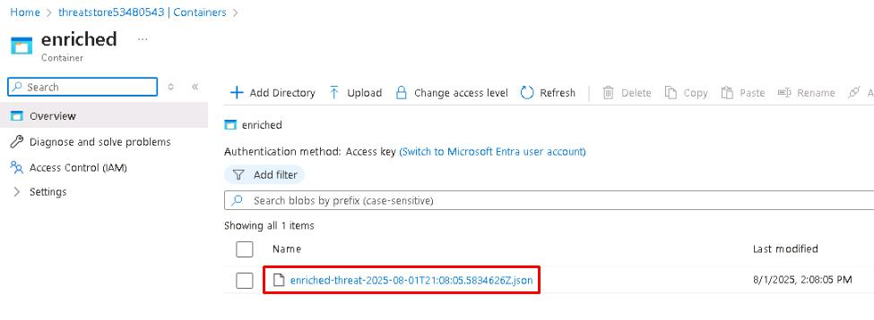 |

> [!TIP]
> Saving the enriched output to Blob Storage makes the threat intelligence available for downstream analysis or integration into security tools.

---

## Test and Optimize Workflow
In this step, you'll test the complete workflow from ingestion through enrichment and storage to verify everything is functioning correctly. You'll also review performance metrics to identify potential bottlenecks and apply optimizations to improve speed and reduce costs. Finally, you'll explore how to prepare the Logic App for deployment with CI/CD to support ongoing updates in a production environment.

> [!NOTE]
> **Action Latency** represents the amount of time it takes for a specific action in the Logic App workflow to execute. It can indicate a bottleneck, such as the Azure OpenAI HTTP call taking too long to return results or storage operations being slow.

> [!NOTE]
> **Runs Failed** shows the number of Logic App runs that ended in failure. This metric is critical for tracking workflow reliability, as frequent failed runs indicate errors in triggers, actions, or data parsing.

> [!NOTE]
> **Run Latency** is the total time it takes for the entire Logic App workflow (from trigger to last action) to complete. High run latency suggests the whole workflow is taking too long, which might impact real-time or near-real-time processing of threat feeds.

| Test and Optimize Workflow |
|:--:|
| 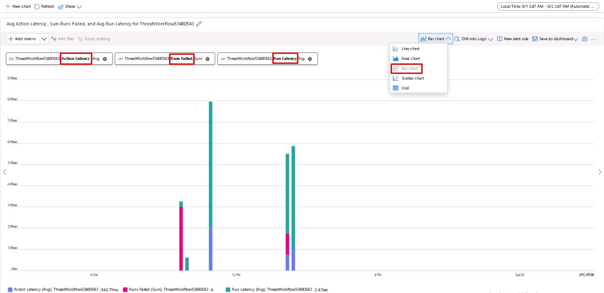 |
| 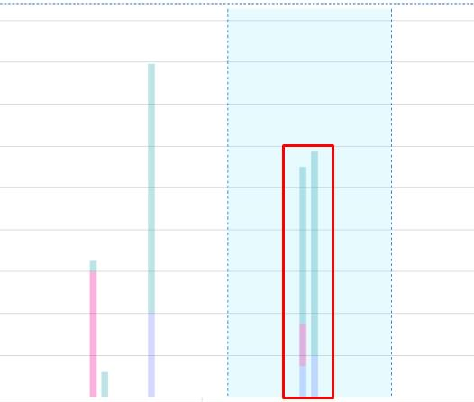 |
| 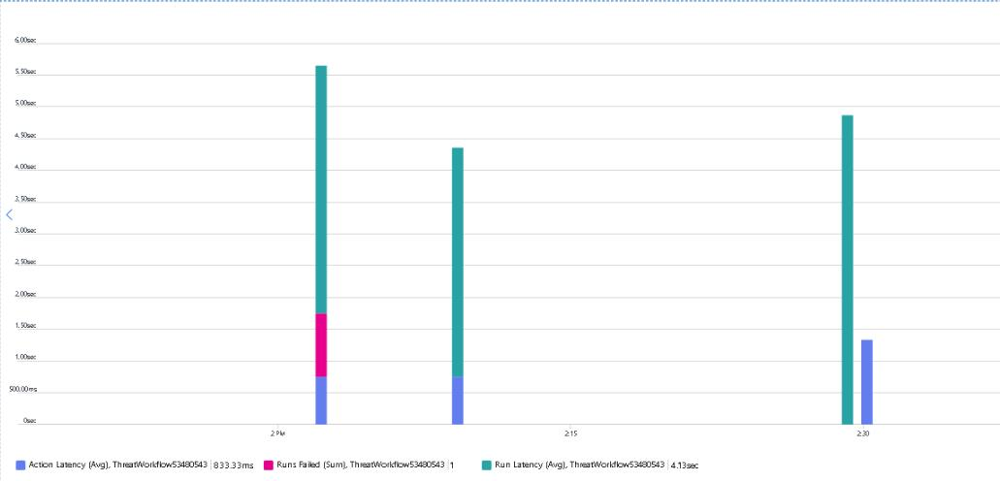 |
| *Monitoring metrics helps you identify where performance or cost optimizations are needed, especially around LLM calls which are often the most resource-intensive part of the workflow.* |

> [!NOTE]
> The Automation script view automatically generates an ARM template of your Logic App workflow. This template defines every action and connection.

| Test and Optimize Workflow 02 |
|:--:|
| 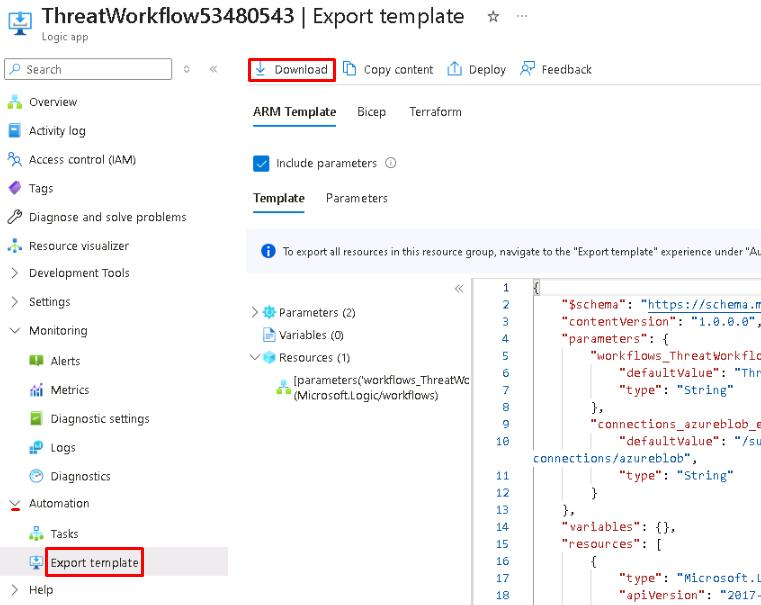 |

> [!NOTE]
> This command deploys the Logic App definition from the exported ARM template. In a real CI/CD pipeline, this step would be automated.
> ```
> az deployment group create --resource-group SecAI60406450 --template-file "C:\LabFiles\template.json" --parameters "@C:\LabFiles\parameters.json" 
> ```

By exporting the Logic App definition and parameters, you've created the core building blocks for automating deployments. In a full CI/CD setup, these files would be stored in a GitHub or Azure DevOps repository. A pipeline would monitor the repo for changes, and on each commit, automatically run the deployment command to push updates to the Logic App.

Additional steps, like injecting environment-specific secrets and running automated tests against the workflow, would ensure reliable, repeatable deployments across development, staging, and production environments.

---
