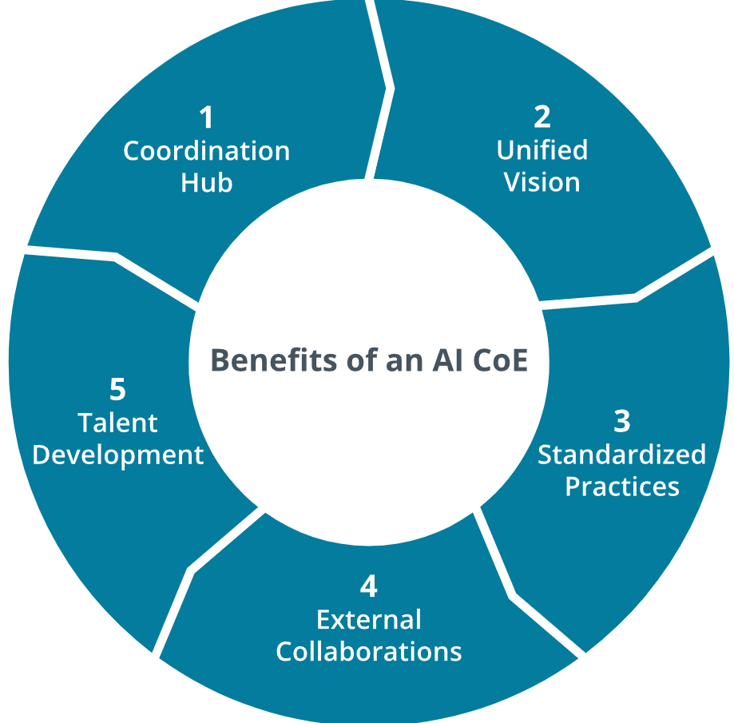

# 6.1.1 Establish AI Governance

Effective AI governance is a management system that helps an organization decide whether, how, and under what controls AI is designed, built, acquired, deployed, and monitored. It combines people, policy, and process with technical guardrails so that AI systems remain lawful, secure, reliable, and aligned with business objectives. Many organizations use an AI Center of Excellence and a comprehensive set of policies and procedures to make this system practical.

## AI Center of Excellence

An ***AI Center of Excellence***, or AI CoE, describes a cross-functional team that represents the organization's hub for safe and effective AI implementation and support. An effective CoE blends AI engineering and data science with information security, privacy, legal, compliance, risk management, procurement, IT operations, and product management. The CoE typically defines standards, reviews projects, curates tools and platforms, and supports product and business teams as they build solutions. In practice, this means the CoE writes and maintains the AI policy, publishes procedures and templates, advises on risk, and may also lead investigations when incidents involving AI occur.

| Benefits of AI CoE |
|:--:|
|  |
| *An illustration showing the benefits of AI CoE.* |

> [!NOTE]
> The benefits are as follows:
> 1. Coordination Hub.
> 2. Unified Vision.
> 3. Standardized Practices.
> 4. External Collaborations.
> 5. Talent Development.

Description

An AI Center of Excellence (CoE) serves as a strategic hub to drive organizational AI adoption by aligning efforts with a unified vision, ensuring that all AI initiatives support business goals, such as innovation and efficiency. This focus prevents fragmented projects and maximizes impact, ensuring that resources are used efficiently and objectives are met effectively. It enables teams to collaborate more seamlessly, resulting in more cohesive and successful outcomes. The framework outlines clear and standardized practices for data governance and model development, while also establishing ethical guidelines for the use of AI technology. By implementing these standards, organizations can significantly reduce risks associated with bias and non-compliance, which are increasingly important in light of a rapidly evolving AI regulatory landscape.

Additionally, the structured approach supported by the CoE enhances scalability and consistency across various processes, ultimately fostering greater trust in AI systems and their outputs. In doing so, it not only protects the organization but also ensures a more responsible and transparent deployment of AI solutions. The CoE fosters external collaboration with industry partners, academia, and vendors to stay at the forefront of AI advancements, enhancing competitiveness through shared knowledge and innovation. It also acts as a talent development hub, training employees and attracting top AI experts to build a skilled workforce, addressing the critical need for specialized expertise. As a coordination hub, it streamlines cross-departmental AI projects, minimizing duplication and aligning resources, thereby boosting efficiency and accelerating deployment.

There are three common ways to position an AI CoE. A centralized model places most AI development and all governance in one team. This speeds standardization and works well for smaller organizations or those in highly regulated industries. A federated model places AI developers in business units and uses the CoE as a standards and assurance function. A hybrid model centralizes platforms, policies, and reviews while allowing business units to develop within predefined boundaries. A hybrid model is most common because it balances control and efficiency.

## AI Policy

An ***AI policy*** states what is allowed, what evidence is needed (to support audits), and who is authorized to make decisions. It should be short enough to read in one sitting and clear enough to support enforcement. A typical set of AI policies generally covers purpose and scope, roles and accountability, data use, model lifecycle requirements, human oversight, security, privacy, and incident response.

The policy should say which decisions require formal sign-off, such as moving a model from testing into production, using customer data for training, or enabling autonomous actions like automated emails or transactions. Additionally, plain language definitions are essential to reduce confusion. If the policy refers to "high-risk AI," it should define what that means, for instance, systems that influence credit decisions, employment, health, safety, or core security functions. If it refers to a "model registry," it should explain that this is a controlled inventory that tracks every model and prompt template with its version, training data sources, owners, approvals, and monitoring status.

## AI Procedures

***AI procedures*** exist to convert policy into predictable and auditable actions. They specify who does what, when, and with what evidence across the AI lifecycle, from risk classification to design review, testing and validation, release and change control, and ongoing monitoring and incident response. Effective procedures ensure that decisions are traceable and safeguards are consistently applied. Well-written procedures are plain-language, role-based, and enable teams to move quickly while simultaneously maintaining control over data protection, security, fairness, and regulatory requirements. By embedding documentation and approvals into each step, procedures create a reliable record of accountability, reduce "shadow AI," and give leaders confidence that AI systems are deployed and operated responsibly.

## Technical Guardrails Supporting Governance

***Technical guardrails*** are controls that enforce compliance with AI governance in day-to-day operations. They include capabilities such as model and prompt registries with versioning, access controls based on least privilege, secrets management, ***data masking*** and quality checks, logging and audit trails, and prompt or response filtering to block unsafe patterns. Technical guardrails reduce the risks associated with operating and using AI. By embedding protection and observability into the platforms teams already in use, technical guardrails create clear boundaries and provide continuous visibility into how AI systems are used and managed.

## AI GRC Maturity Roadmap

***Governance, Risk, and Compliance (GRC)*** programs in general typically mature in stages. Early on, they publish a concise policy and inventory of existing AI uses. Next, they work to establish a model registry, adopt an industry standard, and build monitoring capabilities. Later, they refine risk management practices, automate evidence collection, and seek independent (3rd party) validation for high-risk systems.